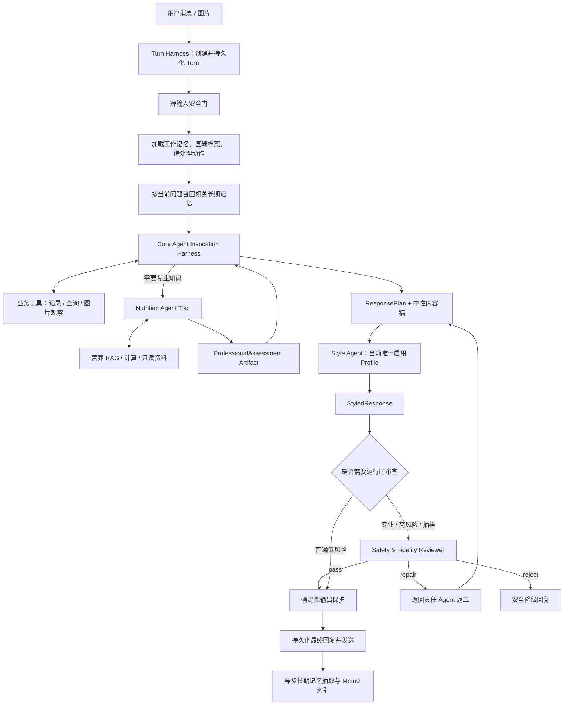

# SlimGuard Core Agent、Harness 与记忆体系重构设计

> 版本：v1.0
>
> 日期：2026-09-17
>
> 状态：讨论结论已冻结，等待实施
>
> 适用范围：Agent 编排、Harness、专业 Agent、医生风格、内容审查、记忆、运行追踪与后台可视化

## 1. 文档目的与决策地位

本文记录本轮架构讨论中提出的全部问题、建议和已经达成一致的方案，并作为下一轮代码重构的实施基线。

它不是对现有实现的描述性说明，而是同时包含：

- 当前代码实际上怎样运行；
- 当前方案为什么让系统显得复杂、难懂、难用；
- 重构后的唯一目标架构；
- 各 Agent、Harness、工具、记忆和审查之间的边界；
- 管理后台应该怎样展示一轮完整执行；
- 迁移步骤、测试重点和最终验收标准。

当本文与以下旧文档中的架构结论冲突时，以本文为准：

- `MULTI_AGENT_ARCHITECTURE.md` 中“独立 Coordinator 先分类”和“旧回复作为候选流程输入”的部分；
- `MULTI_AGENT_IMPLEMENTATION_PLAN.md` 中 baseline-first、shadow/candidate 双生成路径的最终形态；
- `MEMORY_DESIGN.md` 中把长期记忆限制为封闭结构化白名单的部分；
- `AGENT_HARNESS_IMPLEMENTATION_PLAN.md` 中默认由单个旧 Harness Agent 先生成完整回复的部分。

旧文档继续保留，用于理解历史方案和已有实现，不直接删除。

## 2. 最终结论

SlimGuard 应重构为：

**一个负责整轮生命周期的 Turn Harness，一个直接面对用户任务的 Core Agent，以及若干通过有类型工具调用接入的专业 Agent。**

核心原则如下：

1. `Core Agent` 是主教练，也是本轮唯一的业务主控 Agent；不再保留一个必须先做僵硬意图分类的独立 Coordinator。
2. Core Agent 可以调用业务工具，也可以把营养分析等子任务作为“Agent Tool”调用专业 Agent。
3. Agent 之间不自由聊天、不互相直接获取全部上下文，而是由运行时传递经过权限裁剪的请求和结构化结果。
4. 每个 Agent Invocation 都运行在统一的 Invocation Harness 中，拥有自己的模型、Prompt、工具许可、上下文、预算、超时、安全和 Trace；不是只有最外层才有 Harness。
5. Turn Harness 只做整轮控制：持久化、安全硬门、上下文装配、预算、Agent 调度、最终放行和发送。
6. Multi-Agent 成为主路径，不再先花费一整套模型与工具调用生成 Harness 基线回复，再生成一套候选回复。
7. 只有主路径失败时才生成或选择保底回复；保底机制是懒执行的降级路径，不是每轮并行或串行生成第二份完整答案。
8. 专业 Agent 决定专业内容；医生风格 Agent 只负责最终表达。内容和表达必须通过 `ResponsePlan` 解耦。
9. 正常的教练生成回复在发送前统一经过当前唯一启用的医生风格 Profile；同一轮返工产生的是同一 Profile 的不同“渲染尝试”，不是两个风格版本。
10. 内容审查 Agent 只做安全性、证据和语义忠实度审查，不负责主观风格打分，也不直接修改内容。
11. 审查失败后，由造成问题或拥有该内容的责任 Agent 返工；审查 Agent 只输出结构化判决和返工目标。
12. 营养 RAG 是独立、版本化、可评测的公共知识子系统，只由 Nutrition Agent 通过只读工具使用；它与用户记忆、用户领域记录严格隔离。
13. 记忆分为结构化资料、领域记录、对话长期记忆、工作记忆和执行情节；Mem0 只负责长期文本记忆的语义检索，PostgreSQL 保持可审计的权威记录。
14. 体重、饮食、运动等领域记录不进入 Mem0；如未来需要语义搜索领域记录，应建立返回领域记录 ID 的独立派生索引。
15. 长期对话记忆改为开放文本记忆，不再用封闭白名单决定“能不能记”；保存门槛依然严格，但分类允许扩展和 `other`。
16. 普通长期记忆抽取放在回复完成后异步执行；用户明确要求“记住/忘记”时同步执行。
17. 管理后台以“一条用户消息到一条最终回复”为一轮展示，默认呈现业务流程，技术细节按需展开；不得显示隐藏思维链。
18. 暂不引入 LangGraph。当前已有的 Turn、Invocation、Artifact、权限、预算、持久化和 Trace 足以承载目标架构，引入 LangGraph 只会形成两套状态与观测系统。

## 3. 用户提出的问题与对应结论

这一节用于确保讨论内容没有在抽象设计中被遗漏。

### 3.1 为什么现在先生成 Harness 保底回复，再启动 Multi-Agent

当前代码的确如此：旧 `HarnessLoop` 先完成一份带工具调用的完整回复，然后通过
`final_response_hook` 启动 `AgentWorkflowCoordinator` 生成候选回复；候选通过审查和采用条件后覆盖
旧回复，否则返回旧回复。

这适合早期 shadow/canary 上线，因为任何新链路失败都能立即回退；但它不是开发阶段应长期保留的最佳架构。它会导致：

- 同一轮做两套理解和生成；
- 工具结果、记忆和上下文可能被重复处理；
- 延迟和 Token 成本增加；
- 后台同时出现 Legacy、Harness、Candidate、Multi-Agent 等概念；
- 用户很难判断最终到底走了哪条链路；
- 两条路径的 Prompt 和能力会逐渐漂移。

重构后 Multi-Agent/Core Agent 是唯一主路径。只有主路径超时、模型失败、预算耗尽或安全审查无法修复时，
Turn Harness 才进入明确标记的 fallback。

### 3.2 为什么不是每个 Agent 自己有 Harness

重构后每个 Agent 都有 Harness，但需要区分两个层级：

- `Turn Harness`：整轮只有一个，负责用户输入到最终发送的生命周期；
- `Invocation Harness`：每次调用 Core、营养、风格或审查 Agent 时各有一个实例，负责该 Agent 的局部权限和运行边界。

不为每个 Agent 复制一套完全不同的 Harness 代码，而是使用同一套 `InvocationRunner`，加载不同的
`AgentManifest` 和 `InvocationGrant`。这样每个 Agent 都有自己的工具、权限、安全、模型、Prompt 和预算，
又不会形成几套无法统一审计的基础设施。

### 3.3 Coordinator 是否会把意图识别做得生硬

会有这个风险。一个必须在第一步把所有消息分类到有限枚举的独立 Coordinator，容易产生以下问题：

- 复合消息被强行归为单一意图；
- 新场景不在枚举中就误路由；
- 分类一旦错，后面的 Agent 很难自行恢复；
- 为了提高准确率不断膨胀分类 Prompt 和规则；
- 简单对话也多一次模型调用。

因此不再保留独立的刚性意图分类 Agent。Core Agent 直接看到用户消息、有限上下文和可用工具描述，
通过模型原生语义能力决定：直接回答、调用普通工具、调用专业 Agent，还是先向用户澄清。

代码只约束“允许调用什么、请求结构是什么、是否满足前置条件”，不枚举用户所有可能的说法。
这不是取消所有路由，而是把开放语义判断放在 Core Agent 的工具选择循环中，避免一次不可逆的前置分类。

### 3.4 Core Agent 怎样调用其他 Agent，怎样通信

专业 Agent 以有类型的 Agent Tool 暴露给 Core Agent。逻辑链路为：

```text
Core Agent 发出 Agent Tool Call
  → Turn Runtime 校验工具名、参数、权限、预算和当前状态
  → Runtime 创建一个新的 AgentInvocation
  → Context Builder 只装配该专业 Agent 被授权看到的上下文
  → Invocation Harness 运行专业 Agent
  → 专业 Agent 返回经过 Schema 校验的 AgentArtifact
  → Runtime 将脱敏、压缩后的 ToolObservation 返回 Core Agent
  → Core Agent 继续当前任务
```

Agent 之间不通过共享 Prompt、共享可变字典或自由自然语言聊天通信。通信对象至少包含：

- `SpecialistRequest`：目标、用户问题、必要事实引用、期望输出 Schema；
- `InvocationGrant`：可见隐私范围、允许工具、调用/Token/时间预算；
- `AgentArtifact`：结构化结论、依据、引用、不确定性和失败状态；
- `ToolObservation`：返回给 Core Agent 的受控摘要和 Artifact 引用。

### 3.5 是否需要 LangGraph

当前不需要，当前项目也没有使用 LangGraph 或 LangChain。

代码中的 `GraphNode` 与 `RepairTarget` 是项目自定义的 Python `StrEnum`；返工路由是普通 Python 映射，
并不是 LangGraph 类型。

暂不引入的原因：

- 项目已经有 Turn、Invocation、Item、Artifact 和 Trace 持久化；
- 已经有工具网关、权限、预算、状态转换与失败处理；
- 目标工作流规模有限，分支明确；
- LangGraph 会额外引入另一套 state、checkpoint、retry 和 observability 语义；
- 当前首要目标是把系统简化并变得可理解，而不是再增加框架层。

只有未来出现大量并行 fan-out、深层嵌套子图、跨小时/跨天暂停恢复、人工审批节点很多，且现有运行时维护成本
明显高于框架收益时，才重新评估 LangGraph。

### 3.6 ResponsePlan 是什么

`ResponsePlan` 是“最终回复要表达什么”的结构化内容蓝图，不是最终文案，也不是模型隐藏思维链。

它至少包含：

- 本轮沟通行为，例如确认、提醒、询问、解释、建议或风险提示；
- 必须表达的事实、专业结论、行动建议、问题、不确定性和风险；
- 每个事实或专业结论的来源引用；
- 允许的详细程度；
- 风格层禁止做的变化，例如改变数值、把不确定说成确定、增加无依据建议。

示例：

```json
{
  "communication_act": "clarify_and_advise",
  "content_blocks": [
    {
      "kind": "fact",
      "text": "图片中可确认有蒸蛋和白菜",
      "source_refs": ["image-observation-1"]
    },
    {
      "kind": "uncertainty",
      "text": "蒸蛋下方食材和菌菇种类暂时不能确认",
      "source_refs": ["image-observation-1"]
    },
    {
      "kind": "question",
      "text": "蒸蛋下面是肉末吗，菌菇是什么种类？"
    }
  ],
  "prohibited_transformations": [
    "不得猜测菜品身份",
    "不得添加热量估算"
  ]
}
```

ResponsePlan 解决“内容正确”和“表达像医生”混在同一 Prompt 中的问题：Core/专业 Agent 对内容负责，
风格 Agent 对说法负责。

### 3.7 为什么界面中不能出现“医生风格 v1、医生风格 v2”

线上同一时刻只有一个启用的 Style Profile，例如 `doctor_strict_v3`。审查返工时可能发生：

```text
中性内容稿
  → doctor_strict_v3 第 1 次渲染
  → 忠实度审查发现语义变化，要求风格层修复
  → doctor_strict_v3 第 2 次渲染
  → 通过
```

这里是同一风格版本的两次“渲染尝试”，绝不能标成两个医生风格版本。后台应展示：

- 启用的 Profile：`doctor_strict_v3`；
- 风格前文案；
- 风格后文案；
- 若有返工，则显示“第一次渲染”“修订后渲染”；
- 改变了哪些表达，哪些事实、数值、风险和不确定性被保持。

### 3.8 医生风格 Agent 是否总在输出前调用

对所有正常的、由教练生成并准备发送给用户的回复，答案是“是”。它是统一输出边界，不应只在营养场景调用。

以下确定性消息允许绕过风格层：

- 必须保持法定或安全固定措辞的紧急提示；
- 验证码、登录和系统级通知；
- 基础设施故障等无法形成正常业务回复的错误消息。

风格 Agent 内部负责：

- 遵循当前已发布的 Style Profile；
- 使用已审核的表达示例；
- 避免禁用措辞；
- 保持 ResponsePlan 的事实、数值、风险、引用和不确定性；
- 做一次局部自检和必要的局部重写。

### 3.9 回复审查 Agent 做什么，是否审查风格

重构后将它准确命名为 `Safety & Fidelity Reviewer`，中文为“安全与忠实度审查 Agent”。

它负责：

- 最终文案是否完整表达 ResponsePlan 的必需内容；
- 是否改变事实、数值、行动结果或不确定性；
- 专业结论是否有对应依据或 RAG 引用；
- 是否新增未经支持的营养或医疗判断；
- 是否越过医疗边界或给出危险建议；
- 工具失败时是否错误声称“已记录/已完成”；
- 菜品身份、适用范围或风险是否被无依据地强化。

它不负责：

- 判断文案“像不像医生”；
- 对语气做主观审美评分；
- 自己重写回复；
- 调用业务写工具。

风格是否符合 Profile 由风格 Agent 自检、离线 A/B 评测、人工评审和版本发布流程负责。运行时审查只在
风格转换造成语义漂移时介入，而不是再做一套风格打分。

### 3.10 审查不通过后谁修改，当前是否已实现

当前候选工作流已经有“审查只判决、责任 Agent 返工”的雏形：`ReviewerVerdict` 输出
`pass / repair / reject`、问题类型和 `repair_target`；协调器把问题分别送回风格、营养或编排节点，之后再次审查。

但当前实现只存在于旧 `AgentWorkflowCoordinator` 候选链路里，还不是 Core-primary 架构；并且存在一处必须修复的
契约不一致：Reviewer Prompt 将部分无依据菜品建议问题指向风格层，而 `ReviewerVerdict` Schema 又要求这些问题
只能由营养 Agent 修复，可能导致判决校验失败并直接降级。

目标返工归属为：

| 问题 | 责任方 | 处理方式 |
|---|---|---|
| Profile 语气、措辞和格式不合格 | 风格 Agent 自检 | 使用同一 Profile 局部重写 |
| 风格转换改变原意、数值、不确定性 | 风格 Agent | 根据审查反馈重新渲染 |
| 无依据营养结论、禁忌、菜品建议 | 营养专业 Agent | 重新检索、分析并更新专业 Artifact |
| 漏用用户证据、工具结果或任务理解错误 | Core Agent | 补充工具调用、澄清或重建 ResponsePlan |
| 紧急安全红线或无法在预算内修复 | Turn Harness | 拒绝候选，输出安全降级回复或提示人工处理 |

Reviewer 不能返回任意字符串形式的“请改一下”，必须返回结构化 `ReviewVerdict`。返工后必须产生新 Artifact，保留
旧 Artifact 和父子引用，不能覆盖历史。

当前实现的核心思想可以简化为：

```python
target_node = {
    RepairTarget.RESPONSE_STYLE: GraphNode.STYLE_RUNNING,
    RepairTarget.NUTRITION_EXPERT: GraphNode.EXPERT_RUNNING,
    RepairTarget.ORCHESTRATOR: GraphNode.ORCHESTRATOR_RUNNING,
}[verdict.repair_target]
```

重构后不再把返工目标绑定到旧图节点名称，而是直接交给 Artifact 的责任角色：

```python
owner = verdict.owner
if owner == ReviewOwner.STYLE:
    styled = await style_agent.render(plan, feedback=verdict)
elif owner == ReviewOwner.NUTRITION:
    assessment = await nutrition_agent.assess(request, feedback=verdict)
    plan = await core_agent.rebuild_plan(assessment)
elif owner == ReviewOwner.CORE:
    plan = await core_agent.repair_plan(feedback=verdict)
else:
    return safe_fallback(verdict)
```

这只是职责示意；实际执行仍必须经过 Invocation Harness、Grant、Schema、预算和 Artifact 持久化。

## 4. 当前实现基线与主要问题

### 4.1 当前真实流程

根据当前代码，主要执行链路是：

```text
初始化 Turn
  → 输入安全判断
  → 同步记忆摄取
  → 一次性加载大量权威上下文
  → 记忆召回
  → 旧 HarnessLoop 运行模型—工具循环并生成完整 baseline
  → final_response_hook 启动 AgentWorkflowCoordinator
  → 生成 Multi-Agent candidate
  → Reviewer 审查与有限返工
  → 满足采用条件则替换 baseline，否则保留 baseline
  → 输出保护、持久化和发送
```

这是一套为渐进上线设计的“双路径”，不是目标终态。

#### 当前输入安全实际检查的内容

当前 `DefaultInputSafetyPolicy` 主要识别：

- 明确自伤相关表达；
- 胸痛、呼吸困难、昏厥、呕血或便血等急症关键词；
- 催吐、泻药、极端断食等危险减重行为；
- 未成年人标签。现有代码中的未成年人标签本身不等于停止所有工具。

这套实现以确定性关键词为主，能力有限。目标方案保留它作为薄硬门，并增强权限攻击和输入文件边界检查；年龄只改变
适用标准，不重新引入“未成年人不能使用教练”的 blanket rule。

#### 当前每轮实际预载的数据

`AuthoritativeContextDataProvider` 当前会一次性加载：

- 最近 7 条体重；
- 最近 7 条体脂；
- 最近 10 条饮食；
- 最近 10 条运动；
- 用户昵称、首次出现时间；
- 教练档案中的年龄段、身高、当前体重及日期、目标类型、目标体重及日期、可选体脂和运动频率；
- 最多 30 条 active memory；
- 最近 3 轮对话，合计最多约 1500 字符；
- 最近 3 张图片；
- active handoff、pending action 和待确认菜品；
- 提醒、打卡计划以及当天状态。

这些数据不是全都不该存在，而是不该不分场景地在每轮一次性塞给 Core Agent。目标方案将其中的领域历史改为按需工具查询。

#### 当前记忆摄取实际范围

当前 `ModelFirstMemoryIngestor` 在回复生成前同步运行，读取当前用户消息、最多 20 条先前用户证据（合计最多 6000 字符）
和数据库 active memories；模型最多提出 8 个记忆工具调用。它只允许调用结构化记忆工具，因此本质上是结构化资料抽取器。

当前召回以 PostgreSQL active facts 为权威候选，以 Mem0 搜索结果提供 canonical ID 与相关度，再由模型在预算内选择；
Mem0 失败时仍可退回 PostgreSQL。目标方案会保留“PostgreSQL 权威、Mem0 索引”的原则，但把索引内容扩展为真正的长期文本记忆。

### 4.2 当前已经可以复用的基础设施

- 持久化的 Thread、Turn、Item、Invocation 与 Artifact；
- 模型网关和工具网关；
- 工具参数 Schema、权限、幂等、确认和执行结果；
- 每轮与每 Invocation 的 Token、模型调用、工具调用和时间预算；
- 营养 RAG、版本发布和引用数据；
- Style Profile、A/B 评审、发布和全量启用；
- 记忆事实、Mem0 同步、语义召回和审计；
- 输入安全策略、输出保护和 Trace；
- 专业评估、ResponsePlan、StyledResponse 和 ReviewerVerdict 等有类型契约。

重构不推翻这些底座，而是重新安排主控制流和职责。

### 4.3 必须解决的问题

- baseline 和 candidate 重复执行；
- 独立 Coordinator 既像意图分类器，又像内容规划器，职责过重；
- 旧 Harness、Coordinator、Core、Orchestrator 等名称混用；
- 上下文在开头一次性加载过多历史记录，增加噪声和 Token；
- 记忆摄取在回复前同步执行，增加延迟；
- 结构化 Profile 抽取和通用长期记忆被混为一体；
- Mem0 名义上是记忆系统，实际上只索引封闭结构化字段，能力没有充分使用；
- Reviewer 同时承担部分风格判断，责任边界不清；
- Reviewer Prompt 与 Schema 的修复目标存在不一致；
- 后台围绕数据库对象和内部节点展示，而不是围绕用户的一轮任务展示；
- `workflow_interrupted` 等内部状态没有直接说明是哪个预算、超时或节点导致。

## 5. 目标运行流程



### 5.1 简单消息不会强制经过所有 Agent

例如“我今天 75.2kg”：

```text
Turn Harness
  → Core Agent
  → record_weight 工具
  → ResponsePlan
  → Style Agent
  → 确定性输出保护
  → 发送
```

不调用营养 Agent，也不必每次调用内容 Reviewer。

例如“这顿饭减脂期能不能吃”并附图片：

```text
Turn Harness
  → Core Agent
  → 图片观察工具
  → 营养专业 Agent
      → RAG 检索
      → 必要的确定性计算
  → Core Agent 形成 ResponsePlan
  → Style Agent
  → Safety & Fidelity Reviewer
  → 发送
```

若菜品无法确认，专业结论必须保留不确定性，Core Agent 应优先提出最少量的澄清问题。

### 5.2 不再预生成完整 baseline

目标架构只有一条主执行链。fallback 按失败类型懒执行：

- 专业 Agent 不可用：基于已知事实给出不冒进的中性回答，并说明无法完成专业判断；
- 风格 Agent 不可用：采用通过确定性校验的中性内容稿；
- Reviewer 超时：高风险内容不发送未经审查的候选，普通内容按策略降级；
- Core Agent 整体失败：使用确定性的故障回复；
- 工具写入失败：明确告知未完成，绝不声称已记录。

fallback 必须在 Trace 中显示原因、触发节点和采用的降级策略。

## 6. Harness 分层

### 6.1 Turn Harness

Turn Harness 负责一整轮的确定性生命周期：

- 创建并持久化 Turn；
- 执行薄输入安全门；
- 建立用户、渠道、时间和请求身份；
- 加载最小必需上下文；
- 召回相关记忆；
- 冻结本轮使用的 Agent、Prompt、模型、工具、RAG 和 Style 版本；
- 为每个 Agent 签发 `InvocationGrant`；
- 管理整轮时间、Token、模型调用和工具调用总预算；
- 保存 Invocation 与 Artifact 关系；
- 执行确定性输出保护；
- 选择正常输出或 fallback；
- 持久化并交给发送渠道；
- 触发异步记忆摄取。

Turn Harness 不负责：

- 通过关键词表识别全部用户意图；
- 自己完成营养判断；
- 自己模仿医生风格；
- 生成第二份正常业务回复与主路径竞争。

### 6.2 Invocation Harness

每个 Agent 调用都由统一 Invocation Harness 包裹：

- 加载该 Agent 的 Manifest；
- 裁剪并编译该角色可见的上下文；
- 检查允许工具与隐私范围；
- 运行有上限的 model → tool/agent-tool → observation 循环；
- 校验输出 Schema；
- 记录模型、工具、Token、时间和失败原因；
- 生成不可变 Artifact；
- 将受控结果返回父 Invocation。

各 Agent 的权限示意：

| Agent | 普通业务写工具 | 专业 RAG/计算 | Style 资产 | 可调用其他 Agent |
|---|---:|---:|---:|---:|
| Core Agent | 是，按用户与操作授权 | 通过 Nutrition Agent | 只知道当前 Profile ID | Nutrition 等专业 Agent |
| Nutrition Agent | 否 | 是，只读 | 否 | 否 |
| Style Agent | 否 | 否 | 是，只读 | 否 |
| Safety & Fidelity Reviewer | 否 | 只读接收引用摘要 | 只接收 Profile 约束摘要 | 否 |
| Memory Extractor | 仅记忆专用写入 | 否 | 否 | 否 |

### 6.3 输入安全检查到底检查什么

输入安全门必须保持“薄而硬”，只检查可以在进入业务推理前确定的高风险情况：

- 明确的急症信号，如严重胸痛、呼吸困难、昏厥、呕血或便血；
- 明确自伤、自杀或严重进食障碍危险表达；
- 催吐、滥用泻药、极端断食等危险减重行为；
- 恶意附件、越权工具请求和明显 Prompt Injection 对系统权限的攻击；
- 输入格式、文件类型和大小等确定性边界。

它不负责：

- 判断这句话属于饮食、体重还是闲聊；
- 做营养专业分析；
- 根据年龄直接拒绝服务；
- 用大而全的关键词表代替 Core Agent 理解语义；
- 对普通表达做语气判断。

年龄只影响采用哪套健康判断标准和建议边界，不作为“未成年人一律不能使用教练”的规则。

## 7. Core Agent 设计

### 7.1 名称与职责

“主教练 Agent”在代码和技术文档中统一命名为 `Core Agent`；用户界面仍可以称“教练”。

Core Agent 负责：

- 理解用户当轮真正想完成的事情，包括复合任务；
- 根据最小上下文决定是否查询更多领域历史；
- 调用体重、饮食、运动、提醒、档案等业务工具；
- 调用图片观察能力；
- 在需要专业结论时调用 Nutrition Agent；
- 综合工具和专业 Artifact，形成 ResponsePlan；
- 在信息不足时提出最少且有价值的澄清问题；
- 根据审查反馈修复任务理解、证据遗漏或计划问题。

Core Agent 不负责：

- 自己从 RAG 拼凑专业结论；
- 在同一个 Prompt 中同时承担医生风格模仿；
- 绕过工具直接声称写库成功；
- 写入未经用户表达的长期记忆；
- 输出隐藏思维链供后台展示。

### 7.2 避免生硬意图识别的方法

- 不要求 Core Agent 先输出一个全局单标签意图；
- 允许一轮调用多个工具和一个或多个有必要的专业 Agent；
- 工具描述使用能力和前置条件，而不是堆砌用户说法关键词；
- 工具返回可恢复错误，让 Core Agent 能调整或询问；
- 事实不足时允许显式 `needs_clarification`；
- 通过任务完成条件和 Artifact Schema 判断是否完成，而不是靠意图标签判断。

## 8. 专业 Agent 与内容契约

### 8.1 Nutrition Agent

Nutrition Agent 对专业内容负责：

- 根据用户目标、结构化健康档案、图片观察和领域记录做营养分析；
- 使用已发布的营养 RAG 语料；
- 调用确定性计算工具；
- 区分已确认事实、视觉观察、推断和未知项；
- 输出结论、建议、风险、不确定性和引用；
- 不直接面对用户，不修改用户数据，不模仿医生语气。

它返回 `ProfessionalAssessment`，Core Agent 再将其与用户本轮任务和工具结果组合成 `ResponsePlan`。

### 8.2 图片识别边界

系统目标仍然是识别菜品和食材，不从图片直接精确计算热量。识别结果分为：

- 可确认；
- 高概率但需保留不确定性；
- 无法确认，需要向用户询问。

Nutrition Agent 只能针对已确认信息给出明确判断。对不确定菜品，应说明不确定点并请用户补充，不能把猜测写成事实。

### 8.3 Style Agent

Style Agent 的输入是：

- ResponsePlan；
- 可供对照的中性内容稿；
- 当前唯一发布并启用的 Style Profile；
- 与当前场景最相关的已审核表达示例；
- 审查返工反馈（如果有）。

Style Agent 的输出是 `StyledResponse`，其中记录：

- 最终文本；
- 使用的 Profile ID 和版本；
- 本次渲染 attempt；
- 保留的 content block、引用、风险和不确定性；
- 必要的变换摘要，不包含隐藏思维链。

风格 Agent 不得增加专业建议，不得修改工具执行状态，不得强化菜品身份，不得改变数字和时间。

### 8.4 中性内容稿的作用

为满足后台“医生风格从什么变成什么”的可视化要求，每个正常回复保留同一 ResponsePlan 对应的中性内容稿。

中性稿不是旧 Harness baseline，也不运行第二套业务推理。它可以由 Core Agent 随 ResponsePlan 一并输出，或由确定性
渲染器将 content blocks 按顺序拼接。它只作为：

- 风格 Agent 的受控输入；
- 忠实度比较基线；
- 后台前后对照；
- 风格服务故障时的安全降级文本。

## 9. 审查与返工

### 9.1 何时调用 Reviewer

以下情况必须审查：

- 使用了 Nutrition Agent 或专业 RAG；
- 包含健康风险、禁忌、疾病相关用户自述；
- 包含不确定菜品识别和基于该识别的建议；
- 包含较强的限制性建议；
- 风格 Agent 发生过返工；
- 系统配置的质量抽样命中。

普通问候、简单确认、低风险记录反馈不必每轮调用 Reviewer，但仍经过确定性输出保护。

### 9.2 结构化判决

```text
ReviewVerdict
  status: pass | repair | reject
  issue_type: 枚举
  owner: core | nutrition | style | runtime
  affected_artifact_ids: [...]
  evidence_refs: [...]
  repair_instruction: 简短、可执行、无隐藏思维链
```

### 9.3 返工预算

默认采用简单而有界的策略：

- Style Agent 局部自检最多重写 1 次；
- Reviewer 触发的每类责任 Agent 返工最多 1 次；
- 一轮跨 Agent 返工总数最多 2 次；
- 超过预算不无限循环，进入明确的降级或澄清回复。

具体数值可以配置，但管理后台必须显示是哪一种预算耗尽，不能只显示笼统的 `workflow_interrupted`。

## 10. 记忆体系重构

### 10.1 对“记忆就是文本”的澄清

“对话长期记忆主要应该是文本”这个理解是正确的，但系统中并非所有被叫作记忆的数据都应该用文本保存。

例如身高、目标体重、目标日期是参与计算和校验的结构化资料；单次体重和饮食是领域记录；“用户周日经常和家人聚餐”
则更适合保存为可语义检索的文本记忆。将三者都塞入同一种结构，反而会破坏事实权威和可用性。

### 10.2 当前 Mem0 实际怎样使用

当前实现以 PostgreSQL `UserMemoryFactRecord` 为权威事实，Mem0 只是这些结构化事实的语义投影：

- 同步 Worker 把结构化 JSON 转成一行文本；
- 调用 Mem0 时设置 `infer=false`，不让 Mem0 再自行提炼；
- metadata 保存 PostgreSQL memory ID 和 value hash；
- 召回时 Mem0 返回相关 ID，再回 PostgreSQL 读取权威内容；
- Mem0 不可用时不影响 PostgreSQL 中的事实。

因此当前 Memory Ingestion Prompt 中才会出现“身高省略单位按 cm”“目标体重省略单位按 kg”“不怎么运动保存为
运动习惯”等规则。这个组件实际在做“结构化 Profile 抽取”，而不是通用文本长期记忆抽取。

这些规则本身并非完全错误，但放在通用记忆 Prompt 中职责不对。单位归一化应该属于结构化档案/业务工具的 Schema 和
解析逻辑，不应决定开放对话记忆能否保存。

### 10.3 目标记忆分层

| 层 | 内容 | 权威存储 | 使用方式 |
|---|---|---|---|
| 当前输入与 Transcript | 用户和系统当轮原始消息 | Turn / Item | 审计与短期上下文，不默认长期注入 |
| Working Memory | 最近少量对话、待确认动作、未解决问题 | Turn / Pending / Handoff | 每轮按预算加载 |
| Structured Profile | 年龄段、身高、目标体重、目标体脂、目标日期、运动频率 | PostgreSQL Profile / Goal | 计算和业务约束的唯一事实源；当前测量值从领域记录派生 |
| Domain Records | 体重、体脂、饮食、运动、提醒 | PostgreSQL 领域表 | Core Agent 按需查询，不复制到长期记忆 |
| Conversational Long-term Memory | 用户长期稳定或跨轮有用的自然语言事实 | PostgreSQL 权威文本 + Mem0 语义索引 | 按当前任务语义召回 |
| Episodic Coaching Memory | 已验证的计划、承诺、未解决事项及来源 | PostgreSQL Artifact/Handoff；必要时建索引 | 有期限、不能覆盖用户事实 |
| Nutrition Knowledge | 通用营养知识和指南 | RAG 语料库 | 不是用户记忆，由 Nutrition Agent 检索 |

### 10.4 结构化资料怎样写入

结构化 Profile 由 Core Agent 使用明确的业务工具更新，例如：

- `set_height`；
- `set_weight_goal`；
- `set_body_fat_goal`；
- `set_target_date`；
- `set_exercise_frequency`。

单位推断、范围校验、年龄标准和字段约束在这些工具的 Schema/Validator 中实现。写入必须带用户原话引用，工具返回真实
执行结果。它们不再由通用长期记忆 Prompt 顺手抽取。

“当前体重”和“当前体脂”不再作为可独立修改的第二份权威资料。用户说“我现在 78kg”时，应新增一条带时间的体重
领域记录；Profile 页面显示的当前体重由最新有效测量派生：

```text
current_weight = latest(active weight_record)
current_body_fat = latest(active body_fat_record)
```

这样不会出现 Profile 写着 78kg、最新测量记录却是 77kg 的双重事实源。目标体重和目标体脂属于 Goal，仍然是结构化资料，
不能与真实测量混为一谈。

### 10.5 开放文本长期记忆

长期对话记忆保存为忠实、简短的文本事实，例如：

- “用户周日通常和家人聚餐。”
- “用户觉得晚上控制饮食比白天困难。”
- “用户下个月出差两周，期间主要吃外卖。”（带到期时间）

建议新增独立权威表 `user_long_term_memories`，至少包含：

```text
id
user_id
content_text
category                 # 可扩展枚举，并允许 other
status                   # active / superseded / revoked / expired
sensitivity
source_turn_id
source_item_id
evidence_excerpt_hash    # 审计可验证，避免到处复制正文
valid_from
expires_at
review_after
supersedes_id
content_hash
created_at / ended_at
```

完整用户证据仍通过受权限控制的 Item 引用读取；列表和 Trace 默认脱敏。

### 10.6 不再使用封闭内容白名单

当前记忆白名单只允许称呼、回复风格、偏好、目标和约束等固定键。如果用户说了非常重要但不在白名单里的长期信息，
当前实现确实可能不保存。这是需要修复的限制。

目标方案不是完全取消治理，而是从“字段白名单”改为“保存规则 + 开放分类”：

- category 用于检索和治理，可以扩展，并允许 `other`；
- 只要符合长期价值和证据规则，即使没有专门类别也可保存；
- 明确禁止保存的敏感或危险内容仍由策略拒绝；
- 结构化业务数据仍写对应领域表，不能在文本记忆中复制一份。

### 10.7 长期记忆抽取策略

建议 Prompt 的核心语义如下：

```text
你是 SlimGuard 的长期记忆提取器，不负责回答用户。
从本轮用户原话与最终已执行结果中，只提取未来对话仍有帮助的用户事实。

保存条件：
1. 事实由用户明确表达，或用户明确要求记住；
2. 预计跨轮仍有价值，而不是一次性寒暄；
3. 不把助手的说法、模型推断或专业结论写成用户事实；
4. 保留用户原有的不确定性，不升级为医学诊断；
5. 单次体重、饮食、运动、提醒和结构化档案不在这里保存；
6. 临时情况必须给出 expires_at；
7. 与已有记忆重复时不新增，发生变化时提出 supersede；
8. 每条记忆必须引用支持它的用户消息；
9. category 可以使用 other，不能因为没有预设类别就遗漏重要事实；
10. 没有值得保存的内容时返回空列表。
```

输出是 `MemoryCandidate[]`，而不是直接任意写库：

```text
content_text
category
durability: long_term | temporary
expires_at
sensitivity
evidence_ref
operation: create | supersede | none
```

随后由 Memory Policy、证据校验器和 Repository 完成去重、替换、撤销和审计。

### 10.8 记忆何时提取和召回

重构后的时序为：

```text
回复前
  → 加载 Working Memory
  → 用当前问题检索相关长期记忆
  → Core Agent 和被授权的专业 Agent 使用记忆

回复完成并持久化后
  → 异步提取可能值得长期保存的新事实
  → 写 PostgreSQL 权威记录
  → Outbox 异步同步 Mem0 索引
```

例外：用户明确说“记住……”“忘掉……”“把……改成……”时，Core Agent 同步调用记忆管理工具，让本轮回复能准确反馈
操作结果。

将普通抽取移到回复后，可以降低首包延迟，也避免记忆抽取失败阻断用户主任务。

### 10.9 记忆召回流程

```text
当前用户问题 + Core 当前任务摘要
  → Mem0 只搜索当前 user_id 的长期文本索引
  → 得到 top-k canonical memory IDs 与相关度
  → PostgreSQL 读取 active 权威正文与状态
  → 规则过滤过期、撤销、隐私范围和任务不相关项
  → 必要时轻量 rerank
  → 在上下文预算内提供给 Core/专业 Agent
```

每条被使用的记忆必须记录：召回原因、由哪个 Agent 使用、对应 canonical ID。Mem0 中的内容不能覆盖 PostgreSQL 状态，
也不能跨用户召回。

### 10.10 每轮默认加载哪些“历史记录”

每轮固定加载的内容应尽量少：

- 基础结构化 Profile；
- 最近少量对话形成的 Working Memory；
- 未完成的 Pending Action / 澄清问题；
- 与当前消息语义相关的少量长期记忆。

以下内容不再在每轮开头全部预载：

- 最近 7 条体重；
- 最近 7 条体脂；
- 最近 10 条饮食；
- 最近 10 条运动；
- 与当前问题无关的全部长期记忆；
- 全部历史专业结论。

Core Agent 在确实需要趋势、复盘或对比时，通过只读工具查询对应领域数据。这样减少噪声、Token 和“模型看到数据就顺便
点评”的倾向。

### 10.11 用户控制与隐私

用户应继续能够：

- 查看“你记得我的什么”；
- 纠正某条记忆；
- 忘记某条记忆；
- 清空长期个性化记忆；
- 查看敏感记忆的来源和有效期。

删除或撤销先更新 PostgreSQL 权威状态，再通过 Outbox 删除 Mem0 投影。审计记录保留 ID、哈希和原因，不保留不必要的
敏感正文。

### 10.12 Mem0 与领域记录的明确边界

Mem0 不保存以下领域记录：

- 某天测得 75.2kg；
- 某顿吃了蒸蛋、白菜和口蘑；
- 某次步行 40 分钟；
- 某个提醒已经执行；
- 某张图片识别出了哪些菜。

这些数据已经有稳定的业务表、时间字段、修改规则和查询接口。把它们再复制成“用户曾说过……”的 Mem0 文本会造成：

- 同一事实出现两个版本；
- 修改或删除领域记录后索引内容仍可能过期；
- 趋势查询失去准确的时间、单位和排序；
- 语义相似度被错误当成事实准确度；
- 用户清理记忆时可能误删健康记录，或反过来留下副本。

Mem0 的目标使用场景是检索没有固定字段、但跨轮仍有价值的自然语言事实，例如：

- 用户周日通常和家人聚餐；
- 用户觉得晚上比白天更难控制饮食；
- 用户在公司吃午饭时通常不能自己选择菜品；
- 用户下个月出差两周，期间主要吃外卖。

如果未来需要回答“我前阵子是不是经常吃比较油的东西”这类对领域记录的模糊问题，可以建立独立的
`domain_search_index`：

```text
meal_records / exercise_records（权威数据）
  → 独立 namespace 的派生搜索索引
  → 返回 domain record IDs
  → Repository 重新读取 active 权威记录
```

该索引可以使用向量技术，但逻辑上仍属于领域检索，不属于用户长期记忆，也不能与 Mem0 的对话记忆 namespace 混用。
第一阶段先使用日期、餐别、菜品字段和全文搜索；只有真实查询证明必要时再增加向量索引。

### 10.13 一句话包含多个事实和动作时怎样实现

例如用户说：

> 我现在 78kg，想在年底减到 70kg。周日一般会和家里人聚餐。今天中午吃了蒸蛋、白菜和口蘑。

以 2026-09-17 的用户时区为例，“年底”通常可以确定性解析为 2026-12-31，不需要为了结构化而机械追问。只有上下文真的
无法确定年份或用户表达互相冲突时，才建立待澄清项。

正确归属为：

```text
领域记录
├─ 当前时间新增体重测量：78kg
└─ 今天午餐：蒸蛋、白菜、口蘑

结构化目标
├─ 目标体重：70kg
└─ 目标日期：2026-12-31

对话长期记忆
└─ 用户周日通常和家人聚餐

工作记忆
└─ 无；当前信息足够，没有待确认问题

执行情节
└─ 本轮完成了体重记录、目标更新和午餐记录，并引用对应记录 ID
```

其中“当前体重 78kg”不是再写一份 Profile，而是由刚创建的最新体重记录派生。

Core Agent 不先把整句话压缩成一个意图标签，而是在一次 Invocation 中形成并执行多个有证据的动作：

```json
[
  {
    "tool": "record_weight",
    "arguments": {"weight_kg": 78, "measured_at": "2026-09-17"}
  },
  {
    "tool": "set_weight_goal",
    "arguments": {"target_weight_kg": 70, "target_date": "2026-12-31"}
  },
  {
    "tool": "record_meal",
    "arguments": {
      "meal_type": "lunch",
      "eaten_at": "2026-09-17",
      "foods": ["蒸蛋", "白菜", "口蘑"]
    }
  }
]
```

实现约束：

- 每个动作分别引用同一用户消息中的对应证据片段；
- 每个工具分别做 Schema、权限、时间、单位和范围校验；
- 工具必须幂等，重试不能重复创建记录；
- 不强制把所有跨领域写入包成一个大事务；
- 部分失败时 ResponsePlan 只确认实际成功的动作，并明确说明失败项；
- 用户没有要求饮食建议时，不调用 Nutrition Agent 和 RAG，也不主动扩写一大段建议；
- 最终回复发送后，异步 Memory Extractor 再把“周日通常和家人聚餐”写入长期文本记忆；
- 执行情节由 Harness 根据真实 Tool Receipt 和最终回复自动形成，不让模型另写一份业务事实。

这类复合消息的主要工程难点不是语言模型能否识别多个事实，而是证据绑定、幂等、部分成功、权威归属和诚实反馈。以上
约束必须由 Harness、Tool Gateway、Repository 和数据库共同保证。

## 11. 营养知识 RAG 子系统及其与 Agent 的集成

### 11.1 RAG 没有被重构替代

营养 RAG 已经是独立、可管理、可发布的生产子系统。本次重构不删除或弱化它，而是把它放回正确的 Agent 边界：

```text
Core Agent
  → 判断当前任务需要专业营养证据
  → 调用 Nutrition Agent Tool
       → 构造专业检索问题
       → 调用只读 Nutrition Retrieval Tool
       → 从当前 Active Corpus Release 检索
       → 形成带 Claim、Citation 和不确定性的 ProfessionalAssessment
  → Core Agent 形成 ResponsePlan
  → Style Agent 只改变表达
  → Safety & Fidelity Reviewer 验证结论和引用
```

现有的 Retrieval Agent、Diet Guidance Agent、Binder 和 Validator 能力可以继续复用，但在目标主流程中，它们属于
Nutrition Agent Invocation 内部的受控组件，不需要在用户可见的主流程里表现为多个互相聊天的 Agent。

当前已经落地的详细技术实现继续以 [营养知识 RAG 实现说明](./NUTRITION_RAG_IMPLEMENTATION.md) 为准；本节定义它在新
Core Agent/Harness 架构中的职责和接口。

### 11.2 RAG 负责与不负责的事情

RAG 负责从经过审核的公共营养资料中，找到能够直接支持当前专业问题的原文证据，并返回可追溯 Citation。

适合的问题包括：

- 减脂期间一餐怎样搭配；
- 已确认的某类食物或烹饪方式需要关注什么；
- 怎样阅读预包装食品营养标签；
- 当前餐食与体重管理目标之间有哪些有资料支持的调整原则；
- 某条营养建议适用于哪些人群和场景。

RAG 不负责：

- 从照片估算克重、热量或宏量营养素；
- 识别菜名、别名或菜品实体；这属于图片观察和 Dish Catalog；
- 保存用户个人资料、记忆或饮食记录；
- 用模型常识补齐资料中不存在的专业事实；
- 自动抓取互联网内容并直接上线；
- 允许 Agent 修改资料、批准资料或切换线上 Release；
- 取代确定性计算器和业务数据库。

### 11.3 当前已经实现的 RAG 基础设施

现有系统已经具备：

| 能力 | 当前实现 |
|---|---|
| 原始文件 | 腾讯云 COS 私有 Bucket，内容哈希寻址和服务端加密 |
| 权威元数据 | SlimGuard PostgreSQL |
| 向量检索 | `pgvector` cosine 与 HNSW 索引 |
| 中文词法检索 | 版本化 Jieba 词典 + PostgreSQL FTS |
| 短语/模糊检索 | `pg_trgm` |
| Embedding | 智谱 `embedding-3`，当前 Profile 为 1024 维 |
| 重排 | 智谱 Rerank |
| 证据支持性判定 | 结构化模型关卡，判断候选是否直接回答问题 |
| 后台任务 | PostgreSQL 租约队列与 Nutrition Worker |
| 发布单位 | 不可变 Corpus Release，同一时间一个 Active Release |
| 管理后台 | `/admin/nutrition-knowledge` |
| 审计 | Retrieval Run、候选、采用状态、Citation 和版本 Hash |

这意味着重构工作的重点是 Agent 接口、上下文、版本冻结和 Trace 展示，不是把成熟检索退回简单关键词匹配。

### 11.4 从原始资料到可检索知识

```text
管理员上传文件 / 粘贴文本 / 导入公开 URL
  → 原始文件保存到腾讯云 COS 私有 Bucket
  → PostgreSQL 创建 Asset、Source 和后台 Job
  → Worker 校验 SHA-256
  → 解析 PDF / Markdown / TXT / HTML
  → Unicode 与空白规范化
  → 构建 Section 和标题路径
  → Parent/Child Chunk
  → 中文词法字段
  → Embedding
  → content / applicability / rights 三项人工审核
  → 纳入候选 Corpus Release
  → 索引完整性检查
  → 冻结评测集离线评测
  → 人工批准
  → 显式全量启用
```

原始文件只保存在 COS，数据库保存对象 Key、Bucket、Region、ETag、媒体类型、大小和哈希，不保存 COS 密钥。
扫描 PDF 没有足够文本时必须明确进入 `pdf_needs_ocr`，不能产生看似成功但内容为空的 Chunk。

新增资料属于“解析、索引、评测和发布”，不是训练或微调大模型。

### 11.5 Source 与 Corpus Release 治理

单份 Source 必须完成三项审核：

1. `content`：内容正确，适合作为营养资料；
2. `applicability`：适用人群、范围和标签正确；
3. `rights`：具有合法使用权。

Source 批准只表示“允许进入 Release”，不代表立刻被 Agent 使用。

Corpus Release 冻结：

- Source ID 集合及每份内容哈希；
- Chunker Profile；
- Embedding Profile；
- 中文词法 Profile；
- Retrieval Profile；
- Release Manifest SHA-256；
- 对应的冻结评测结果。

同一时间只允许一个默认 Active Release。启用新版本和回滚都通过数据库事务与 append-only Activation Event 完成；旧
Release、历史检索和 Citation 不删除。

### 11.6 Turn 和 Invocation 怎样冻结 RAG 版本

正常用户请求不能查询任意候选版本。Turn Harness 在需要营养能力时解析当前 Active Release，并把以下信息冻结到
Nutrition Agent Invocation：

```text
corpus_release_id
corpus_manifest_sha256
retrieval_profile_id
embedding_profile_id
lexical_profile_id
chunker_profile_id
```

即使管理员在本轮执行过程中切换了 Active Release，已经开始的 Invocation 仍使用冻结版本，以保证：

- 同一专业评估的多次检索来自同一语料版本；
- Trace 可以复现当时的知识状态；
- Reviewer 不会拿另一版本的资料校验；
- 风格返工不重新选择知识版本。

管理后台检索实验室和离线评测可以显式指定候选 Release；正常 Agent 只能使用当轮冻结的 Active Release。

### 11.7 Nutrition Agent 如何构造检索请求

Core Agent 不直接访问向量库，也不自己拼 Citation。它向 Nutrition Agent 提供：

- 用户真正提出的专业问题；
- 已确认的菜品或食材；
- 必要的结构化 Profile 和领域数据引用；
- 图片观察中的已确认项与不确定项；
- 本轮目标，例如“评价这一餐的搭配”，而不是笼统的“用户发了一张图”；
- 允许使用的知识适用范围。

Nutrition Agent 通过只读检索工具提交 `NutritionRetrievalRequest`：

```text
question
confirmed_foods
analysis_goal
applicability_filters
publisher / language / tag filters
max_results
invocation_id
frozen_corpus_release_id
```

检索 Query 不应包含无关的完整聊天记录、用户身份或敏感资料。只有影响专业适用性的最小条件可以进入 Query 或 metadata
filter。当前实现按已确认菜品构造主 Query；未来若增加多 Query 改写，必须作为版本化 Retrieval Profile 的一部分发布，
不能在代码部署时静默改变线上语义。

### 11.8 运行时混合检索流程

现有检索链保持：

```text
Metadata Filter
  → Dense Retrieval
  → Lexical Retrieval
  → Phrase Retrieval
  → RRF 融合
  → Rerank
  → 直接证据支持性判断
  → 去重、阈值、数量和上下文预算
  → adopted Citation
```

各阶段职责：

- `Metadata Filter`：在召回前限制 Active Release、Source、机构、语言、发布日期、Tag 和适用范围；
- `Dense`：处理语义近似和表达改写；
- `Lexical`：处理明确术语、营养关键词和指南用词；
- `Phrase`：补足完整菜名、短语和模糊字符匹配；
- `RRF`：融合不同量纲的三路排名，不直接相加不兼容分数；
- `Rerank`：判断 Query 与候选上下文的相关性；
- `Direct Support Gate`：进一步判断资料是否真的直接包含所问事实，而不只是主题相关；
- `Adoption`：只将最终合格且不重复的 Parent Context 转成 Citation。

`candidate_only` 结果可以在管理后台排障，但不能交给 Nutrition Agent 当作证据使用。

### 11.9 检索状态和失败关闭

检索必须返回明确状态：

| 状态 | 含义 | Nutrition Agent 行为 |
|---|---|---|
| `empty` | 没有 Active Release | 不生成 RAG 专业结论，说明知识库未启用 |
| `available + adopted` | 有直接支持证据 | 允许形成带 Citation 的 Claim |
| `insufficient` | 有相关候选，但没有足够直接证据 | 说明证据不足、缩小回答范围或向用户澄清 |
| `error` | Embedding、Rerank、支持性关卡或索引异常 | fail closed，不采用任何候选 |

以下行为明确禁止：

- RAG 无结果时让大模型凭常识补出一个看似专业的答案；
- Rerank 相关就当成直接证据；
- 用一般原则回答需要精确数值、品牌标签、疾病方案、图片重量或效果保证的问题；
- 将未采用候选伪装成 Citation；
- 检索错误时悄悄切换到未发布 Source。

如果问题只有一部分得到支持，Nutrition Agent 只能回答有证据的部分，并对其余部分明确保留不确定性或提出澄清问题。

### 11.10 Citation 如何贯穿最终回复

每条 Citation 至少包含：

- Source ID、Chunk ID；
- 标题、发布机构、资料版本和发布日期；
- 章节路径或页码；
- Source/Chunk 内容 SHA-256；
- Corpus Release ID 和 Manifest SHA-256；
- Retrieval Run ID；
- 当前 Invocation ID；
- 适用范围和审核状态。

证据链必须保持：

```text
adopted retrieval candidate
  → KnowledgeCitation
  → ProfessionalClaim.knowledge_refs
  → ResponsePlan content block.source_refs
  → StyledResponse.preserved_citation_refs
  → Reviewer citation/fidelity validation
  → 最终回复与 Trace
```

其中：

- Nutrition Agent 只能引用本次 Invocation 采用的 Citation；
- 一个声明使用 RAG 的 ProfessionalClaim 必须有有效 `knowledge_refs`；
- Core Agent 不能把没有引用的模型意见包装成 RAG 结论；
- Style Agent 不得新增、删除或改变引用支持的结论；
- Reviewer 检查 Claim—Citation 覆盖、内容哈希、Release、适用范围和语义忠实度；
- 历史 Trace 必须继续引用当时 Release，不随线上切换而改变。

### 11.11 RAG 与 Reviewer 返工

若 Reviewer 发现：

- Claim 没有 Citation；
- Citation 与 Claim 不对应；
- 资料适用范围不符；
- 一般原则被升级为精确结论；
- RAG 明确 insufficient，但回答仍给出肯定建议；

返工责任属于 Nutrition Agent。它可以重新构造 Query、缩小 Claim、恢复不确定性或明确说明证据不足。Style Agent 不负责
修复专业证据问题，Core Agent 也不能通过改写措辞掩盖引用缺口。

### 11.12 离线评测和发布门槛

评测集和结果必须不可变并带 Manifest Hash。Case 同时覆盖：

- 应命中正确资料的正例；
- 应返回 `insufficient` 的负例；
- metadata filter 应排除的资料；
- 主题相关但不直接回答问题的困难负例；
- 禁止采用的 Source；
- 引用完整性和未发布资料泄漏。

当前实现的硬门槛为：

| 指标 | 门槛 |
|---|---:|
| Recall@5 | ≥ 0.90 |
| Recall@10 | ≥ 0.95 |
| Insufficient Precision | ≥ 0.95 |
| 未发布或禁止资料泄漏 | 0 |
| Citation 内容哈希完整率 | 1.00 |

评测通过只进入人工审批阶段，不能自动全量启用。管理员需要检查典型正例、负例和新增资料对应 Case，批准后再执行“全量
启用”。严重问题通过激活上一批准 Release 回滚，不重建原始文件和向量。

### 11.13 管理后台能力

管理入口继续使用：

`https://enceladus.online/admin/nutrition-knowledge`

后台需要持续支持：

- **总览**：COS、Worker、索引、Active Release 和最近任务；
- **资料源**：上传、粘贴、URL 导入、原件下载、Section/Chunk 检查；
- **审核**：content、applicability、rights 三项具名审核；
- **后台任务**：真实阶段、完成数量、租约、重试和安全错误；
- **检索实验室**：选择线上或候选 Release，检查三路召回、RRF、Rerank、支持性判定和 adopted 状态；
- **语料版本**：建立 Release、运行评测、批准、全量启用和回滚；
- **评测集**：查看 Case，并把真实失败查询追加到下一版回归集。

普通 Agent 没有上述写权限。审核人身份来自管理员 Session，所有批准、拒绝、启用和回滚事件 append-only 审计。

### 11.14 Turn Trace 中怎样展示 RAG

Turn 首屏只显示业务摘要：

```text
营养知识检索
  Release：nutrition_xxx（本轮已冻结）
  Query：减脂期这顿蒸蛋、白菜和口蘑怎样搭配
  检索候选：18
  重排候选：8
  采用证据：2
  状态：available
  耗时：1.8s
```

展开后显示：

- Query Plan 和 metadata filters；
- Dense、Lexical、Phrase 各自候选与排名；
- RRF 和 Rerank 分数；
- 支持性关卡结果和拒绝 reason code；
- adopted / candidate_only；
- Source、章节、页码、Release、内容哈希和 Citation ID；
- 哪个 ProfessionalClaim 使用了哪条 Citation；
- Embedding、Rerank、支持性模型的版本、请求 ID、Token/输入量和延迟；
- 是否发生 insufficient、error、重试或 Nutrition Agent 返工。

默认不把全部 Chunk 正文铺满页面；管理员按需展开安全片段和原始 Source。用户隐私数据不写入 RAG Candidate 或公共语料。

### 11.15 RAG、记忆和领域数据的严格边界

| 数据 | 回答的问题 | 示例 | 检索方式 |
|---|---|---|---|
| Structured Profile / Goal | 这个用户的稳定资料和目标是什么 | 身高、目标体重、目标日期 | PostgreSQL 精确读取 |
| Domain Records | 用户在某个时间实际做过什么 | 体重测量、今天午餐、一次运动 | 领域 Repository；必要时独立派生索引 |
| Long-term Memory | 用户长期怎样生活、偏好或面临什么困难 | 周日家庭聚餐、晚上更难控制饮食 | PostgreSQL canonical + Mem0 |
| Nutrition RAG | 经过审核的公共专业资料怎么说 | 餐盘搭配、减脂饮食原则 | Active Corpus Release 的 Hybrid RAG |

严格禁止：

- 把 RAG 资料写入用户记忆；
- 把用户个人经历或健康资料加入公共 RAG；
- 把体重、饮食和运动记录复制进 Mem0；
- 把模型生成的建议保存成用户自述；
- 让 Mem0 检索结果冒充营养专业资料；
- 让营养 RAG 覆盖用户的真实领域记录。

一次专业回答可以同时使用三类来源，但必须分别标记：

```text
用户事实：来自 Profile / Domain / 用户证据
生活背景：来自 Long-term Memory
专业依据：来自 Nutrition RAG Citation
```

### 11.16 安全、性能和扩展原则

- COS Bucket 保持私有，密钥只放服务器 Secret；
- URL 导入继续做 SSRF、重定向、大小和超时防护；
- Query 和资料正文都作为不可信数据，不能覆盖系统指令；
- Source、Chunk、Release 和 Citation 使用哈希固定内容身份；
- 外部 Embedding、Rerank 或支持性模型失败时检索 fail closed；
- 每次检索设置候选数、上下文字符数、模型调用和时间预算；
- 只有真实指标证明 PostgreSQL + pgvector 不足时，再评估独立搜索服务；
- 扫描 PDF OCR、多 Query Variant、缓存和评测并发属于后续可测优化，不改变 Citation 契约。

## 12. 管理后台的目标展示

### 12.1 展示单位

默认以一个 Turn 为唯一主视图：

```text
开始：用户发送的一句话 / 一张图片 / 一组输入
结束：系统最终实际发送给用户的回复
```

页面首先回答：

1. 用户说了什么；
2. 系统最终回了什么；
3. 中间用了哪些 Agent 和工具；
4. 用了哪些记忆和数据；
5. 医生风格把什么文本改成了什么文本；
6. 是否发生审查、返工或降级；
7. Harness 在权限、预算、安全和版本方面做了什么。

### 12.2 默认摘要布局

```text
┌──────────────────────────────────────────────────────────────┐
│ 本轮输入                                                     │
│ 用户：这顿饭减脂期能吃吗？ [图片缩略图]                     │
│ 09:16:24  ·  Turn ID  ·  成功  ·  12.8 s                   │
├──────────────────────────────────────────────────────────────┤
│ 执行路线                                                     │
│ Turn Harness                                                 │
│   → Core Agent                                               │
│      → 图片观察：成功                                        │
│      → Nutrition Agent                                       │
│         → RAG：命中 3 条，引用 2 条                           │
│      → ResponsePlan                                          │
│   → Style Agent：doctor_strict_v3                            │
│   → 忠实度审查：通过                                         │
│   → 输出保护：通过                                           │
├──────────────────────────────────────────────────────────────┤
│ 医生风格效果                                                 │
│ 风格前                         │ 风格后                      │
│ [中性内容稿]                   │ [实际发送文案]              │
│ 保持：菜品不确定性、2 个引用、目标体重                        │
├──────────────────────────────────────────────────────────────┤
│ 本轮使用的记忆                                               │
│ Working 3 条 · 长期候选 8 条 → 采用 2 条 · 领域查询 1 次     │
│ [展开查看内容、来源、召回原因和使用 Agent]                   │
├──────────────────────────────────────────────────────────────┤
│ 最终回复                                                     │
│ [用户实际收到的文本]                                         │
└──────────────────────────────────────────────────────────────┘
```

### 12.3 Harness 应该展示什么

“Harness 做了什么”不应只显示一句“由 Agent Harness 编排”，而应显示可验证的控制动作：

- Turn 创建和最终状态；
- 输入安全结果及 reason code；
- 加载了哪几类上下文，各多少条；
- 冻结的 Core/Nutrition/Style/Reviewer Prompt 与模型版本；
- 各 Agent 获得的工具和隐私 scope；
- 各 Invocation 的模型/工具/Token/时间预算及实际消耗；
- Artifact 父子关系和采用的最终 Artifact；
- Reviewer 是否触发返工，返回哪个责任 Agent；
- 是否发生 fallback，为什么发生；
- 输出保护和发送结果。

### 12.4 Agent 与工具怎样展示

默认使用用户能理解的业务名称，而不是内部类名：

- “主教练理解并处理任务”；
- “查看图片中的菜品”；
- “查询最近 7 天体重趋势”；
- “检索营养知识库”；
- “按医生风格整理表达”；
- “检查专业内容是否有依据”。

点击后再展示 Invocation ID、模型、Prompt 版本、Schema、工具参数摘要、Artifact ID 和失败码。

### 12.5 记忆展示

单独显示：

- Working Memory 加载条数；
- 长期记忆候选数、采用数和被预算截断数；
- 实际采用的记忆文本、来源日期、召回理由；
- 哪个 Agent 使用了哪条记忆；
- 本轮结束后新增、更新、忽略或过期了哪些记忆；
- Mem0 查询是否成功、PostgreSQL canonical 是否命中。

### 12.6 风格展示

风格区域必须并排展示同一 ResponsePlan 的中性稿和最终风格稿，并显示唯一 Profile 版本。

发生返工时展示时间线：

```text
doctor_strict_v3 · 第一次渲染
  → 审查：把“不确定”改成了确定判断
  → 返回 Style Agent
doctor_strict_v3 · 修订后渲染
  → 审查通过
```

不能写成“医生风格 v1 → 医生风格 v2”，因为那会误导为线上切换了两个 Style Profile。

### 12.7 不展示隐藏思维链

后台展示的是：

- 结构化决策；
- 调用原因摘要；
- 工具输入输出摘要；
- Artifact；
- 证据和引用；
- 状态、预算和错误。

不保存、不展示模型逐字思考过程或隐藏 chain-of-thought。管理员需要的是可审计事实，不是模型私有推理草稿。

## 13. 预算与失败语义

每个 Invocation 有独立预算，Turn Harness 另有整轮总预算：

```text
TurnBudget
  max_elapsed_seconds
  max_total_model_calls
  max_total_tool_calls
  max_total_tokens

InvocationBudget
  max_elapsed_seconds
  max_model_calls
  max_tool_calls
  max_tokens
```

简单提高一个全局 Token 数并不能解决所有中断，因为中断可能来自：

- 某个 Agent 自己的 Token 上限；
- 模型调用次数；
- 工具调用次数；
- Invocation 超时；
- Turn 总超时；
- 返工次数；
- Schema 校验失败；
- 上游服务错误。

Trace 必须给出具体的 `limit_type`、配置值、实际值和发生节点。预算应按 Agent 角色配置，避免一个节点耗尽整轮资源，
也避免旧 baseline 抢占 Multi-Agent 的预算。

## 14. 建议的数据契约

### 14.1 Agent 调用

```text
AgentInvocation
  invocation_id
  parent_invocation_id
  turn_id
  role
  agent_version
  input_artifact_ids
  allowed_tools
  privacy_scopes
  budget
  status
```

### 14.2 专业 Agent Tool 请求

```text
SpecialistRequest
  task
  user_question
  evidence_refs
  profile_refs
  requested_output_schema
  constraints
```

### 14.3 Artifact

```text
AgentArtifact
  artifact_id
  producer_invocation_id
  artifact_type
  schema_version
  parent_artifact_ids
  payload
  created_at
```

### 14.4 风格与审查

```text
StyledResponse
  response_plan_id
  neutral_draft_id
  style_profile_id
  style_profile_version
  attempt
  text
  preserved_content_block_ids
  preserved_citation_refs
  preserved_risk_flags

ReviewVerdict
  status
  issue_type
  owner
  affected_artifact_ids
  evidence_refs
  repair_instruction
```

### 14.5 RAG 检索与引用

```text
NutritionRetrievalRequest
  question
  confirmed_foods
  analysis_goal
  metadata_filters
  max_results
  invocation_id
  corpus_release_id

NutritionRetrievalReceipt
  retrieval_run_id
  corpus_status
  corpus_release_id
  corpus_manifest_sha256
  retrieval_profile_id
  query_variants
  candidate_count
  reranked_count
  adopted_count
  citations
  usage
  failure_code

KnowledgeCitation
  citation_id
  source_id
  chunk_id
  title
  publisher
  published_at
  section_or_page
  source_content_sha256
  chunk_content_sha256
  corpus_release_id
  corpus_manifest_sha256
  retrieval_run_id
  retrieved_in_invocation_id
  applicability
```

所有契约都使用严格 Schema，拒绝多余字段，并保留版本号。

## 15. 代码组织与模块边界

### 15.1 代码结构是本次重构的硬要求

本次重构不能只改变调用流程而保留一个更大的 `coordinator.py`、`contracts.py` 或 `utils.py`。功能相对独立的代码必须聚合在
同一能力目录中；不同能力只能通过公开契约和端口交互。

判断代码是否应该放在一起时，优先看“是否因同一种业务原因一起修改”，而不是简单按照 controller、service、repository
等技术层把全项目同类文件堆在一起。

基本规则：

- 一个模块只有一个清晰的修改原因；
- 一个 feature 的契约、服务、工具适配、Repository 端口和测试尽量相邻；
- 跨 feature 只依赖公开契约，不直接导入对方内部 Repository 或数据库模型；
- 通用运行时只包含真正跨业务复用的能力，不能成为杂物目录；
- `__init__.py` 只暴露稳定公共接口，不承载业务逻辑；
- 不新增含义模糊的 `utils.py`、`helpers.py` 或新的全局 `contracts.py`；
- 文件超过约 500 行时必须检查是否混合了多个职责；超过 1000 行原则上必须拆分，除非有明确、可评审的理由；
- 调整某个混乱模块时，应顺手把本次涉及的边界整理清楚，不能因为“以前就这样”继续往大文件追加；
- 不为追求目录数量把一个完整的小模块机械拆成大量单函数文件。

### 15.2 当前需要重点整理的结构

截至本文编写时，以下位置已经出现明显的职责聚集或同一功能分散：

| 当前区域 | 现状 | 重构方向 |
|---|---|---|
| `orchestration/coordinator.py` | 约 3500 行，混合图状态、执行、返工、持久化和降级 | 拆入 Turn Runtime、Core Agent、Reviewer Repair 和 Artifact 流程 |
| `agents/contracts.py` | 聚合所有 Agent 的大量契约 | 共享信封放 Runtime，各 Agent 业务契约放各自目录 |
| `agent/composition.py` | 组装、配置和具体实现选择混在一个文件 | 收敛为薄 Composition Root，并按能力拆 Builder |
| `db/models.py` | 约 2800 行，所有业务模型集中 | 按 feature 拆模型模块，保留统一 Base 和迁移入口 |
| `db/repositories.py` | 多领域 Repository 集中 | Repository 端口靠近 feature，实现放基础设施层 |
| 根目录 `style_*.py` | Profile、Corpus、反馈、迭代、评审散落 | 归入统一 `features/style_management/` |
| `nutrition_knowledge.py` 与 `nutrition_rag/` | 同一知识能力分布在根文件和 package | 归入统一 `features/nutrition_knowledge/` |
| `tools/` | Agent Tool、工具运行时、CLI 混在一起 | Runtime Gateway、feature tool adapter 和 CLI 分开 |
| `memory/` | 基础聚合较好，但结构化抽取与文本长期记忆混合 | 按 working、long-term、episodic、indexing 拆子模块 |
| `frontend/src/types.ts` | 全后台类型集中 | 类型与 API 跟随 trace、style、nutrition 等 feature |
| `frontend/src/api.ts` | 所有请求集中 | 按 feature 拆 API client，保留共享 HTTP client |
| `frontend/src/App.tsx` | 路由、页面装配和部分业务状态聚集 | App 只保留路由和顶层 Layout |

这里的行数只是发现职责混合的信号，不是为了追求短文件而机械拆分。

### 15.3 后端目标目录

目标目录可以在迁移过程中小幅调整，但能力边界必须保持：

```text
src/slim_guard/
├─ app/                         # Composition Root、配置解析、进程启动
│  ├─ composition.py
│  ├─ settings.py
│  └─ workers.py
├─ runtime/                     # 与具体业务无关的 Agent 运行底座
│  ├─ turn/                     # Turn Harness、生命周期、最终采用与 fallback
│  ├─ invocation/               # Invocation Runner、Manifest、Grant、预算
│  ├─ artifacts/                # Artifact 信封、父子关系、持久化端口
│  ├─ tools/                    # Tool Gateway、Registry、权限、幂等协议
│  └─ contracts/                # 真正跨 Agent 共享的信封契约
├─ agents/
│  ├─ core/                     # 主任务理解、工具/Agent Tool 调用、ResponsePlan
│  ├─ nutrition/                # ProfessionalAssessment 与营养专业推理
│  ├─ style/                    # 运行时风格渲染和自检
│  ├─ reviewer/                 # Safety & Fidelity 判决
│  └─ common/                   # 严格受限的通用 Structured Agent Runner
├─ features/
│  ├─ profile/                  # 结构化用户资料和目标
│  ├─ weight/                   # 体重领域记录、查询和 Tool Adapter
│  ├─ body_fat/
│  ├─ meal/
│  ├─ exercise/
│  ├─ routine/
│  ├─ dish/                     # Dish Catalog 与菜品规则
│  ├─ memory/
│  │  ├─ working/
│  │  ├─ long_term/
│  │  ├─ episodic/
│  │  └─ indexing/              # Mem0 Adapter、Outbox 同步
│  ├─ nutrition_knowledge/
│  │  ├─ ingestion/             # COS 导入、解析和切片
│  │  ├─ retrieval/             # Hybrid RAG、支持性关卡、Citation
│  │  ├─ releases/              # Source 审核、Release、Runtime 激活
│  │  ├─ evaluation/
│  │  └─ admin/
│  └─ style_management/
│     ├─ profiles/
│     ├─ corpus/
│     ├─ feedback/
│     ├─ iterations/
│     └─ reviews/
├─ interfaces/
│  ├─ http/
│  │  ├─ admin/
│  │  └─ mobile/
│  ├─ channels/wecom/
│  └─ cli/                      # 管理命令，不与 Agent Tool 混放
├─ infrastructure/
│  ├─ db/
│  │  ├─ models/                # 按 feature 拆分的 ORM model
│  │  ├─ repositories/          # feature 端口的 PostgreSQL 实现
│  │  └─ migrations/
│  ├─ ai_models/                # 智谱等模型 Provider Adapter
│  └─ object_storage/           # COS Adapter
└─ observability/               # Trace、日志和指标基础设施
```

目录的重点不是把现有文件全部改名，而是形成稳定所有权：例如 RAG 的解析、检索、发布、评测和后台服务都属于
`nutrition_knowledge`；Style 的 Profile、Corpus、反馈和版本迭代都属于 `style_management`；普通业务 Tool Adapter 跟随
weight、meal 等 feature，不再散落在全局 `tools/` 中。

### 15.4 每个 Agent 目录应包含什么

以 Nutrition Agent 为例：

```text
agents/nutrition/
├─ agent.py                     # 业务入口和有限模型循环
├─ prompt.py                    # 版本化系统指令
├─ contracts.py                 # Request、Assessment、Claim、Action
├─ context.py                   # 角色化 Context Builder
├─ manifest.py                  # 模型、工具、隐私 scope 和预算
├─ validation.py                # 输出与 Citation 校验
└─ tests/                       # 若采用源码旁测试；否则由 tests/ 镜像目录承载
```

Agent 目录不拥有 RAG 数据库、COS 或 Release 状态机。它只通过公开的 `NutritionRetrievalPort` 使用
`features/nutrition_knowledge`。同理，Style Agent 使用已发布 Profile 的只读端口，不拥有后台版本管理逻辑。

### 15.5 依赖方向

依赖必须单向：

```text
interfaces
  → app/composition
      → runtime
      → agents
      → features
      → infrastructure adapters

agents
  → runtime contracts
  → feature public ports/contracts

features
  → 自身领域契约
  → 少量共享基础类型

infrastructure
  → 实现 feature/runtime 定义的端口
```

禁止的依赖包括：

- feature 反向导入 API Route；
- Agent 直接导入 SQLAlchemy Session 或具体 ORM Model；
- Nutrition RAG 导入 Memory 内部实现；
- Style Agent 导入 Nutrition Agent 实现；
- Reviewer 直接修改业务 Repository；
- 为了方便从任意模块导入 `main.py` 或 Composition Root；
- 两个 feature 通过彼此的私有文件形成循环依赖。

Composition Root 是唯一可以同时知道具体 Provider、Repository、Agent 和 Runtime 实现的地方。

### 15.6 契约放在哪里

契约遵循“最小共同所有权”：

- `AgentInvocation`、`ArtifactEnvelope`、`InvocationGrant` 等跨 Agent 信封放 `runtime/contracts/`；
- `ProfessionalAssessment` 放 `agents/nutrition/contracts.py`；
- `StyledResponse` 放 `agents/style/contracts.py`；
- `ReviewVerdict` 放 `agents/reviewer/contracts.py`；
- `NutritionRetrievalReceipt` 与 `KnowledgeCitation` 放 `features/nutrition_knowledge/retrieval/contracts.py`；
- `LongTermMemory` 与 `MemoryCandidate` 放 `features/memory/long_term/contracts.py`；
- 体重、饮食等业务请求和结果放各自 feature。

若两个模块需要共享一个契约，应依赖拥有该概念的模块，而不是把契约移动到全局文件。只有确实没有单一业务所有者的运行时
信封才进入共享目录。

### 15.7 前端目标目录

后台前端同样按 feature 聚合：

```text
frontend/src/
├─ app/                         # 路由、Layout、认证边界
├─ features/
│  ├─ users/
│  ├─ traces/
│  │  ├─ api.ts
│  │  ├─ model.ts
│  │  ├─ pages/
│  │  └─ components/
│  ├─ nutrition-knowledge/
│  │  ├─ api.ts
│  │  ├─ model.ts
│  │  ├─ pages/
│  │  └─ components/
│  └─ style-management/
│     ├─ api.ts
│     ├─ model.ts
│     ├─ pages/
│     └─ components/
└─ shared/
   ├─ api/httpClient.ts
   ├─ components/
   └─ formatting/
```

一个类型或组件只有被两个以上 feature 真正复用时才进入 `shared`。不能把所有 API、类型和组件继续集中到单个大文件。

### 15.8 测试目录与模块对应

测试结构应能直接映射生产模块：

```text
tests/
├─ unit/runtime/
├─ unit/agents/core/
├─ unit/agents/nutrition/
├─ unit/agents/style/
├─ unit/agents/reviewer/
├─ unit/features/memory/
├─ unit/features/nutrition_knowledge/
├─ integration/runtime/
├─ integration/memory/
└─ integration/nutrition_knowledge/
```

共享契约变更必须运行契约拥有者、直接调用方和序列化/数据库边界测试。目录移动不能靠 import shim 永久掩盖测试缺口。

### 15.9 结构迁移方式

结构调整与行为重构按可验证的小步进行：

1. 先建立目标 package 和公共契约；
2. 用 `git mv` 迁移职责完整的模块，尽量保留历史；
3. 先做无行为变化的 import 调整并运行定向测试；
4. 再在清晰边界中实现 Core-primary、记忆和审查行为；
5. 临时 re-export 必须标注删除阶段，不能成为永久兼容层；
6. 全部调用方迁移后删除旧路径、死代码和旧命名；
7. 数据库 Python 文件的拆分不改变现有表名；真正 Schema 变化仍通过正式迁移完成；
8. 每个阶段提交信息分别说明“结构移动”还是“行为变化”，便于复审和回退。

不要求一次提交移动整个仓库，但任何被本次重构大幅修改的大文件都必须在合适阶段拆分，不能继续向已知混乱位置追加实现。

### 15.10 代码结构验收

- 不再存在承担整个 Multi-Agent 工作流的数千行 Coordinator；
- Core、Nutrition、Style、Reviewer 各自拥有独立目录、Prompt、契约、Manifest 和测试；
- RAG、Style Management、Memory 的完整能力分别聚合在单一 feature 根目录；
- Agent Tool、CLI 命令和 Tool Runtime 不再混在同一目录；
- 数据库 Model 和 Repository 可按 feature 定位；
- 前端 Trace、RAG 和 Style 页面各自拥有 API、类型和组件；
- 依赖方向可通过静态检查或架构测试验证；
- 删除完成迁移后的旧 re-export、旧 Coordinator 和死代码；
- 新开发者能够从目录名称找到一项功能的主要代码、测试和契约，而不需要先全仓搜索。

## 16. 迁移实施顺序

### Phase 1：统一命名和运行边界

- 引入 `TurnHarness` / `InvocationRunner` / `CoreAgent` 的明确接口；
- 将现有 Manifest、Grant、Invocation、Artifact 和 Recorder 接到统一 Invocation Harness；
- 保留现有数据库和工具网关；
- 先不改变业务表现。

### Phase 2：Core Agent 成为唯一主路径

- 把现有旧 Harness Agent 的业务理解和工具能力迁入 Core Agent；
- 将 Nutrition Agent 暴露为 Agent Tool；
- 删除“先完整 baseline、再 candidate”的正常执行方式；
- 将 fallback 改为按失败懒执行；
- 移除独立刚性 Coordinator 分类步骤。

### Phase 3：ResponsePlan、风格和审查收口

- Core Agent 输出 ResponsePlan 和中性内容稿；
- 所有正常教练回复统一经过当前 active Style Profile；
- Style Agent 增加局部自检；
- Reviewer 收口为 Safety & Fidelity；
- 修复 Prompt、IssueType 与 repair owner 的契约不一致；
- 完成按责任方返工和有界重审。

### Phase 4：把现有 RAG 接入新的 Nutrition Agent 边界

- 保留现有 COS、Source、Chunk、Embedding、Hybrid Retrieval、Release、评测和后台管理；
- 将 Retrieval Service 作为 Nutrition Agent Invocation 内的只读工具；
- Turn Harness 冻结 Active Corpus Release 和全部检索 Profile；
- 将 Citation 从 adopted candidate 贯穿到 ProfessionalClaim、ResponsePlan、StyledResponse 和 Reviewer；
- 将旧 Retrieval/Diet Guidance 多节点的技术细节收进 Nutrition Agent 内部 Trace；
- 增加 empty、insufficient、error 三种 fail-closed 路径；
- 在 Turn 页面增加查询、候选、采用证据、Claim 映射和版本详情；
- 保持管理后台的评测、批准、全量启用和回滚流程不变。

### Phase 5：记忆拆分

- 将结构化 Profile 更新迁到 Core Agent 业务工具；
- 新增开放文本长期记忆的权威数据模型；
- 改写长期记忆抽取 Prompt，允许 `other`；
- 普通记忆抽取移到回复后异步 Worker；
- 保留“记住/忘记”的同步工具；
- 将 Mem0 从“结构化字段投影”扩展为长期文本记忆语义索引；
- 完成旧结构化 Memory Fact 的分类迁移和兼容读取。

### Phase 6：上下文按需加载

- 每轮只预载基础 Profile、Working Memory、Pending 与相关长期记忆；
- 将体重、体脂、饮食、运动历史改为 Core Agent 按需查询；
- 为专业 Agent 建立角色化 Context Builder；
- 对上下文 Token、召回条数和引用建立预算。

### Phase 7：重做 Turn 追踪页面

- 用用户输入—执行路线—风格前后—记忆—最终回复作为首屏；
- 技术字段折叠到二级详情；
- 增加返工时间线、Artifact 父子关系和 fallback 原因；
- 明确区分 Style Profile 版本和 render attempt；
- 增加 RAG Release、Query、检索阶段、采用 Citation 和 Claim 对应关系；
- 增加具体预算耗尽原因。

### Phase 8：清理旧路径

- 在新链路稳定后删除旧 `final_response_hook` candidate 覆盖逻辑；
- 删除不再使用的 shadow/baseline UI 和术语；
- 将旧 `AgentWorkflowCoordinator` 中仍有价值的契约和测试迁入新运行时；
- 更新旧架构文档的状态说明和部署配置；
- 不长期维护两套主流程。

项目仍在开发期，不需要复杂的长期 canary 体系。允许用一个临时架构版本开关完成本地和服务器回退，但验收后应尽快删除
旧分支，避免再次形成双轨。

## 17. 测试与验收标准

### 17.1 架构验收

- 一轮普通请求只存在一条主业务生成链；
- 不再预先生成完整 legacy baseline；
- Core Agent 可调用普通工具和专业 Agent Tool；
- 每个 Agent 都有独立 Invocation、权限和预算记录；
- 项目不依赖 LangGraph；
- Agent 之间只通过经过 Schema 校验的请求和 Artifact 通信。
- 代码目录、依赖方向和模块大小满足第 15 节的结构验收条件。

### 17.2 内容与风格验收

- 专业内容与风格改写可分别测试；
- 后台能看到中性稿和最终医生风格稿；
- 同一轮所有渲染显示同一个 active Style Profile，只区分 attempt；
- 风格层不能改变数字、事实、不确定性、风险和引用；
- Reviewer 不修改文本，只输出结构化判决；
- Reviewer 不做主观风格评分；
- 不同问题能准确返回对应责任 Agent，并在预算内重审。

### 17.3 记忆验收

- 结构化档案、领域记录和长期文本记忆不互相复制；
- 不在旧白名单内但确有长期价值的信息可保存为 `other`；
- 一次性打卡不写入长期文本记忆；
- 临时信息带有效期并能自动过期；
- Mem0 只在当前用户范围内检索；
- PostgreSQL 状态覆盖 Mem0 索引结果；
- 普通抽取失败不阻断回复；
- “记住/忘记/纠正”在当前轮同步生效；
- 后台能看到召回候选、采用项、原因、使用 Agent 和抽取结果。

### 17.4 RAG 验收

- 原始资料只从已审核 Source 和冻结 Corpus Release 进入检索；
- 正常 Agent 只能使用本轮冻结的 Active Release；
- Dense、Lexical、Phrase、RRF、Rerank 和直接支持性关卡均可追踪；
- `candidate_only` 结果不能进入 Nutrition Agent 的证据上下文；
- `empty`、`insufficient` 和 `error` 都不能退化为模型常识式专业结论；
- 每个 RAG ProfessionalClaim 都能追溯到本次 Invocation 的 Citation；
- Style Agent 不改变或删除引用支持的事实、不确定性和适用范围；
- Reviewer 能发现无引用 Claim、错配 Citation 和适用范围错误，并退回 Nutrition Agent；
- 离线硬门槛未通过的 Release 不能被批准或全量启用；
- 管理后台可上传、审核、评测、批准、启用、回滚和检查完整检索链；
- Turn Trace 显示 Release、Query、候选数、采用数、Claim 映射、延迟和失败状态；
- RAG、Mem0 和领域数据使用不同的权威存储、权限和索引边界。

### 17.5 典型场景验收

1. **简单体重记录**：Core 调用一次写工具，Style 输出简洁反馈，无 Nutrition Agent。
2. **图片菜品不确定**：图片观察给出不确定项，Core 向用户澄清，不编造菜名和热量。
3. **饮食专业建议**：Nutrition Agent 使用 active RAG release，结论带引用，最终经 Style 和 Reviewer。
4. **风格语义漂移**：Reviewer 将问题退回同一 Style Profile 重新渲染，后台展示前后尝试。
5. **营养结论无依据**：Reviewer 退回 Nutrition Agent，不让 Style Agent 修专业内容。
6. **业务写入失败**：最终回复明确未记录，输出保护拦截虚假成功声明。
7. **开放长期记忆**：用户说“我周日通常和家人聚餐”，异步保存文本并在相关周末饮食问题中召回。
8. **临时长期记忆**：用户说“下个月出差两周”，保存到期时间，到期后不再注入。
9. **紧急风险**：薄安全门优先进入固定安全流程，不让普通风格改写削弱警示。
10. **主路径故障**：只在失败后使用 fallback，Trace 清楚显示具体失败节点和预算。
11. **单句复合输入**：一句话中的体重、目标、午餐和长期生活规律分别进入正确存储；重复执行不产生重复记录。
12. **部分写入失败**：三个业务动作中一个失败时，只确认两个成功动作，并准确指出失败项。
13. **RAG 证据不足**：检索到主题相关资料但缺少直接答案时返回 insufficient，不生成肯定专业结论。
14. **RAG 版本切换**：Turn 执行中切换 Active Release 不改变该 Turn 已冻结的检索版本。

## 18. 明确不做的事情

- 不让多个 Agent 自由群聊；
- 不让专业 Agent 接管整个用户 Thread；
- 不引入一个必须覆盖所有说法的封闭意图分类器；
- 不保留 baseline 和 Multi-Agent 两套正常回复长期竞争；
- 不让 Reviewer 自己重写最终文案；
- 不让风格 Agent 发明专业内容；
- 不把每次风格返工误称为新风格版本；
- 不把完整聊天记录每轮全部塞给模型；
- 不把单次体重、饮食和运动重复写入文本长期记忆；
- 不因长期记忆没有预设类别就直接丢弃；
- 不让 Mem0 成为不可审计的最终事实源；
- 不把营养 RAG、用户记忆和用户领域记录混成一个向量库；
- 不保存或展示模型隐藏思维链；
- 不在现阶段为了“看起来像多 Agent”而引入 LangGraph。

## 19. 重构完成后的最终心智模型

对用户来说，系统只有一个教练。

对工程系统来说：

```text
Turn Harness 管整轮
  └─ Core Agent 管任务
       ├─ 普通工具处理真实数据和动作
       ├─ Nutrition Agent 等专业 Agent 提供结构化能力
       └─ 形成 ResponsePlan

ResponsePlan
  └─ 当前唯一 Style Profile 负责最终表达
       └─ Safety & Fidelity Reviewer 按风险检查

记忆系统
  ├─ Structured Profile：可计算资料
  ├─ Domain Records：真实行为记录
  ├─ Working Memory：当前上下文和未解决事项
  ├─ Long-term Text Memory：PostgreSQL 权威 + Mem0 语义检索
  └─ RAG：独立的通用专业知识
```

后台则围绕一条最简单的问题组织全部信息：

**“用户发来这句话以后，系统实际做了什么，为什么这样回复，最终采用了哪份结果？”**

这就是本次重构的最终边界。
