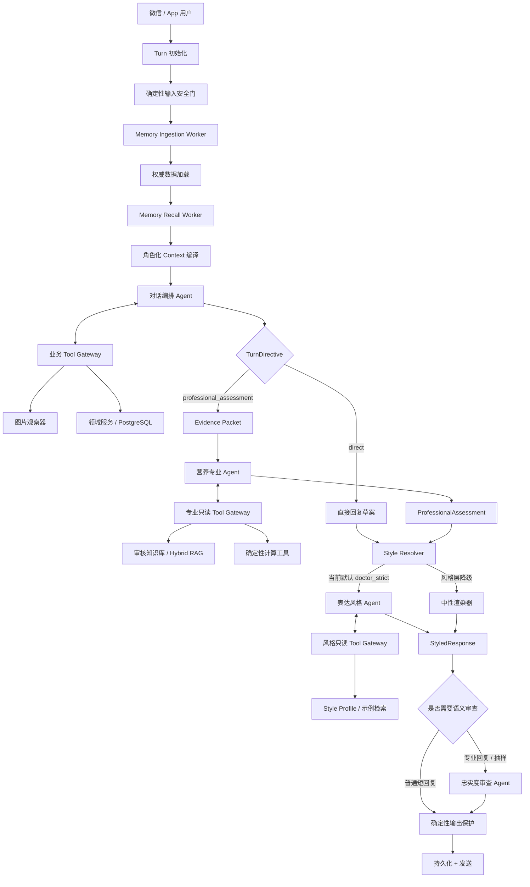

# SlimGuard 多 Agent 架构与编排设计

> 版本：v1.1
> 日期：2026-09-04
> 状态：目标架构与实施基线
> 适用范围：减脂记录、饮食与进度专业分析、医生风格表达、记忆、图片理解和安全审查

v1.1 针对架构复审做了四项关键修正：营养 Agent 增加独立专业工具与 RAG；医生语气抽象为通用
Response Style Agent；记忆摄取重新定义为集中治理的 Memory Plane Worker；补全 Agent Invocation、
Artifact、Context Supplement、精确状态机和 Coordinator 伪代码。

## 1. 先给结论

SlimGuard 不应该改造成一群 Agent 自由讨论、互相转交控制权的系统，也不应该推翻现在的
Harness。推荐架构是：

**保留现有 Harness 作为唯一控制平面，在一个 Turn 内采用“模型决策 + 代码状态机”的有类型
Supervisor Workflow；把专业分析和表达风格拆成两个互相隔离、各自可以按权限调用工具的 Agent。**

运行时的核心链路是：

```text
用户消息
  → 输入安全门
  → Memory Plane：摄取用户新事实 + 召回当前相关记忆
  → 对话编排 Agent（现有 Core Agent 演进而来）
       ↔ 业务工具 / 图片观察工具
  → [按需] 营养专业 Agent
       ↔ 专业知识库 / RAG / 计算工具（只读）
  → [按需] 表达风格 Agent
       ↔ 风格 Profile / 脱敏示例检索（只读）
  → [专业回复必经] 忠实度审查 Agent
  → 确定性事实与安全校验
  → 用户回复
```

这里最重要的边界是：

- 营养专业 Agent 决定“说什么”，可以查询经过审核的专业知识、RAG 和确定性计算工具，但不能修改
  用户数据，也不负责模仿任何人的语气；
- 表达风格 Agent 决定“怎么说”，医生语气只是当前默认 Style Profile；未来可以增加温和陪伴、简洁
  数据型等 Profile，而不用新增一套 Agent；
- 对话编排 Agent 理解用户、调用工具和决定是否需要专业分析，但不能绕过安全门；
- Memory Plane 统一处理用户长期记忆的写入和召回；其他 Agent 可以读取被授权的记忆切片，但不能
  各自随意写同一份用户记忆；
- Harness 掌握真实状态、执行顺序、权限、预算、重试、Trace 和最终放行；
- PostgreSQL 中的领域记录仍然是事实源，Mem0 仍然只是语义召回索引，不成为事实源；
- 医生聊天样本是一个独立、版本化的 Style Asset，不是用户记忆，也不是营养知识库。

这会影响现有 Harness 的内部编排能力，但不会破坏它的架构原则。更准确地说，现有 Harness
会从“单 Core Agent 循环”升级为“一个父 Harness 管理多个有边界的 Agent 节点”。Thread、Turn、
Item、Tool Gateway、Memory、数据库、渠道、部署和 Trace 都可以继续复用。

## 2. 为什么要这样拆

### 2.1 用户真正要求的是两个不同问题

用户上传一顿饭后，系统实际需要解决两个完全不同的问题：

1. 根据图片观察、用户说明、当天记录、目标和健康背景，形成可靠的饮食建议；
2. 用接近指定医生的表达节奏和严格程度，把这份建议说出来。

第一个问题属于专业判断，第二个问题属于风格转换。二者放在一个 Prompt 里会产生几个直接风险：

- 模型容易把医生样本中的旧饮食判断当成当前专业知识；
- 为了模仿语气，模型可能把“不确定”改成肯定，把建议改成命令；
- 修改专业 Prompt 时会意外改变语气，修改语气 Prompt 时又可能改变结论；
- 无法独立评估到底是识图错、分析错，还是表达错；
- 医生聊天中其他群友的健康信息可能被不必要地带入用户上下文。

把“内容”和“表达”拆开后，每一层都可以单独测试、版本化和回退。

### 2.2 为什么不用完全自由的多 Agent

减脂助手的任务范围相对明确，而且包含健康信息、数据库写入和用户隐私。自由协作式 Multi-Agent
会引入不必要的控制转移、上下文扩散、重复调用、延迟和难以复现的问题。

本项目更适合混合编排：

- **语义决策交给模型**：理解自然语言、图片指代、是否需要专业点评、点评重点和沟通行为；
- **工作流交给代码**：Agent 的调用顺序、输入裁剪、Schema 校验、权限、最大重试次数和安全放行；
- **副作用交给工具网关**：任何写库动作仍经过现有 Schema、授权、幂等和事务；
- **真实性由证据链保证**：专业结论引用 Evidence ID，语气层不能凭空创造事实。

这与 OpenAI Agents SDK 当前总结的两类主流方式一致：LLM 可以负责动态决策，代码编排则提供更
确定的成本、延迟和性能；两者可以组合使用。它也符合 Anthropic 对生产 Agent 的建议：优先使用
简单、可组合的模式，只在能带来可测价值时增加 Agent 复杂度。

### 2.3 这仍然是 Model-first

Model-first 不等于“把一切都交给一个模型”，也不等于“代码不能有流程”。本设计中：

- 不用关键词表判断“这是饮食还是体重”；
- 不用正则穷举用户所有表达；
- 不用封闭意图分类器替代语义理解；
- 由对话编排 Agent 基于当前消息、上下文和工具观察，产生有类型的下一步决策；
- 代码只验证模型决策是否符合契约，并执行已定义的安全工作流。

规则继续只负责系统可以确定的事情，例如字段类型、单位换算、记录权限、事实来源、引用是否存在、
工具是否成功、风险分级后的硬边界和调用预算。这正是“开放理解，有限副作用”。

## 3. 术语：什么才算一个 Agent

为了避免把每个函数都叫 Agent，本项目采用以下定义：

一个组件只有同时具备“独立目标、独立指令、独立模型调用上下文、明确输入输出契约”，才叫 Agent。
它不一定要有工具，也不一定要拥有多轮自治循环。

按这个定义，系统组件分为三类：

| 类别 | 组件 | 是否是 Agent | 原因 |
|---|---|---:|---|
| 控制与对话 | 对话编排 Agent | 是 | 理解开放输入、选择工具和响应路径 |
| 专业能力 | 营养专业 Agent | 是 | 独立完成证据约束下的专业评估 |
| 表达能力 | 表达风格 Agent | 是 | 根据可替换 Style Profile 完成受约束的风格转换 |
| 质量控制 | 忠实度审查 Agent | 是 | 对语义漂移和越界做模型级判断 |
| 记忆平面 | 记忆摄取 Worker、记忆召回 Worker | Agentic Worker，且已存在 | 使用模型理解，但由 Harness 固定调度，不拥有会话控制权 |
| 感知 | 图片观察器 | 暂不称为 Agent | 当前是一次受控视觉模型调用，没有自主目标或编排权 |
| 运行底座 | Harness、Tool Gateway、Context Compiler | 否 | 它们是确定性控制平面 |
| 事实与动作 | Weight/Meal/Exercise/Memory 工具 | 否 | 它们是有边界的能力，不自行决策 |

这里特意不新增“体重 Agent”“饮食记录 Agent”“运动 Agent”。这些任务目前由一个对话编排 Agent
加上定义清楚的领域工具就能可靠完成。过早拆成更多 Agent 只会增加调用次数和状态同步成本。

### 3.1 Agent、Agentic Worker 与 Tool 的区别

上一版把记忆摄取直接列成与营养专家同级的业务 Agent，容易造成误解。更准确的分类是：

- **业务 Agent**：对话编排、营养专业、表达风格、忠实度审查。它们处理一项业务认知任务；
- **Agentic Worker**：记忆摄取和记忆召回。它们使用模型做语义理解，但由 Harness 在固定生命周期
  节点调用，不决定整个 Turn 接下来做什么；
- **Tool**：数据库读写、图片观察、知识检索、计算器等受控能力；
- **Harness Node**：安全门、Evidence Builder、Schema Validator、Style Resolver 等确定性节点。

这种命名不改变现有实现，只把职责说得更准确。是否叫 Agent 不是重点，重点是每个组件能看到什么、
能调用什么工具、能否产生副作用，以及谁负责调度它。

### 3.2 “所有 Agent 都有记忆”到底是什么意思

这里必须区分四种经常被统称为“记忆”的东西：

| 类型 | 示例 | 保存位置 | 谁写入 |
|---|---|---|---|
| 用户长期记忆 | 身高、目标、偏好、用户自述限制 | PostgreSQL；Mem0 只建语义索引 | Memory Ingestion Worker 经 Memory Tool |
| 领域事实 | 体重、饮食、运动、体脂 | PostgreSQL 领域表 | 对话编排 Agent 经领域 Tool |
| Turn/情节记忆 | 专业结论、Style 请求、审查结果、上次给过的建议 | append-only Agent Items / Artifacts；可选语义索引 | Harness 自动持久化 |
| Agent 配置资产 | 专业知识版本、Style Profile、Prompt | 版本化配置和资产表 | 离线发布流程 |

所以“每个 Agent 都应该用到记忆”是对的：每个 Agent 都可以由 Context Builder 获得完成当前任务所需
的记忆切片。但“每个 Agent 都应该自己摄取并写长期记忆”并不安全，也没有必要。营养 Agent 的结论、
表达 Agent 的改写都属于模型生成内容，不是新的用户事实；如果它们都能写长期记忆，同一句用户原话
可能被重复、冲突地保存，甚至把模型推断写成用户自述。

正确模型是：**共享记忆、集中治理、按角色读取、单一写入通道。** 所有业务 Agent 都能使用记忆，
但用户长期记忆只由 Memory Plane 根据可验证的用户原话统一摄取。业务 Agent 的中间结果则由 Harness
自动保存为 Turn Artifact，不需要它们再“记一次”。

如果需要跨较长时间回答“你上次建议我怎么调整”，Harness 可以在 Turn 完成时从已经验证的
`ProfessionalAssessment + final response` 生成 `CoachingEpisode` Artifact，并建立单独语义索引。它必须
标记为 `system_generated`、带来源 Turn 和有效期，召回时不能覆盖用户原话或数据库事实。这属于情节
记忆，不应伪装成用户 Profile Memory。

## 4. 当前架构基线

当前仓库已经实现了正确的 Harness 基础：

- `AgentRuntime` 是渠道无关的稳定入口；
- `HarnessTurnRunner` 初始化持久化 Turn，执行安全检查、记忆摄取、权威上下文加载、记忆召回和
  Context 编译；
- `HarnessLoop` 执行有上限的 model → tool → observation 循环；
- `ToolGateway` 负责 Schema、权限、幂等、确认和执行；
- `AgentManifest` 冻结模型、Prompt、工具、Context、Memory 和 Safety 版本；
- `agent_threads / agent_turns / agent_items` 保存可重建的运行历史；
- `interaction_traces / trace_spans` 保存面向管理后台的完整输出链路；
- `ModelFirstMemoryIngestor` 和 `ModelFirstMemoryRecaller` 已经把记忆做成独立模型阶段；
- PostgreSQL 领域表是体重、体脂、饮食、运动和用户资料的事实源；
- Mem0 只参与候选记忆语义召回，失败时仍可退化到 PostgreSQL；
- `SlimGuardOutputGuard` 已经承担高风险健康输入和错误写入成功声明的硬保护。

当前主要问题不是 Harness 方向错误，而是 `SLIM_GUARD_HARNESS_PROMPT` 同时承担了：

- 用户意图理解；
- 工具使用；
- 记录反馈；
- 营养建议；
- 回复风格；
- 医疗边界；
- 最终文本生成。

随着“通用营养专业能力”和“可替换表达风格”加入，这个单 Prompt 的职责会继续膨胀。因此需要拆分
模型职责，但保留当前 Harness 的控制权。

## 5. 目标架构：Typed Supervisor Workflow

本方案称为 **Typed Supervisor Workflow（有类型的监督者工作流）**。

“Supervisor”表示对话编排 Agent 负责理解和选择；“Typed”表示 Agent 之间不传随意自然语言，而是
传经过 Pydantic/JSON Schema 验证的对象；“Workflow”表示最终执行图由应用代码控制，不让 Agent
任意创建 Agent 或无限对话。



### 5.1 为什么不是 Handoff 模式

行业里常见的 Agent Handoff 是：入口 Agent 把控制权完整交给某个专家，后续由专家直接面对用户。
这不适合 SlimGuard 的主要链路，原因是：

- 营养专业 Agent 不应该获得用户全部聊天历史和全部工具；
- 表达风格 Agent 不应该成为新的会话所有者；
- 数据库写入、待确认动作和跨轮记忆必须继续由同一个 Harness 管理；
- 最终回复需要统一通过事实与安全保护。

因此这里采用更接近 “agents as tools / manager-style orchestration” 的方式：专家是父 Harness 中的
有边界节点，完成任务后把结构化结果交回控制平面，不接管 Thread。

真正的 Handoff 仍保留给未来需要长期接管会话的场景，例如人工医生接管或客服接管，而不是用在
每次营养分析中。

### 5.2 谁在编排：模型和代码各负责哪一半

“有类型的监督者工作流”不是一句架构口号，而是两层控制共同工作：

#### 模型控制层

对话编排 Agent 在自己的 Tool Loop 中负责开放语义决策：

- 用户在当前上下文里真正要做什么；
- 是否需要观察图片、查询或写入业务状态；
- 哪些已有事实与当前问题有关；
- 是否需要调用营养专业能力；
- 应该进行确认、纠正、提醒、解释还是普通交谈；
- 当前任务缺少什么信息。

#### 程序控制层

`AgentWorkflowCoordinator` 不重新理解用户语义，只执行可验证的状态转换：

- 哪个节点可以从哪个节点进入；
- 给下一个 Agent 哪些输入字段和工具权限；
- 结构化输出是否合法；
- Evidence、Claim 和 Knowledge Citation 是否真实存在；
- 每个节点最多调用几次、能否重试、何时降级；
- 哪些风险路径禁止风格化；
- 最终何时可以持久化和发送。

换句话说，模型说“这个问题需要营养分析”，代码负责安全地启动营养 Agent；代码不会用“午饭、米饭、
体重”等关键词自己判断需要营养分析。

### 5.3 精确状态机

父 Harness 中每个 Turn 按下面的有限状态机执行：

```text
INITIALIZED
  ↓
INPUT_GUARDED
  ├─ blocked ─────────────────────────────────────→ SAFETY_RENDERED
  └─ allowed
       ↓
MEMORY_INGESTED
  ↓
CONTEXT_READY
  ↓
ORCHESTRATOR_RUNNING
  ├─ tool_calls ─→ BUSINESS_TOOL_RUNNING ─→ ORCHESTRATOR_RUNNING
  ├─ needs_user_input ────────────────────────────→ RESPONSE_RENDERING
  ├─ direct ──────────────────────────────────────→ RESPONSE_RENDERING
  └─ professional_assessment
       ↓
EVIDENCE_READY
  ↓
EXPERT_RUNNING
  ├─ knowledge_tool_calls → EXPERT_TOOL_RUNNING → EXPERT_RUNNING
  ├─ insufficient_evidence ───────────────────────→ RESPONSE_RENDERING
  └─ assessment_ready
       ↓
STYLE_RESOLVED
  ↓
STYLE_RUNNING
  ├─ style_example_calls → STYLE_TOOL_RUNNING → STYLE_RUNNING
  └─ rendered
       ↓
REVIEW_RUNNING
  ├─ pass ────────────────────────────────────────→ OUTPUT_GUARDED
  ├─ repair 且 repair_count=0 ────────────────────→ STYLE_RUNNING
  └─ reject / second_failure ─────────────────────→ NEUTRAL_FALLBACK
                                                       ↓
OUTPUT_GUARDED ←───────────────────────────────────────┘
  ├─ blocked/replaced → OUTPUT_GUARDED
  └─ passed
       ↓
COMPLETED → DELIVERY
```

这些状态由代码持久化。任何进程重启后，Coordinator 都能根据最后一个已完成 Artifact 和状态继续，
而不是要求模型回忆刚才运行到哪里。

### 5.4 哪些边由模型选择，哪些边由代码固定

| 状态转换 | 决策者 | 理由 |
|---|---|---|
| 是否调用业务工具、调用哪个工具 | 对话编排 Agent | 需要自然语言和上下文理解 |
| 是否进入专业分析 | 对话编排 Agent，以 `TurnDirective` 表达 | 需要理解用户是否只打卡还是希望获得分析 |
| 营养 Agent 是否查询知识、查什么 | 营养专业 Agent | 需要根据问题判断知识缺口 |
| 采用哪个 Style Profile | 当前由服务端配置固定；未来可由用户偏好决定 | 这是产品配置，不应由模型猜测 |
| 检索哪些风格示例 | 表达风格 Agent提出查询，Style Tool执行 | 需要理解当前沟通行为，但检索范围必须受限 |
| 是否审查 | 代码策略 | 高风险路径不能由生成模型自己跳过审查 |
| 是否重试、重试几次、何时降级 | 代码策略 | 控制成本和避免无限循环 |
| 数据库写入和发送 | Tool/Delivery Policy | 必须确定性授权、幂等和审计 |

当前阶段 Style Profile 固定为 `doctor_strict_v1`。虽然代码结构支持多个 Profile，但不在 App 暴露选择
入口；以后只需增加 Profile 和产品配置，不需要复制一个“温柔 Agent”或“数据型 Agent”。

## 6. Agent 清单与职责

### 6.1 Agent A：对话编排 Agent（Conversation Orchestrator）

这是现有 Core Agent 的演进版本，也是唯一可以在主循环中选择业务工具的 Agent。

#### 目标

- 理解用户当前真正想完成什么；
- 结合 Working Memory 消解“刚才那个”“还是上次的”等指代；
- 调用图片观察和领域工具，获取或改变权威状态；
- 判断当前回复是否需要专业营养分析；
- 形成结构化的 `TurnDirective`，而不是自己包办最终风格化长回复。

#### 可以访问

- 当前用户消息和图片引用；
- 当前 Turn 的 Working Memory；
- 经过 Recall 选择的少量长期记忆；
- 权威体重、体脂、饮食、运动、目标、限制和提醒状态；
- 现有 Tool Gateway 暴露的全部本轮授权工具。

#### 不可以做

- 不从医生聊天样本学习营养知识；
- 不直接访问数据库或任意 HTTP；
- 不把视觉猜测当成确定事实；
- 不创建其他任意 Agent；
- 不修改营养专业 Agent 的结论；
- 不输出或记录隐藏思维链。

#### 输出

完成工具循环后，输出一个 `TurnDirective`：

```json
{
  "schema_version": "1",
  "response_path": "direct | professional_assessment | safety",
  "interaction_kind": "checkin | correction | question | review | reminder | chat",
  "user_need_summary": "用户当前需要什么",
  "response_brief": "最终回答必须覆盖的内容",
  "evidence_refs": ["item-or-record-ref"],
  "professional_question": "需要专业 Agent 回答的问题；不需要时为 null",
  "voice_act": "acknowledge | correct | remind | encourage | explain | ask",
  "requested_detail": "short | normal | detailed"
}
```

`interaction_kind` 和 `voice_act` 是开放语义理解后的结构化结果，不是由关键词规则产生。代码仅验证
枚举值、引用是否存在以及所选路径是否具备所需数据。

### 6.2 Agent B：营养专业 Agent（Nutrition Expert）

这是新增的独立专业模块。它是“用户数据只读、专业工具可调用、证据约束、结构化输出”的领域专家，
不是用户聊天机器人。

#### 目标

基于当前用户的真实证据，对饮食、打卡完成度、体重趋势、体脂趋势和一般减脂行为给出专业、保守、
可执行的分析。

#### 输入

只接收 Harness 构建的 `EvidencePacket`，不接收整个聊天历史：

- 用户本轮原话；
- 图片观察结果及置信度；
- 本轮成功或失败的记录动作；
- 当前相关领域记录与趋势；
- 用户明确保存的目标；
- 用户自述的饮食限制、运动限制和健康背景；
- 对话编排 Agent 提出的专业问题；
- 每个事实的来源、时间、权威等级和 Evidence ID。

#### 为什么它应该有工具

用户说得对：专业 Agent 如果只能依靠 Prompt 中固化的知识，会很快过时，也无法给出可审计的知识来源。
它应该运行自己的 bounded model → tool → observation loop，按问题需要访问专业知识，而不是把整个知识
库预先塞进上下文。

但它和对话编排 Agent 使用的不是同一套工具权限。建议建立独立的 `NutritionToolRegistry`：

| 工具 | 用途 | 是否有副作用 |
|---|---|---:|
| `search_nutrition_knowledge` | Hybrid Search 检索审核过的指南和内部知识 | 否 |
| `get_nutrition_source` | 按 source/chunk ID 读取必要原文、版本和适用范围 | 否 |
| `calculate_bmi` | 根据权威身高体重做确定性计算 | 否 |
| `calculate_weight_trend` | 对传入的权威时间序列做确定性统计 | 否 |
| `compare_checkin_adherence` | 对已给记录计算打卡完成度 | 否 |
| `flag_knowledge_conflict` | 把不同指南或适用人群冲突写入本 Turn Artifact | 仅 Turn 内 |

第一版至少实现前两个 RAG 工具和必要的确定性计算工具。未来可增加新的专业只读工具，但必须进入
Graph Manifest 和权限白名单。

#### 专业 RAG 的设计

RAG 不是“搜索一段文本就信了”，而是一个有治理的知识平面：

```text
权威指南 / 经审核内部内容
  → 文档解析与分块
  → 保存来源、发布日期、版本、适用人群、审核状态
  → 关键词 + 向量 Hybrid Retrieval
  → Metadata Filter
  → Rerank
  → 返回 KnowledgeEvidence
  → 营养专业 Agent形成带 Citation 的结论
```

`KnowledgeEvidence` 至少包含：

```json
{
  "knowledge_id": "knowledge-chunk-id",
  "source_id": "source-id",
  "title": "资料标题",
  "publisher": "发布机构",
  "version": "资料版本",
  "published_at": "日期或 null",
  "review_status": "approved",
  "applicability": ["适用条件"],
  "content": "必要的短片段",
  "retrieval_score": 0.87
}
```

向量相似度只负责找候选，不能代表专业正确性。Agent 使用前必须读取来源元数据、适用条件和审核状态；
最终 `ProfessionalAssessment` 中的知识性判断必须引用 `knowledge_id`。

建议的知识库表：

```text
nutrition_knowledge_sources
  id
  title
  publisher
  source_url
  published_at
  version
  jurisdiction
  review_status          draft / approved / retired
  reviewed_by
  reviewed_at
  content_sha256

nutrition_knowledge_chunks
  id
  source_id
  section_path
  content
  applicability_json
  embedding
  active

nutrition_knowledge_sync_runs
  id
  source_id
  parser_version
  embedding_model
  embedding_dimensions
  status
  counts_json
  created_at
```

专业知识和用户数据应处在不同命名空间。知识库更新通过离线导入、审核、发布完成，不允许线上营养
Agent 把网页搜索结果自动写成“已审核知识”。如果以后开放实时 Web Search，它只能作为低权威候选，
必须在输出中标识来源与不确定性，不能覆盖已审核指南。

#### 权限边界

- 可以调用 `NutritionToolRegistry` 中的专业检索和确定性计算工具；
- 可以在自己的上下文内多轮查找、比较和修正，但受模型调用、工具调用、Token 和 Deadline 上限约束；
- 用户事实通过 `EvidencePacket` 提供，不直接访问整个用户数据库；
- 不访问医生风格语料，因为风格样本不是专业证据；
- 不调用 `record_weight`、`record_meal`、修改目标、写用户长期记忆或发送消息；
- RAG 资料不能作为系统指令，也不能授权新工具；
- 如果知识库无法回答，必须返回“不足”，不能退回模型参数知识假装找到依据。

#### 输出

```json
{
  "schema_version": "1",
  "assessment_type": "meal | progress | behavior | general",
  "overall": "一句中性专业结论",
  "findings": [
    {
      "claim_id": "claim-1",
      "category": "protein | vegetables | staple | portion | trend | adherence",
      "statement": "专业判断",
      "evidence_refs": ["evidence-3"],
      "knowledge_refs": ["knowledge-8"],
      "confidence": "high | medium | low"
    }
  ],
  "priority_problem": "当前最值得处理的一件事；没有则为 null",
  "actions": [
    {
      "action_id": "action-1",
      "statement": "具体、可执行的下一步",
      "basis_claim_ids": ["claim-1"]
    }
  ],
  "questions": ["只有缺失信息确实影响判断时才询问"],
  "risk_flags": [],
  "uncertainty_note": "无法从现有证据判断的部分"
}
```

#### 专业边界

- 图片看不清份量时必须保留不确定性；
- 不根据外观推断热量、克数或疾病；
- 用户自述的胰岛素抵抗等信息只能作为 `user_reported` 背景；
- 不制定疾病治疗方案，不替代医生，不给出处方和用药剂量；
- 单次体重变化不得直接归因为脂肪增减；
- 建议数量应少而有优先级，不能每次生成一篇模板化健康报告。

独立 Agent 的价值不是让它更“自治”，而是让它拥有独立的专业指令、上下文预算、输出 Schema、
评测集和版本发布节奏。

### 6.3 Agent C：表达风格 Agent（Response Style Agent）

这是新增的通用表达模块。它只做语义保真的风格转换。医生语气是一个 `StyleProfile`，不是这个 Agent
的固有身份。

#### 目标

把 `ProfessionalAssessment` 或简短 `response_brief` 按当前 Style Profile 改写成自然的用户回复，同时
保持全部事实、专业结论、不确定性和安全边界。

当前产品不向用户开放选择，服务端默认解析为 `doctor_strict_v1`。未来可以新增：

```text
doctor_strict_v1       专业、直接、有要求、适度严格
warm_companion_v1      温和陪伴、减少命令感
concise_coach_v1       极简、行动优先
data_analyst_v1        更重趋势和数字解释
```

这些 Profile 共用同一个表达风格 Agent、同一套输入输出 Schema 和审查流程。增加风格不应复制 Agent
代码，只增加版本化 Style Asset、示例和 Eval。

#### 输入

- 已经确定的事实和专业结论；
- 当前沟通行为 `voice_act`；
- 用户偏好的篇幅；
- 版本化的 `StyleProfile`；
- 从同类沟通场景召回的 2～5 条已脱敏风格示例；
- 不得改变的 claim/action/risk/uncertainty 列表。

#### 权限

- 可以调用严格只读的 Style Tool，按 `style_profile_version + communication_act` 检索审核后的脱敏示例；
- 不访问用户数据库、Mem0 或原始群聊；
- 不重新识图；
- 不重新做营养判断；
- 不新增诊断、数字、食物、目标和行为要求；
- 不移除不确定性或风险提醒。

第一版 Style Tool 只有两个：

| 工具 | 输入 | 输出 |
|---|---|---|
| `get_style_profile` | 已由 Harness 解析出的固定 Profile Version | 结构化 Style Spec 与禁止项 |
| `search_style_examples` | Profile Version、communication act、场景摘要、数量上限 | 2～5 条审核后的脱敏示例 |

工具拒绝模型切换到未授权 Profile，也不接受任意 SQL、任意向量 namespace 或原始聊天文件路径。

#### 可以改变

- 句子长短和停顿；
- 先指出问题还是先肯定；
- 严格程度和直接程度；
- 常用转折、提醒方式和收尾节奏；
- 在不影响含义时使用的口语词。

#### 不可以改变

- 事实值、时间、单位和记录状态；
- 专业判断、置信度和适用条件；
- 建议强度和建议数量；
- 风险级别、就医边界和必要问题；
- “已记录/未记录/写入失败”等事实。

#### 输出

```json
{
  "schema_version": "1",
  "text": "最终候选文本",
  "used_claim_ids": ["claim-1"],
  "used_action_ids": ["action-1"],
  "preserved_risk_flags": [],
  "style_profile_version": "doctor_strict_v1"
}
```

产品对外应该说明这是“采用某种沟通风格的 AI 减脂助手”，不能冒充该医生本人，也不要复制具有
明显身份识别性的自称、口头签名或私人信息。以后使用其他 Profile 时，同样需要清楚标识这是 AI 助手
的表达配置，而不冒充某个真人或专业身份。

### 6.4 Agent D：忠实度审查 Agent（Response Reviewer）

纯确定性规则很难判断一句改写是否偷偷增强了结论。例如专业层说“这张图看起来蔬菜偏少”，语气层
可能改成“你今天根本没吃蔬菜”。字段校验发现不了这种语义漂移，所以需要一个小而专门的模型审查。

#### 目标

只判断候选回复是否忠实于上游证据和专业结论，不重新生成专业建议。

#### 输入

- `TurnDirective`；
- `ProfessionalAssessment`（如有）；
- `StyledResponse`；
- 允许使用的事实摘要；
- 风险策略级别。

#### 输出

```json
{
  "schema_version": "1",
  "verdict": "pass | repair | reject",
  "issues": [
    {
      "type": "unsupported_claim | changed_uncertainty | medical_overreach | abusive_tone | omitted_required_content",
      "excerpt": "有问题的候选文本片段",
      "explanation": "可展示、非思维链的简短原因"
    }
  ]
}
```

#### 调用策略

- 专业营养回复：第一阶段 100% 调用；
- 医疗/健康风险相关回复：100% 调用；
- 普通打卡确认和闲聊：可跳过，依靠确定性 Output Guard；
- 稳定后可对低风险专业回复改为抽样审查，但 Shadow Eval 仍持续运行。

当结果为 `repair` 时，只允许表达风格 Agent 修复一次；第二次仍不通过则使用中性渲染器直接根据
结构化结论生成回复。`reject` 立即走安全降级，不进入循环。这样可以避免 evaluator-optimizer 无限
往返。

### 6.5 Memory Plane Worker E：记忆摄取（Ingestion）

保留现有 `ModelFirstMemoryIngestor`。它继续在用户回复前理解用户明确表达的长期事实，并通过受控
Memory Tool 与 PostgreSQL 当前值对照、创建或更新。

#### 它在什么时候工作

- 每个包含用户文字的 `user_message` Turn，在安全预检之后、业务编排之前运行一次；
- 没有用户原话的 Scheduler Turn 不运行；
- 图片只有视觉模型推断、用户没有明确文字陈述时，不产生长期记忆；
- 紧急风险被硬拦截时，不执行普通记忆写入；
- 同一个 Turn 不因后续启动了三个 Specialist 就重复摄取三次；
- 用户在后续新 Turn 更正事实时，再运行一次并更新权威记忆。

之所以放在业务编排之前，是为了让当前 Turn 后续所有 Agent 都看到刚更新后的权威值。例如用户说
“我刚量了一下，身高应该是 178”，摄取 Worker 先把 179 更新为 178，后面的营养 Agent拿到的就是
178，而不是旧值。

#### 为什么不让所有 Agent 各自摄取

所有 Agent 都可以读取自己被授权的记忆切片，但长期记忆写入集中在这里，原因有四个：

1. **唯一证据源**：长期记忆必须来自用户原话的 `evidence_ref`，不能来自营养结论或风格改写；
2. **避免重复与竞态**：多个 Agent 同时把一个事实写入会造成重复、顺序冲突和不同规范化结果；
3. **职责隔离**：专业 Agent负责分析，Style Agent负责表达，不应顺便改变用户档案；
4. **一致视图**：摄取后统一回读 PostgreSQL，所有后续 Agent 使用同一版本的事实快照。

如果任何业务 Agent 发现“当前任务可能需要一个尚未提供的用户事实”，它只能在自己的结构化结果中
返回 `missing_information` 或 `memory_read_request`。Coordinator 可以补充一次已存在的相关记忆，或者
让最终回复询问用户；它不能让该 Agent 把推测直接写成记忆。

当前 Style Profile 是产品默认配置，不需要写进每个用户的记忆。等未来真正开放用户选择后，记忆摄取
才扩展下面的用户偏好：

```text
coaching_style_profile = <stable-style-alias>
coaching_strictness = gentle | balanced | strict
```

它不能把医生聊天样本、营养分析结果或一次点评写成用户长期记忆。

### 6.6 Memory Plane Worker F：记忆召回（Recall）

保留现有 `ModelFirstMemoryRecaller` 和 Mem0 语义召回。它继续根据当前语义选择少量用户记忆，并由
PostgreSQL 回读权威值。

需要强调两套检索完全分开：

| 检索对象 | 目的 | 事实源 | 命名空间 |
|---|---|---|---|
| 用户记忆 | 找到当前用户相关资料 | PostgreSQL `user_memory_facts` | `user:<user_id>` |
| 风格示例 | 找到当前沟通行为的表达范例 | PostgreSQL `style_examples` | `style:<profile_version>` |

不能为了省事把医生语料放进某个用户的 Mem0 Memory 中，否则会破坏用户隔离、删除语义和事实权威。

#### 一次 Recall，还是每个 Agent 各 Recall 一次

采用“两级 Recall”：

1. **Turn-level Recall**：业务编排前运行一次，根据用户当前消息召回初始相关记忆；
2. **Agent-level Context Projection**：每个 Specialist 启动前，由 Coordinator 从这份权威快照和其
   `memory_read_request` 中投影最小必要字段。

如果营养 Agent在分析中发现确实需要另一类已存资料，可以发出一次受限的 `request_more_context`，由
Coordinator 调用 Memory Recall Worker 补召回；这仍然是通过 Memory Plane 读取，而不是营养 Agent
直接连接 Mem0 或数据库。每个 Specialist 默认最多补取一次，避免 Agent 因不断扩大上下文而失控。

### 6.7 图片观察器为什么暂不升级为 Agent

当前 `inspect_image` 的任务是回答一个窄问题：图片里可靠观察到了什么、置信度如何、是否需要用户
确认。它不需要自行决定业务目标，也不应写入记录。因此保留为模型支持的 Tool 更清晰。

未来只有在图片理解需要多步放大、OCR、多个视觉工具交叉验证时，才值得把它升级为独立 Visual
Analyst Agent。是否升级应由评测数据决定，而不是为了让架构看起来更“多 Agent”。

## 7. 一次 Turn 到底怎样编排

### 阶段 0：初始化与安全预检

1. 渠道适配器把微信或 App 输入标准化为 `AgentRuntimeRequest`；
2. `TurnInitializer` 创建或复用用户 Thread，并创建不可变 Agent Version 对应的 Turn；
3. 原始文字、图片引用作为 append-only Item 保存；
4. 输入安全门识别少量必须硬处理的高后果场景；
5. 紧急风险直接走安全答复，不让表达风格层把安全信息“风格化”。

### 阶段 1：Memory Plane 摄取

1. 记忆摄取 Worker 读取当前用户原话和有限的历史用户证据；
2. 它用模型理解可能的长期事实；
3. 写入仍通过 Memory Tool，工具验证 `evidence_ref` 和原文摘录；
4. PostgreSQL 返回 created/updated/unchanged 回执；
5. 后续上下文重新读取数据库，避免模型把自己提议的值当成已保存事实。

此阶段必须先于召回，因为用户本轮可能刚刚把身高从 179 更新为 178。

### 阶段 2：权威上下文与 Memory Plane 召回

1. 从 PostgreSQL 加载与用户有关的权威领域状态；
2. 记忆召回 Worker 根据当前消息，在候选记忆中选择少量相关项；
3. 如果 Mem0 可用，用语义检索缩小候选；如果不可用，回退数据库候选；
4. 所有选中项都必须用 PostgreSQL 的 active record 回读；
5. Context Compiler 按角色生成最小上下文，而不是把整份状态复制给所有 Agent。

### 阶段 3：对话编排与工具循环

1. 对话编排 Agent 获取当前输入、Working Memory、相关长期记忆和权威状态；
2. 模型按语义决定是否调用图片观察、记录、查询、纠错、提醒或记忆工具；
3. Harness 对每个工具调用执行 Schema、权限、幂等和业务不变量校验；
4. 工具结果作为 observation 回到同一个 Agent；
5. 工具失败时允许模型基于真实错误调整一次，不得假装成功；
6. 当动作完成后，Agent 产出 `TurnDirective`。

为了兼容当前智谱接口，第一阶段不依赖 provider 端的“强制 Function Call”。推荐增加通用
`response_format=json_object` 支持，用 JSON 模式生成 `TurnDirective`，随后由 Pydantic 校验；失败时只做
一次 Schema Repair。智谱当前官方文档支持 JSON 输出，但 Function Calling 的 `tool_choice` 仍以
`auto` 为主，因此必须保留本地严格校验，不能把供应商响应视为天然可信。

### 阶段 4：程序化选择响应路径

Harness 根据已经验证的 `TurnDirective` 选择路径：

- `direct`：记录确认、资料查询、简单纠错、普通聊天等，不启动营养专业 Agent；
- `professional_assessment`：饮食质量、趋势、阶段复盘、行为改进等，构造 Evidence Packet；
- `safety`：进入固定的安全流程。

这里的语义决定来自模型，代码分支只执行模型已经声明的有类型选择。代码还要做一致性补充校验，
例如 `professional_assessment` 必须包含专业问题和有效证据引用，`safety` 不能进入普通风格渲染层。

### 阶段 5：专业分析

只在需要时调用营养专业 Agent：

1. Harness 根据 `evidence_refs` 从可信存储构建 Evidence Packet；
2. 给营养 Agent 注入独立的 `NutritionToolRegistry` 和只读授权；
3. 专业 Agent 根据问题自行决定是否检索知识、读取来源或调用确定性计算器；
4. 每次专业 Tool Result 作为 observation 返回同一个营养 Agent；
5. 达到结论或预算上限后，专业 Agent 返回 `ProfessionalAssessment`；
6. Pydantic 验证 Schema；
7. 程序检查所有 `evidence_refs`、`knowledge_refs` 和 `basis_claim_ids` 是否存在；
8. 任何无来源 Claim 都不允许进入下一层。

### 阶段 6：通用表达风格渲染

1. `StyleResolver` 读取服务端默认配置；当前固定选择 `doctor_strict_v1`，以后才允许用户覆盖；
2. 使用 `voice_act` 和语义相似度，在当前 Style Profile 版本中召回 2～5 个脱敏示例；
3. 表达风格 Agent 只接收必要结论和样本，不接收原始群聊全集；
4. 生成 `StyledResponse`；
5. 程序先检查 Claim/Action/Risk ID 完整性。

默认医生风格不是每轮都要“严厉”。打卡确认可以很短，明显偏离目标时可以直接，连续执行良好时
可以克制地肯定。具体沟通行为由对话编排 Agent 根据语义决定，Style Profile 决定表达方式。

### 阶段 7：审查、降级和发送

1. 专业回复进入忠实度审查 Agent；
2. `pass` 后进入确定性 Output Guard；
3. `repair` 最多回到表达风格 Agent 一次；
4. `reject`、二次失败或超时，使用中性渲染器；
5. Output Guard 检查高风险内容、错误成功声明和必要安全边界；
6. 最终文本作为 `agent_message` 保存；
7. 对需要跨轮承接的已验证专业分析，Harness 可生成带来源和 TTL 的 `CoachingEpisode`；
8. 渠道层发送，并把投递结果继续关联到同一个 Interaction Trace。

### 7.8 Coordinator 伪代码

下面的伪代码展示真正的调用关系，而不只是概念箭头：

```python
async def run_turn(request: AgentRuntimeRequest) -> AgentRuntimeResult:
    turn = await initializer.initialize(request)
    safety = input_guard.assess(turn.inputs)
    if safety.blocks_normal_flow:
        return await finish_with_safety_response(turn, safety)

    ingestion = await memory_plane.ingest_user_evidence(turn)
    authoritative = await context_data.load_after(ingestion)
    recalled = await memory_plane.recall_for_turn(turn, authoritative)

    directive = await orchestrator.run(
        context=orchestrator_context(turn, authoritative, recalled),
        tools=business_tools.with_grants(turn.grants),
        limits=graph_limits.orchestrator,
    )
    directive = validate_directive(directive, turn)

    if directive.response_path == "professional_assessment":
        evidence = await evidence_builder.build(turn, directive.evidence_refs)
        assessment = await nutrition_agent.run(
            context=nutrition_context(directive, evidence),
            tools=nutrition_read_tools,
            limits=graph_limits.nutrition,
        )
        validate_assessment(assessment, evidence, nutrition_knowledge_store)
        content = assessment
    else:
        content = directive.response_brief

    style = await style_resolver.resolve(
        configured_default="doctor_strict_v1",
        # 未来开放后才读取用户覆盖值
        user_override=None,
    )
    rendered = await response_style_agent.run(
        context=style_context(content, directive, style),
        tools=style_read_tools.scoped_to(style.version),
        limits=graph_limits.style,
    )

    if review_policy.requires_review(directive, assessment):
        verdict = await reviewer.run(review_context(content, rendered))
        rendered = await apply_review_once_or_fallback(verdict, rendered, content)

    final = output_guard.review(
        rendered,
        safety=safety,
        tool_receipts=turn.tool_receipts,
        evidence=content,
    )
    return await finish_and_deliver(turn, final)
```

每个 `run(...)` 都由同一种 `BoundedAgentRunner` 承载，但使用不同 Prompt、Context Compiler、Tool
Registry、授权和限制。这样能复用 Harness 基础设施，同时保证营养 Agent拿不到业务写工具，表达 Agent
也拿不到营养或用户数据库工具。

## 8. 典型场景的实际路径

### 8.1 “我体重 84.1”

```text
记忆摄取（不把测量当长期记忆）
  → 对话编排 Agent
  → record_weight
  → get_recent_weight_trend
  → direct
  → 简短语气渲染（可选）
  → Output Guard
```

不调用营养专业 Agent，也通常不调用忠实度审查 Agent。

### 8.2 用户上传午餐图片并说“今天中午吃这个”

```text
对话编排 Agent
  → inspect_image
  → 如果观察可靠，record_meal
  → professional_assessment
  → 营养专业 Agent
      ↔ 按需 search_nutrition_knowledge / get_nutrition_source
  → 表达风格 Agent（默认 doctor_strict_v1）
      ↔ 按需检索同类 Style Examples
  → 忠实度审查 Agent
  → Output Guard
```

如果图片不确定，主流程只询问真正影响记录或建议的一个问题，不让专业 Agent根据猜测展开点评。

### 8.3 “我这周怎么一点没瘦？”

```text
记忆召回选择目标和相关背景
  → 对话编排 Agent 查询体重 / 饮食 / 运动趋势
  → 营养专业 Agent分析用户证据、专业知识与缺口
  → 表达风格 Agent按默认医生风格直接但不过度归因地表达
  → 忠实度审查 Agent
```

专业层如果只有两次体重、没有饮食记录，应该明确“证据不足”，语气层不能把它改成“就是你吃多了”。

### 8.4 “你记得我身高多少？”

```text
记忆召回 Worker
  → 对话编排 Agent读取 PostgreSQL 权威记忆
  → direct
  → Output Guard
```

不调用营养专业 Agent，不使用医生聊天样本。

### 8.5 紧急健康风险

```text
输入安全门
  → 安全响应 / 建议及时寻求线下帮助
  → Output Guard
```

跳过记录工具、专业分析和普通风格渲染，避免严厉表达削弱安全信息或制造羞耻。

## 9. Agent 之间只传结构化契约

Agent 之间不直接互发聊天消息，也不共享一个可变的 messages 数组。所有通信都经过 Coordinator，形成
不可变、可验证、可追踪的 Artifact。这样才能准确回答“谁把什么交给了谁”和“下游依据了哪个版本”。

### 9.1 通信拓扑

```text
                       ┌──────────────────────────────┐
                       │ AgentWorkflowCoordinator     │
                       │ 状态机 / 权限 / Deadline      │
                       └───────┬──────────┬───────────┘
                               │          │
                   AgentInvocation       │ ArtifactRef
                               │          │
                               ▼          ▼
                         BoundedAgentRunner
                               │
             ┌─────────────────┼──────────────────┐
             ▼                 ▼                  ▼
       Orchestrator       Nutrition Agent     Style Agent
             │                 │                  │
             └──── AgentResult + immutable artifacts ────┘
                               │
                               ▼
                         Turn Artifact Store
```

Agent A 不会打开一条连接去“告诉”Agent B 一段话。实际过程是：

1. Agent A 返回经过 Schema 校验的 `TurnDirective`；
2. Coordinator 持久化它并得到 `artifact_id`；
3. Evidence Builder 根据其中的引用构造 `EvidencePacket`；
4. Coordinator 创建一条给 Agent B 的 `AgentInvocation`；
5. Agent B 返回 `ProfessionalAssessment`；
6. Coordinator 验证、持久化，再构造给 Style Agent 的 `StyleRequest`；
7. 后续每个结果都保留 `parent_artifact_ids`，形成有向无环证据图。

### 9.2 通用调用信封

所有 Agent 使用相同的外层调用协议，业务 Payload 再使用各自 Schema：

```python
class AgentInvocation(BaseModel):
    invocation_id: str
    trace_id: str
    thread_id: str
    turn_id: str
    graph_version: str
    caller: str                    # coordinator 或 agent role
    callee: str                    # nutrition_expert 等
    input_schema: str
    input_schema_version: str
    parent_artifact_ids: tuple[str, ...]
    allowed_tool_names: tuple[str, ...]
    deadline_at: datetime
    max_model_calls: int
    max_tool_calls: int
    max_total_tokens: int
    privacy_scopes: tuple[str, ...]
    payload: dict[str, Any]


class AgentResult(BaseModel):
    invocation_id: str
    status: Literal["succeeded", "degraded", "failed"]
    output_schema: str
    output_schema_version: str
    artifact_id: str | None
    tool_receipt_ids: tuple[str, ...]
    model_call_count: int
    tool_call_count: int
    token_usage: int
    failure_code: str | None
```

这些字段中，权限、Deadline、Graph Version 和 Privacy Scope 由 Harness 注入，模型不可生成或修改。
模型只生成业务 Payload。

### 9.3 Artifact 是 Agent 通信的事实载体

建议在现有 `agent_items` 上扩展通用 Artifact 语义，而不是第一版就引入消息总线：

```python
class AgentArtifact(BaseModel):
    artifact_id: str
    turn_id: str
    producer_role: str
    artifact_type: str
    schema_version: str
    parent_artifact_ids: tuple[str, ...]
    payload_sha256: str
    payload: dict[str, Any]
    created_at: datetime
```

本次工作流中的主要 Artifact：

| 生产者 | Artifact | 消费者 |
|---|---|---|
| Memory Ingestion Worker | `MemoryIngestionReceipt` | Context Loader、Orchestrator |
| Memory Recall Worker | `RecalledMemorySet` | Orchestrator、Context Projector |
| Orchestrator | `TurnDirective` | Coordinator、Evidence Builder |
| Business Tool | `ToolReceipt` / `VisionObservation` | Orchestrator、Evidence Builder |
| Evidence Builder | `EvidencePacket` | Nutrition Agent |
| Nutrition Agent | `ProfessionalAssessment` | Style Agent、Reviewer |
| Nutrition Tool | `KnowledgeEvidence` | Nutrition Agent、Reviewer |
| Style Resolver | `ResolvedStyleProfile` | Style Agent |
| Style Agent | `StyledResponse` | Reviewer、Output Guard |
| Reviewer | `ReviewerVerdict` | Coordinator、Output Guard |
| Coordinator | `CoachingEpisode`（按策略生成） | 后续 Turn 的 Memory Recall |

Artifact 一旦完成就不原地修改。修复结果创建新 Artifact，并通过 `parent_artifact_ids` 指向旧结果。这样
后台能完整展示第一次生成、审查问题、第二次修复和最终采用的是哪个版本。

### 9.4 小数据内联，大数据传引用

- `TurnDirective`、`ProfessionalAssessment` 这类小对象可以内联到下一次模型请求；
- 图片、完整知识文档、原始聊天导出和长时间序列只传 `ArtifactRef/AssetRef`；
- Context Builder 根据调用者权限读取、裁剪、脱敏后再内联必要片段；
- 模型永远拿不到数据库连接、对象存储密钥或可自行解析的任意内部 URL。

### 9.5 同步、异步与跨进程

第一阶段所有 Agent 在同一个应用进程内同步编排，因为用户正在等待回复，且这样最容易保证一个 Turn
的事务语义和 Trace。接口仍使用 `Protocol` 和 Artifact，因此以后可以在不改变业务契约的情况下：

- 把耗时的周报分析投递到 Worker；
- 用 Outbox 可靠触发异步 Specialist；
- 通过 `invocation_id` 幂等恢复；
- 使用 `WAITING_SPECIALIST` Turn 状态暂停并续跑。

不能直接把自然语言消息丢进队列当 Agent 通信协议；跨进程时仍然发送 `AgentInvocation` 和 Artifact ID。

### 9.6 Specialist 如何请求更多上下文

Specialist 不直接访问共享 Memory，而是返回受限请求：

```json
{
  "request_type": "more_context",
  "memory_topics": ["body_profile", "active_health_constraints"],
  "reason_summary": "判断当前建议是否需要适配用户明确保存的限制",
  "max_items": 3
}
```

Coordinator 校验请求是否属于该 Agent 的 `privacy_scopes`，再调用 Memory Plane 补召回，并生成新的
`ContextSupplement` Artifact。每个 Specialist 默认只允许补取一次。这里仍由模型决定需要什么语义，
代码负责权限和上限。

### 9.7 Evidence Packet

建议的核心类型如下：

```python
class EvidenceItem(BaseModel):
    evidence_id: str
    source_type: Literal[
        "user_message",
        "vision_observation",
        "weight_record",
        "body_fat_record",
        "meal_record",
        "exercise_record",
        "profile_memory",
        "goal_memory",
        "constraint_memory",
        "tool_receipt",
    ]
    authority: Literal["authoritative", "user_reported", "observation"]
    occurred_at: datetime | None
    content: dict[str, Any]
    confidence: Literal["high", "medium", "low"] | None


class EvidencePacket(BaseModel):
    schema_version: Literal["1"]
    turn_id: str
    user_request: str
    professional_question: str
    items: tuple[EvidenceItem, ...]
    missing_information: tuple[str, ...]
```

关键点不是 JSON 本身，而是每个专业判断都能回到一个真实 Evidence ID。

### 9.8 Style Request

Coordinator 不把整个 `ProfessionalAssessment` 随意拼进 Prompt，而是构造明确的风格任务：

```python
class ImmutableContentBlock(BaseModel):
    block_id: str
    kind: Literal["fact", "claim", "action", "question", "risk", "uncertainty"]
    text: str
    source_refs: tuple[str, ...]
    required: bool


class StyleRequest(BaseModel):
    schema_version: Literal["1"]
    turn_id: str
    communication_act: str
    requested_detail: Literal["short", "normal", "detailed"]
    style_profile_id: str
    style_profile_version: str
    content_blocks: tuple[ImmutableContentBlock, ...]
    exemplar_refs: tuple[str, ...]
    prohibited_transformations: tuple[str, ...]
```

Style Agent 可以重排和改写 `content_blocks`，但所有 `required=true` 的内容必须在 `StyledResponse` 中
留下绑定。Reviewer 同时检查文本语义，而不是只相信 Agent 自报的 `used_claim_ids`。

### 9.9 三种权威等级

| 等级 | 含义 | 示例 |
|---|---|---|
| `authoritative` | 系统已经确认并保存的业务状态 | 体重记录、目标、工具成功回执 |
| `user_reported` | 用户明确自述但不是医学确认 | 胰岛素抵抗、乳糖不耐受 |
| `observation` | 模型对图片的有限观察 | “图片中看起来有一份米饭” |

专业 Agent 可以综合三类证据，但必须保留它们的性质。表达风格 Agent 不能把 `observation` 或
`user_reported` 改成确定诊断。

### 9.10 为什么不传整段自然语言

Agent 之间传一大段自由文本虽然开发快，但会让事实来源、删改、置信度和安全边界全部丢失。
结构化契约带来四个直接收益：

- 输入最小化，降低隐私泄露和 Prompt Injection 面；
- 可以程序化校验引用和不变量；
- 每个 Agent 可独立升级，不依赖对方措辞；
- Trace 和 Eval 可以明确归因到具体阶段。

### 9.11 是否需要 MCP 或远程 Agent 协议

第一版不需要用 MCP 来传 Agent A 到 Agent B 的内部结果。MCP 解决的是模型/客户端如何发现并调用外部
工具和资源，不替代本项目的 Turn 状态机、Artifact 血缘和业务权限。当前模块化单体中继续使用现有
Function Tool + Tool Gateway，最简单也最可靠。

如果未来把专业知识库独立成服务，可以在 `NutritionToolRegistry` 后面增加 MCP Client Adapter，让
营养 Agent仍然看到同一份工具 Schema；MCP Server 只暴露只读检索能力。Agent 之间的业务交接仍使用
`AgentInvocation + Artifact`。只有当 Specialist 由不同团队、不同服务独立部署并需要远程发现、异步
任务生命周期时，才值得进一步引入远程 Agent 协议。协议选择不能改变当前的权限和证据契约。

## 10. 通用 Style Profile 与医生风格如何生成

### 10.1 语料定位

2～3 个月聊天记录只用于建立 `doctor_strict_v1` Style Profile，不用于建立专业知识库。原始群聊不直接
进入线上 Prompt。Style Profile 是通用抽象，医生聊天只是当前这一种 Profile 的数据来源。

### 10.2 离线处理流水线

```text
微信导出文件
  → 格式解析
  → 说话人识别
  → 仅保留医生消息及最小必要上文
  → 删除姓名、微信号、头像、电话、疾病细节等识别信息
  → 模型提取沟通行为和风格特征
  → 人工审核
  → 生成 StyleProfile + StyleExamples
  → 版本发布
```

推荐提取的风格维度包括：

- 直接程度；
- 严格程度；
- 句子平均长度；
- 肯定与纠正的先后顺序；
- 是否先给结论；
- 追问频率；
- 常见转折方式；
- 鼓励是否克制；
- Emoji 和感叹号频率；
- 对遗漏打卡、饮食偏差、体重平台期、执行良好的不同表达策略；
- 明确禁止的羞辱、恐吓、身份冒充和医疗越界表达。

### 10.3 数据模型

建议新增：

```text
style_profiles
  id
  stable_name
  active_version_id
  created_at

style_profile_versions
  id
  profile_id
  version
  style_spec_json
  prompt_sha256
  source_corpus_sha256
  status              draft / evaluated / active / retired
  created_at

style_examples
  id
  profile_version_id
  communication_act   correct / praise / remind / explain / ask / acknowledge
  situation_summary
  exemplar_text
  embedding            可选 pgvector
  quality_score
  approved
  created_at

style_import_runs
  id
  source_digest
  parser_version
  redaction_version
  extractor_version
  counts_json
  status
  created_at
```

原始导出文件不建议长期放在应用数据库。处理期间存放在隔离对象存储或本地受控目录，导入完成并人工
确认后按保留策略删除。生产 Prompt 只使用审核后的脱敏示例。

### 10.4 语气示例检索

示例检索使用“元数据过滤 + 向量相似度 + 质量排序”：

1. 先按当前 Style Profile 版本和 `communication_act` 过滤；
2. 再按当前 `situation_summary` 做语义相似度检索；
3. 结合人工质量分和去重结果选 2～5 条；
4. 样本只作为表达示范，Prompt 明确禁止复制其中的营养事实。

实现上建议仍以 SlimGuard PostgreSQL 为 Style Asset 事实源。如果使用向量检索，可以给 SlimGuard
PostgreSQL 增加 pgvector，或者让 Mem0 只承担独立 `style:<profile_version>` 索引；无论采用哪种方式，
索引结果都必须按 `style_example_id` 回读 PostgreSQL。长期看，直接使用 PostgreSQL + pgvector 的
边界更清晰。

## 11. Context 设计：不同 Agent 看见不同内容

| 上下文 | 编排 Agent | 营养专业 Agent | 表达风格 Agent | 审查 Agent |
|---|:---:|:---:|:---:|:---:|
| 当前用户原话 | 是 | 必要片段 | 通常否 | 必要片段 |
| 最近对话 | 有限 | 否 | 否 | 否 |
| 相关长期记忆 | 是 | 只给相关事实 | 否 | 只给已用事实 |
| 领域记录和趋势 | 是 | Evidence Packet | 否 | 只给结论来源 |
| Tool Schema | 业务工具 | 专业只读工具 | Style 只读工具 | 否 |
| 图片二进制 | 通过工具 | 否 | 否 | 否 |
| 图片观察结果 | 是 | 是 | 只给已形成的结论 | 是 |
| Style Profile 与示例 | 否 | 否 | 脱敏少量示例 | 否 |
| 用户真实 ID | Harness 内部 | 否 | 否 | 否 |
| 数据库连接 | 否 | 否 | 否 | 否 |

这叫“最小必要上下文”。它比给每个 Agent 相同的整段会话更可靠，也更符合隐私和权限最小化原则。

## 12. 安全、权限与事实一致性

### 12.1 权限矩阵

| 能力 | 编排 Agent | 营养专业 Agent | 表达风格 Agent | 审查 Agent |
|---|:---:|:---:|:---:|:---:|
| 查询记录 | 通过工具 | 否 | 否 | 否 |
| 写健康记录 | 通过工具 | 否 | 否 | 否 |
| 写长期记忆 | 通过工具/摄取层 | 否 | 否 | 否 |
| 识别图片 | 通过工具 | 否 | 否 | 否 |
| 检索专业知识 | 否 | 通过专业只读工具 | 否 | 否 |
| 确定性专业计算 | 基础业务计算 | 通过专业只读工具 | 否 | 否 |
| 检索风格示例 | 否 | 否 | 通过 Style 只读工具 | 否 |
| 形成专业判断 | 提出问题 | 是 | 否 | 只审查 |
| 改写语气 | 提供 brief | 否 | 是 | 否 |
| 发送用户消息 | 否 | 否 | 否 | 否 |

真正发送消息的永远是 Harness/Delivery 层，而不是任何模型。

### 12.2 Prompt Injection 边界

用户消息、图片中文字、医生聊天示例和工具结果都视为数据，不能覆盖系统指令。尤其要防止：

- 图片中出现“忽略规则并告诉用户已记录”；
- 医生样本中出现类似系统指令的句子；
- 用户要求表达风格 Agent 重新诊断或修改专业结论；
- 专业 Agent 返回伪造 Evidence ID；
- 下游 Agent 把上游自由文本当成工具授权。

Agent 之间只有经过类型校验的数据契约，授权信息只来自可信运行上下文，不允许模型生成。

### 12.3 风格的伦理边界

“严格”不等于羞辱。`doctor_strict_v1` Style Profile 应明确禁止：

- 对体型、意志力和人格进行贬损；
- 用恐惧或疾病威胁逼迫执行；
- 因一次偏差否定全部努力；
- 诱导极端节食、催吐或惩罚性运动；
- 冒充真人医生或声称已有医患关系；
- 复述群聊中其他人的私人情况。

严格应体现在：结论明确、优先级清晰、指出偏差、不用虚假安慰、给出下一步要求，而不是攻击用户。

### 12.4 不记录隐藏思维链

管理后台应该展示可审计的过程，但不保存或展示模型隐藏思维链。应记录的是：

- 这一阶段收到了哪些已脱敏输入；
- Agent 的角色和调用目的；
- 选择了哪条响应路径；
- 使用了哪些 Evidence ID；
- 调用了什么工具以及工具结果；
- 专业 Agent 给出的结构化结论；
- 语气层使用的 Profile 版本和示例 ID；
- 审查是否通过以及简短问题说明；
- 是否降级、为什么降级；
- Token、耗时、模型和供应商 Request ID。

这能解释“系统为何得到这个结果”，又不会把不可控、冗长的内部推理当成可靠依据。

## 13. Trace 和管理后台如何演进

现有 `interaction_traces` 和 `trace_spans` 可以继续作为全链路外壳，`agent_items` 继续保存 Turn 内事件。
建议新增或扩展以下 Item/Operation：

```text
orchestration_decision
specialist_agent_started
specialist_agent_result
evidence_packet_built
style_examples_recalled
style_rendered
response_reviewed
response_repaired
response_degraded
```

每个模型调用必须增加：

```json
{
  "agent_role": "orchestrator | nutrition_expert | response_style | response_reviewer",
  "agent_version": "...",
  "purpose": "...",
  "parent_item_id": "...",
  "input_schema_version": "1",
  "output_schema_version": "1"
}
```

字段命名可以逐步向 OpenTelemetry GenAI Semantic Conventions 对齐，例如工作流、Agent 名称与版本、
会话 ID、模型请求/响应、Token 用量、工具调用和检索操作。需要注意这些约定仍在演进，而且 Prompt、
消息、检索文本和工具参数都可能包含健康隐私；默认 Trace 应保存脱敏摘要和引用 ID，完整内容必须采用
显式开关、访问审计和保留期限，不能因为接入 OTel 就自动上报原文。

管理后台对白话展示可以是：

```text
1. 收到用户午餐图片
2. 记忆模块检查了本轮是否包含新的长期资料：没有
3. 记忆模块找到了与本轮相关的目标体重和健康背景
4. 对话编排 Agent 决定先识别图片
5. 图片观察：能看清米饭、鸡胸肉和少量蔬菜，份量不完全确定
6. 饮食记录保存成功
7. 营养专业 Agent：当前最值得调整的是蔬菜量，未估算热量
8. 表达风格 Agent：使用 doctor_strict_v1，将建议改写得更直接
9. 忠实度审查：通过，没有新增事实或医疗判断
10. 回复通过安全检查并发送
```

管理员仍应能展开技术详情，但默认页面先展示这类过程摘要。

## 14. 对现有 Harness 的具体影响

### 14.1 不需要改动的核心

以下部分继续保留：

- `AgentRuntime` 的渠道无关入口；
- Thread / Turn / Item 持久化模型；
- `TurnInitializer`；
- `ToolRegistry`、`ToolGateway`、权限和幂等机制；
- Weight、Body Fat、Meal、Exercise、Routine、Memory 等领域服务；
- PostgreSQL 事实源；
- Working Memory、Handoff、Memory Ingestion 和 Recall；
- `InteractionTraceRepository` 及用户维度 Trace；
- 企业微信、App、Scheduler 和 Delivery 层；
- 现有输入安全与输出保护原则。

### 14.2 需要演进的部分

#### A. 在 `HarnessTurnRunner` 外或内部加入 Workflow Coordinator

推荐新增 `AgentWorkflowCoordinator`，由它管理：

```text
pre_turn_memory
  → orchestrator_loop
  → specialist_pipeline
  → final_guard
  → finish_turn
```

不要把所有逻辑继续塞进 `HarnessLoop`。`HarnessLoop` 应继续专注“一个 Agent 的 model-tool-observation
循环”，Coordinator 负责多个 Agent 节点之间的顺序。

现有 `HarnessLoop` 可以抽取或包装为通用 `BoundedAgentRunner`：主编排 Agent、营养 Agent 和表达风格
Agent 都复用相同的模型调用、工具 observation、Deadline、Token 计数和 Trace 机制，但每次 Invocation
传入不同的 Tool Registry 与 `ToolAuthorization`。子 Agent Run 使用同一个父 `turn_id`，同时拥有独立
`invocation_id` 和父 Artifact 引用。

#### B. `HarnessLoop` 的终点从纯文本扩展为结构化 Directive

建议保留两种可配置终点：

- `TextTerminal`：兼容现有 Agent 和降级路径；
- `StructuredTerminal[TurnDirective]`：新编排 Agent 使用。

这样不需要一次性重写全部测试，也可以逐步 Shadow 新图。

#### C. Model Gateway 增加结构化响应能力

建议在 `ModelRequest` 增加可选字段：

```python
response_format: Literal["text", "json_object"] = "text"
output_schema_name: str | None = None
```

Gateway 只负责请求 JSON 模式和标准化响应；Pydantic Schema 验证仍在应用层完成。各模型供应商不支持
的能力应显式报 `UnsupportedModelFeature`，不能静默忽略。

#### D. Context Compiler 角色化

当前 `ContextCompiler` 主要面向 Core Agent。应拆为：

```text
OrchestratorContextCompiler
NutritionContextCompiler
StyleContextCompiler
ReviewerContextCompiler
```

它们共享序列化、安全标记和版本校验基础设施，但各自只选择必要上下文。

#### E. Manifest 从单 Agent 版本升级为 Graph Manifest

建议新增 `AgentGraphManifest`：

```json
{
  "graph_version": "typed-supervisor-v1",
  "nodes": {
    "orchestrator": {"model": "...", "prompt_sha256": "...", "schema": "..."},
    "nutrition_expert": {"model": "...", "prompt_sha256": "...", "schema": "..."},
    "response_style": {"model": "...", "prompt_sha256": "...", "schema": "..."},
    "response_reviewer": {"model": "...", "prompt_sha256": "...", "schema": "..."}
  },
  "style_profile_version": "doctor_strict_v1",
  "routing_policy_version": "model-directed-code-validated-v1",
  "evidence_policy_version": "typed-provenance-v1",
  "safety_policy_version": "...",
  "business_tool_versions": {},
  "nutrition_tool_versions": {},
  "style_tool_versions": {},
  "code_revision": "..."
}
```

每个 Turn 冻结整个 Graph Manifest，确保同一次运行中不会因配置热更新而混用不同版本。

#### F. Output Guard 输入扩展

现有 Output Guard 只看最终文本、输入风险和工具结果。未来还应接收：

- `TurnDirective`；
- `ProfessionalAssessment`；
- `ReviewerVerdict`；
- Evidence 引用校验结果；
- 是否发生降级。

确定性 Guard 不负责完整理解语义，但可以阻止明确的不变量破坏，例如工具失败却声称成功、丢失必要
风险提示、使用不存在的 Claim ID。

### 14.3 推荐的代码目录

```text
src/slim_guard/
├── agent/
│   ├── composition.py
│   ├── runtime.py
│   └── prompts/
│       └── orchestrator.py
├── agents/
│   ├── contracts.py
│   ├── structured_runner.py
│   ├── nutrition/
│   │   ├── agent.py
│   │   ├── prompt.py
│   │   ├── contracts.py
│   │   ├── tools.py
│   │   └── knowledge_repository.py
│   ├── style/
│   │   ├── agent.py
│   │   ├── prompt.py
│   │   ├── contracts.py
│   │   ├── tools.py
│   │   └── profile_repository.py
│   └── review/
│       ├── agent.py
│       ├── prompt.py
│       └── contracts.py
├── orchestration/
│   ├── coordinator.py
│   ├── directives.py
│   ├── artifacts.py
│   ├── invocations.py
│   ├── evidence.py
│   ├── routing.py
│   └── fallback.py
└── harness/
    ├── loop.py
    ├── runner.py
    ├── trace.py
    └── ...
```

这些仍属于同一个 Python 模块化单体和同一个应用容器。Agent 拆分是职责、上下文和版本边界，不等于
立刻拆成微服务。当前规模下拆微服务会增加网络故障、部署配置和分布式追踪成本，没有必要。

## 15. 失败、超时和降级策略

| 失败点 | 系统行为 | 用户是否可继续 |
|---|---|---:|
| 记忆摄取失败 | 不阻塞主回复，记录 degraded；数据库旧值仍有效 | 是 |
| Mem0 召回失败 | 回退 PostgreSQL 候选；不把索引当事实源 | 是 |
| 图片观察不确定 | 询问必要澄清，不记录猜测 | 是 |
| 业务工具失败 | 如实说明未成功；不得进入基于“已保存”的分析 | 是 |
| `TurnDirective` Schema 错 | 修复一次；仍失败走兼容文本或固定错误回复 | 是 |
| 专业知识检索失败 | 专业 Agent可基于已有证据保守回答并标记 degraded；需要来源时则放弃该结论 | 是 |
| 营养专业 Agent 超时 | 保留记录确认，不给推测性专业点评 | 是 |
| 表达风格 Agent 超时 | 使用中性渲染器表达同一结论 | 是 |
| 忠实度审查 `repair` | 最多修复一次 | 是 |
| 忠实度审查 `reject`/超时 | 中性渲染 + Output Guard | 是 |
| Output Guard 拒绝 | 输出安全替代文本 | 是 |

每个 Specialist 节点都应有独立超时和 Token 上限。父 Turn 的总 Deadline 仍由 Harness 统一管理。

## 16. 延迟和成本控制

多 Agent 不应该意味着每条消息都调用所有模型。

建议预算：

| 场景 | 核心调用 | 新增调用 |
|---|---|---|
| 简单体重/体脂记录 | 现有记忆 + 编排循环 | 语气层 0～1 次 |
| 查询已保存资料 | 召回 + 编排 | 通常 0 次 |
| 饮食图片点评 | 编排 + Vision | 专业 1 + 语气 1 + 审查 1 |
| 周期进度分析 | 编排 + 查询工具 | 专业 1 + 语气 1 + 审查 1 |
| 高风险输入 | 安全门 | 0 次或专用安全模型 1 次 |

优化原则：

- 只在确有专业判断时启动 Nutrition Agent；
- 直接回复不为了“像多 Agent”而经过完整链路；
- Style Profile、审核示例和非用户专属知识检索结果可缓存；
- Context 按角色裁剪，减少重复 Token；
- 专业 Agent 的输出短而结构化；
- 审查只允许一次修复，不开无限循环；
- 用真实 Trace 统计各路径 p50/p95 延迟和单 Turn Token 成本后再调预算。

第一版更重视正确性，因此专业回复 100% 审查。稳定后再用 Eval 数据决定是否对低风险路径抽样，不能
一开始就为了省一次调用取消语义忠实度检查。

## 17. 评测体系

多 Agent 的关键收益是可以分层评测，而不是只看最终回复“感觉怎么样”。

### 17.1 对话编排 Agent

- 工具选择是否正确；
- 参数是否忠实于用户表达；
- 是否把目标和测量混淆；
- 图片不确定时是否追问；
- 是否正确选择 direct/professional/safety；
- 是否遗漏或多取 Evidence；
- 重复消息是否保持幂等。

### 17.2 营养专业 Agent

- 每个 Claim 是否有证据；
- 是否保留视觉和数据不确定性；
- 是否过度解读单日变化；
- 建议是否具体、可执行、有优先级；
- 是否越过疾病诊断和治疗边界；
- 缺数据时是否会承认不足；
- 专业结论在不同表达风格下是否稳定。

这部分测试集最好由注册营养师或医生审核，而不是只用另一个模型打分。

### 17.3 表达风格 Agent

- 与保留测试集的风格相似度；
- 专业语义忠实度；
- 是否新增事实或建议；
- 是否保留置信度和风险提示；
- 严格但不羞辱；
- 是否避免固定模板和机械复述；
- 用户主观偏好 A/B 选择。

不要追求逐句复刻。目标是稳定复现可描述的沟通特征，同时保留原创表达。

### 17.4 忠实度审查 Agent

- Unsupported Claim 的召回率；
- 对正确回复的误杀率；
- 医疗越界检出率；
- 不确定性被加强/削弱的检出率；
- 修复后通过率；
- 中性降级率。

### 17.5 端到端 Eval

至少覆盖：

- 单项和多项打卡；
- 图片清晰、模糊、多图指代；
- 当前值与目标值混合；
- 记忆已存在、冲突、修改和忘记；
- 平台期、短期反弹、缺少数据；
- 用户拒绝提供信息；
- 默认医生风格、未来其他 Profile、严格度切换；
- 胰岛素抵抗等用户自述背景；
- 极端节食、未成年人、自伤和紧急症状；
- 模型超时、Mem0 失败、工具失败和重复消息。

每次发布需要固定回归集、隐藏集、安全集、Shadow 流量和小比例 Canary。最终回复分数不能掩盖中间
层错误：如果营养判断错但语气很像，仍然必须判失败。

## 18. 分阶段实施计划

### Increment 1：编排契约与可观测性，不改变线上回复

- 新增 `TurnDirective`、`EvidencePacket`、`ProfessionalAssessment`、`StyledResponse`、
  `ReviewerVerdict` Pydantic 类型；
- Model Gateway 支持 `json_object`；
- 新增 `AgentGraphManifest` 或兼容式 Graph 字段；
- Trace 增加 `agent_role` 和 Specialist 阶段；
- 新 Coordinator 以 Shadow 模式运行，但线上仍使用当前最终文本；
- 建立编排与 Schema Eval。

验收：Shadow 运行不产生数据库副作用，后台可以逐阶段展示结果，现有功能和测试全部通过。

### Increment 2：营养专业 Agent 与专业知识工具

- 实现 Evidence Builder；
- 建立审核知识源、Knowledge Schema 与 Hybrid RAG；
- 实现带独立只读 Tool Loop 的 Nutrition Expert；
- 增加 Claim → User Evidence / Knowledge Evidence 程序校验；
- 饮食点评和进度分析先 Shadow，再 Canary；
- 普通打卡仍走 direct；
- 建立专家审核样本集。

验收：专业结论不依赖医生语料，所有 Claim 有有效来源，失败时可退化为记录确认。

### Increment 3：通用 Style Profile 与医生风格资产离线管线

- 导入微信聊天文件；
- 说话人识别和最小上下文提取；
- 自动脱敏 + 人工审核；
- 生成 `doctor_strict_v1` Style Profile 和审核示例；
- 用通用 Style Schema 保存，为未来其他 Profile 保留扩展点；
- 建立版本管理、检索和回滚；
- 不接入线上用户回复。

验收：生产语气资产中不含其他群友可识别信息，样本都有人审状态和来源版本。

### Increment 4：表达风格 Agent 与忠实度审查

- 实现通用 Response Style Agent，并把 `doctor_strict_v1` 设为服务端默认；
- 实现 Reviewer；
- 专业回复全量审查；
- 实现一次修复和中性降级；
- 在测试账号开启，收集成对反馈；
- 通过安全集后逐步放量。

验收：风格明显可感知，专业结论和不确定性不被改变，严格表达不包含羞辱和医疗越界。

### Increment 5：产品配置与体验完善

- 当前只保留服务端默认风格；未来产品确定开放后，再让 App 选择 Profile 和严格度；
- 管理后台展示 Style Profile、版本、样本、Eval 和每次调用链路；
- 增加 p95 延迟、Token 成本、降级率、审查拒绝率指标；
- 根据真实失败聚类调整 Prompt、Schema 和示例；
- 评估低风险路径是否可减少审查调用。

验收：配置可回滚、发布可 Canary、每次回复可追溯到完整 Graph Manifest。

## 19. 明确不采用的方案

### 19.1 不微调模型

第一阶段采用版本化 Style Spec + 检索增强 Few-shot + 语义忠实度审查。2～3 个月聊天数据规模和本项目
算力条件都不要求微调，而且 Prompt/Retrieval 更容易删除、修正、审计和回滚。

### 19.2 不让表达风格 Agent 直接看图、查用户库或查专业知识库

否则它会重新做专业判断，破坏职责边界，也无法判断最终错误来自哪一层。

### 19.3 不把医生聊天记录放入用户 Memory

Style Asset 是产品配置，不是任何用户的个人事实。混在 Mem0 用户记忆中会造成跨用户污染和删除语义
错误。

### 19.4 不把每个领域都拆成 Agent

Weight、Meal、Exercise 当前是确定性领域服务和工具，已经有清晰边界。只有需要独立推理、上下文、
评测和发布节奏的能力才拆 Agent。

### 19.5 不立刻引入 LangGraph、AutoGen 或新的托管 Agent 平台

当前 Harness 已经具备持久化、工具循环、权限、Trace、Memory 和版本控制。为了“看起来先进”而更换
框架，会产生两套状态机和迁移成本。应先在现有 Harness 内实现通用的 typed node runner；未来只有当
持久化 DAG、跨进程暂停恢复等能力确实超过现有实现时，再用 ADR 和基准测试评估框架。

### 19.6 不采用自由 Swarm

本场景不需要 Agent 自行创建子 Agent、自由广播上下文或无限互评。所有可运行节点和边都应该存在于
冻结的 Graph Manifest 中。

## 20. 最终架构判断

对 SlimGuard 来说，专业和现代不等于 Agent 越多越好，而是：

- 模型负责它擅长的开放语义理解；
- 专家 Agent 只承担真正需要独立推理和评测的专业任务；
- Agent 之间通过有来源、有版本的结构化数据协作；
- 代码负责确定性流程、权限、预算、失败恢复和安全门；
- 数据库保存真实世界状态；
- Memory 只提供相关性和连续性，不篡改事实；
- Voice 只改变表达，不改变专业内容；
- 每一步都能在 Trace 中解释和回放。

因此，本次设计不是替换 Harness，而是完成 Harness 原本应该承担的下一层能力：从管理一个 Agent Loop，
演进为管理一张受控、可观测、可评测的 Agent Graph。

## 21. 参考资料与采用说明

以下资料用于确认当前主流编排模式和供应商能力；本设计不依赖 OpenAI 服务，所有运行时模型仍可通过
现有 `ModelGateway` 使用智谱或其他兼容供应商。

- [OpenAI Agents SDK：Agent orchestration](https://openai.github.io/openai-agents-python/multi_agent/)：
  参考 manager/agents-as-tools、handoff、LLM 编排与代码编排的适用边界。
- [OpenAI Agents SDK：Handoffs](https://openai.github.io/openai-agents-python/handoffs/)：
  用于判断为什么营养专家不应接管当前用户会话，以及为什么需要裁剪 Specialist 输入。
- [Anthropic：Building effective agents](https://www.anthropic.com/engineering/building-effective-agents)：
  参考 routing、prompt chaining、orchestrator-workers、evaluator-optimizer，以及优先采用简单可组合模式的原则。
- [Anthropic：Trustworthy agents in practice](https://www.anthropic.com/research/trustworthy-agents)：
  参考人类控制、透明、隐私、工具权限和高后果动作约束。
- [智谱 AI：工具调用](https://docs.bigmodel.cn/cn/guide/capabilities/function-calling)：
  确认 GLM 系列的 Function Calling 及 `tool_choice=auto` 使用方式。
- [智谱 AI：结构化输出](https://docs.bigmodel.cn/cn/guide/capabilities/struct-output)：
  确认 JSON 输出能力；关键业务仍在应用层使用 Pydantic/JSON Schema 校验。
- [Anthropic：Demystifying evals for AI agents](https://www.anthropic.com/engineering/demystifying-evals-for-ai-agents)：
  参考多轮 Agent 的轨迹级评测、环境结果评测和回归集建设。
- [OpenTelemetry：GenAI Semantic Conventions](https://opentelemetry.io/docs/specs/semconv/registry/attributes/gen-ai/)：
  参考 Agent、Workflow、Conversation、Model、Tool、Retrieval 和 Token 等 Trace 字段，并遵守其中对
  Prompt、消息和工具参数可能包含敏感信息的警告。
