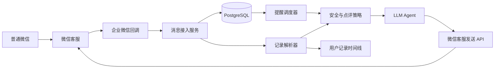

# SlimGuard MVP 0：微信减脂记录 Agent

> 基于真实使用场景收敛  
> 日期：2026-08-26

## 1. 只解决一个问题

用户继续使用微信，把每天的空腹体重、饮食文字和食物照片发出来；Agent 读取内容、更新减脂记录，并像现在的减肥医生一样给出简短点评。

第一版只验证：

```text
微信用户发记录
      ↓
微信客服会话
      ↓
Agent 解析记录并生成点评
      ↓
点评回到用户微信
```

企业微信在这里提供微信客服通道和身份体系，真正完成点评的是我们自己的 Agent 服务。真人医生不参与日常流程，只在未来需要时作为高风险兜底。

## 2. 真实记录格式

用户当前使用的是月度流水：

```text
小明第三个月减肥记录
上月体重 78.25
----------------
61.77.90
62.77.80
```

结合上下文，`61.77.90` 很可能表达“6 月 1 日，77.90kg”，`62.77.80` 很可能表达“6 月 2 日，77.80kg”。这种格式对人容易理解，对程序存在歧义。

MVP 同时接受：

- `6.1 77.90`
- `6/1 77.90kg`
- `今天早上 77.9`
- 原有的 `61.77.90`

系统遇到紧凑格式时不能静默猜测，第一次应确认：

> 我理解为：6 月 1 日空腹体重 77.90kg，对吗？

用户确认后，可以记住该用户的输入习惯。

## 3. 第一版不做什么

- 不做外部群机器人；
- 不做卡路里精确计算；
- 不做排行榜、会员、支付；
- 不做复杂 H5 健康档案；
- 不做主动催促；
- 不要求真人医生参与日常点评；
- 不尝试读取现有微信群或企微客户群的群消息。

最后一项是平台限制：现有外部客户群可以继续保留，但官方 API 不能让自定义 Agent 在群内自由读取并自动回复。

## 4. 两步完成“微信接 Agent”

### 4.1 第一步：零代码验证用户侧入口

1. 在企业微信后台开通“微信客服”；
2. 创建客服账号，例如“轻守减脂记录”；
3. 临时配置一个测试接待人员；
4. 生成客服二维码或链接；
5. 用户用普通微信扫码；
6. 用户发送体重、文字和照片；
7. 测试人员回复一条消息；
8. 确认用户能在微信客服会话中收到回复。

这一步不验证 Agent，只确认二维码入口、消息通知和“客服消息”界面是否可接受。

### 4.2 第二步：接入 Agent，形成真正 MVP

确认用户侧体验后开启微信客服 API：

1. 企业微信回调通知服务端有新消息；
2. 服务端调用 `kf/sync_msg` 拉取具体内容；
3. 保存消息并识别体重、饮食或图片；
4. 把会话切换为“由智能助手接待”；
5. Agent 读取用户历史和当天记录；
6. Agent 生成简短点评；
7. 服务端调用 `kf/send_msg` 自动回复微信用户；
8. 保存回复、提取结果和决策依据。

官方会话状态明确支持“由智能助手接待”，这种状态下可以使用 API 回复消息。未来遇到高风险或用户输入“人工”时，再转给企业微信里的真人接待人员。

## 5. 用户体验

### 5.1 第一次进入

欢迎语只需要说明三件事：

> 你好，我是轻守 AI 减脂记录助手。你可以直接发送每天的空腹体重、饮食文字或照片，我会更新记录并给出生活方式点评。我的建议不属于医疗诊断；回复“停止”可以退出，回复“删除记录”可以申请删除。

Agent 随后发送一条示例：

> 推荐格式：`6.1 空腹 77.90kg`。饮食直接发照片即可，不需要填写表格。

### 5.2 每日体重

用户：

> 6.2 77.80

Agent 合并“记录确认”和“简短点评”，避免连续发送多条消息：

> 已记录：6 月 2 日空腹体重 77.80kg，比昨天低 0.1kg。单日波动先不用下结论，我们继续看 7 日趋势。今天保持正常三餐即可。

### 5.3 饮食

用户可以连续发送三餐照片，也可以补一句：

> 午饭，米饭半碗，鸡胸肉和炒青菜。

系统把图片和文字归入当天午餐。Agent 对餐食只做定性点评，不承诺从照片精确计算热量：

> 看起来有主食、鸡胸肉和蔬菜，搭配比较完整。照片无法准确判断油量和份量；如果下午容易饿，可以告诉我米饭和鸡胸肉的大致份量。

用户经常会连续发送“照片 + 补充文字”。系统应等待约 20～30 秒的静默窗口，把同一餐的连续消息合并后只回复一次，避免逐条打断用户，也节省微信客服的下发额度。

### 5.4 Agent 点评规则

- 每次先确认系统记录了什么；
- 体重优先看 7 日趋势，不评价一次上升或下降；
- 饮食点评采用“一项做得合适 + 一项可执行调整”；
- 图片信息不足时明确表达不确定性并提一个问题；
- 一次回复只给一个主要行动，不输出长篇营养课；
- 不使用羞辱、恐吓或“破戒”等表达；
- 不提供药物、减肥针、催吐、极端断食等建议；
- 用户可以回复“记错了”进入纠错流程；
- 出现健康风险时停止普通点评，提示寻求专业帮助。

第一版不需要医生操作界面，只保留一个供开发者检查消息、提取结果和 Agent 回复的简单审计页。

## 6. MVP 三个核心能力

### 6.1 自动记录与历史对比

用户不再维护整段月度文本，只发送当天发生的事情：

```text
早上空腹 77.8
```

或者直接发送体重秤照片。系统自动完成：

1. 判断消息是体重文本、体重秤照片、饮食、运动还是普通问答；
2. 从文字或图片读取日期、数值和单位；
3. 结合用户历史检查数值是否合理；
4. 高置信度时直接保存，低置信度时询问确认；
5. 计算与昨日、近 3 日和近 7 日趋势的对比；
6. 合并成一条“已记录 + 点评”回复。

体重秤图片处理规则：

- 使用 OCR 与视觉模型共同读取屏幕；
- 区分 kg、斤、lb；
- 图片中有体脂率、BMI 等多个数字时，优先读取明确标注为体重的字段；
- 多个候选值冲突时不得自动保存；
- 与最近一次体重差异异常时要求用户确认，而不是自行纠正；
- 保存原图引用、识别值、置信度和最终确认值；
- 图片模糊时回复“没有看清数字”，请用户补拍或输入数字。

示例：

> 已从体重秤照片记录：今天空腹 77.80kg。比昨天低 0.10kg，比近 7 日均值低 0.35kg。单日变化不需要额外控制饮食，我们继续看趋势。

没有足够历史数据时，Agent 明确说明：

> 已记录 77.80kg。这是你的第 1 条体重记录，积累 3 天后我再开始做短期对比。

### 6.2 自动保存饮食与运动

#### 饮食

支持以下输入：

- 一张或多张食物照片；
- “早餐两个鸡蛋、一杯牛奶”；
- 照片后补充“这是午饭，米饭半碗”；
- “刚才照片里还有一杯奶茶”。

系统自动：

- 按用户时区和发送时间推断早餐、午餐、晚餐或加餐；
- 将短时间连续发送的图片和文字合并为同一餐；
- 提取主要食物类别、可见份量描述和用户补充信息；
- 保存原始记录与模型估算；
- 根据全天已有饮食给一个定性点评；
- 用户说“不是午饭，是早餐”时移动整条记录，而不是新增重复记录。

MVP 不追求照片热量精算。点评重点是：餐盘结构、蔬菜/蛋白质/主食是否出现、份量是否需要用户补充，以及与用户当天其他餐次的关系。

#### 运动

支持以下输入：

- “今天走了 8500 步”；
- “跑步 5 公里，35 分钟”；
- “力量训练 40 分钟”；
- 运动 App、手表或跑步机截图。

结构化字段包括：

- 运动类型；
- 开始时间或所属日期；
- 时长；
- 距离；
- 步数；
- 设备显示的活动消耗；
- 强度和来源；
- 是否为模型估算。

如果用户只发一张健身房自拍，Agent 不能推断训练时长或消耗，应询问一句“今天练了什么、大约多久”。

### 6.3 缺卡提醒与晚间复盘

每个用户拥有可配置的日程。例如：

| 检查点 | 默认时间 | 缺失条件 | 动作 |
|---|---:|---|---|
| 空腹体重 | 09:30 | 当天无体重记录 | 提醒一次 |
| 白天饮食 | 19:30 | 当天无任何饮食记录 | 提醒一次 |
| 晚间复盘 | 21:30 | 用户未关闭复盘 | 汇总并提问 |

用户可以修改时间、关闭某一类提醒，或说“今天不称重”“今天休息”。这类主动跳过会标记为 `skipped`，不应再次提醒。

日打卡状态：

```text
pending（暂无记录）
   ↓
partial（记录了一部分）
   ↓
complete（完成用户要求的项目）
   ↓
reviewed（已完成晚间复盘）
```

提醒规则：

- 只提醒缺失项，不发送“记得打卡”这种无上下文消息；
- 同一缺失项每天最多提醒一次；
- 每天主动提醒最多两次，晚间复盘另算一次；
- 用户刚刚发完一批消息时取消对应的待发送提醒；
- 不因为漏打卡而羞辱、扣分或连续追问；
- 用户回复“停止提醒”后立即取消所有计划；
- 用户连续两天未回复后停止微信客服侧催促，避免无效打扰。

缺体重示例：

> 早上好，今天还没有收到空腹体重。方便时发一个数字或体重秤照片就行；今天不称也可以回复“跳过”。

缺饮食示例：

> 今天还没有饮食记录。如果不想补三餐，发一张最有代表性的餐食照片也可以。

晚间复盘不是通用鸡汤，而是由当天数据生成：

> 今日复盘：体重 77.80kg，比近 7 日均值低 0.35kg；记录了午餐和晚餐，午餐搭配较完整，晚餐蔬菜偏少；完成跑步 35 分钟。今天最值得保留的是运动完成度。明天只做一个调整：晚餐先准备一份蔬菜。你今天的饥饿感是低、中还是高？

如果记录不完整，必须展示缺失，不得假装知道：

> 今天记录了体重和午餐，没有收到晚餐及运动信息。基于现有记录，我只能做部分复盘：体重仍处在近 7 日正常波动范围。明天先继续完成早晨称重即可。

#### 微信提醒的硬限制

微信客服只允许在用户主动发送消息后的 48 小时内下发最多 5 条消息；用户再次发送消息后才能继续获得下发额度。因此：

- Agent 每次打卡尽量只发送一条合并回复；
- 调度器发送前必须检查 48 小时窗口和剩余额度；
- 用户漏一天时，通常仍可发送提醒和复盘；
- 用户超过 48 小时未互动后，微信客服不能继续提醒；
- 需要长期召回时，增加小程序订阅消息，但必须由用户主动授权；普通一次性订阅通常是一次授权换一次通知，不能假设拥有永久提醒权限。

MVP 0B 可以先接受“超过 48 小时停止提醒”，小程序订阅通知放到下一阶段。

## 7. 最小技术架构



第一版后端只需要八个模块：

- 微信客服回调验签和解密；
- `sync_msg` 消息拉取和幂等；
- 体重文本解析；
- 体重秤 OCR、饮食图片和运动截图理解；
- 每日打卡状态机；
- 提醒与复盘调度器；
- Agent 点评与安全策略；
- `send_msg` 回复和简单审计页。

暂时不需要向量数据库、复杂 RAG、多 Agent 或微服务。

## 8. 最小数据结构

### 用户

- 内部用户 ID；
- 微信客服 `external_userid`；
- 显示昵称；
- 时区；
- 同意状态。

### 体重记录

- 用户 ID；
- 测量日期；
- 体重 kg；
- 是否空腹；
- 原始消息 ID；
- 解析置信度；
- 是否经用户确认。

### 饮食记录

- 用户 ID；
- 日期和餐次；
- 文字；
- 图片引用；
- 原始消息 ID。

### 运动记录

- 用户 ID；
- 日期和时间；
- 运动类型；
- 时长、距离、步数和活动消耗；
- 数据来源；
- 是否为估算；
- 原始消息 ID。

### 每日打卡状态

- 用户 ID 和日期；
- 需要记录的项目；
- 每个项目的 `pending/received/skipped` 状态；
- 体重、饮食、运动记录引用；
- 当天是否已复盘。

### 提醒计划与发送记录

- 用户 ID；
- 提醒类型和计划时间；
- 用户时区；
- 是否启用；
- 触发时的缺失项；
- 48 小时窗口与剩余额度；
- 实际发送结果。

### Agent 点评

- 用户 ID；
- 回复内容；
- 回复时间；
- 关联的记录日期；
- 使用的模型和 Prompt 版本；
- 记录提取结果；
- 风险规则结果；
- 是否由用户纠错。

### 每日复盘

- 用户 ID 和日期；
- 当日数据快照；
- 完整度；
- 主要观察；
- 次日唯一行动；
- 用户主观反馈；
- Agent 回复和版本信息。

## 9. 解析规则

体重解析先使用规则而不是 LLM：

1. 识别 `kg`、`公斤`、`斤`；
2. 没有单位时，根据用户近期合理范围判断候选单位；
3. 识别日期、今天、昨天和早上/空腹；
4. 对明显歧义要求确认；
5. 同一天重复记录时询问是覆盖还是新增；
6. 永远保留用户原文用于纠错；
7. 用户能通过对话修正错误记录；
8. 同一用户短时间连续发送的图片和文字先合并，再触发一次 Agent 点评。

图片使用视觉模型识别主要食物类别和餐盘结构，但所有份量和热量相关结论必须标记为估算。无法确认时询问用户，不得虚构食材。

## 10. 现有群怎么处理

可以保留现有群，但 MVP 0 中它只承担：

- 运营人员发布公共通知；
- 分享微信客服入口；
- 用户互相鼓励；
- 提醒用户私聊提交健康数据。

推荐群公告：

> 为保护个人健康信息，体重和饮食记录请点击群公告中的“轻守减脂记录”私聊发送，AI 助手会自动整理并点评。群内仍可交流经验。

如果产品必须原样保留“用户在群里发记录、Agent 在群里点评”，就无法走纯官方 API，需要非官方 RPA/Hook，不建议把它作为正式产品基础。

## 11. 三个迭代阶段

### MVP 0A：零代码真机验证

- 一个客服账号；
- 1～3 个微信用户；
- 真实发送体重、图片和测试回复；
- 验证通知、会话入口和使用意愿。

预计：半天到一天，取决于企业微信账号和认证状态。

### MVP 0B：最小 Agent 闭环

- 接收用户消息；
- 保存文字和图片；
- 解析体重；
- 读取体重秤图片；
- 识别餐食组成；
- 保存运动文字和截图；
- 读取最近 7 天记录；
- Agent 自动生成点评；
- 缺卡提醒和晚间复盘；
- 通过微信客服回复；
- 支持纠错、停止和删除记录。

预计：单人约 2～4 周的工程工作量，不含企业认证等待时间。建议按“文本体重闭环 → 图片与运动记录 → 提醒和复盘”三个小版本逐步上线。

### MVP 1：增强个性化

- 生成周趋势总结；
- 记住用户饮食习惯和常见困难；
- 增加温和、直接、极简三种点评语气；
- 支持用户设置目标和提醒时间；
- 加入可选的真人健康专业人员兜底。

Agent 从 MVP 0B 就负责日常点评，但输出范围严格限制在记录反馈和一般生活方式建议内，不冒充医生或提供医疗诊断。

## 12. MVP 0 验收标准

- 用户全程只使用普通微信；
- 用户文字和图片能被后端读取；
- Agent 回复能回到同一个微信客服会话；
- 后端不会因回调重试保存重复消息；
- `6.1 77.90` 能正确生成体重记录；
- `61.77.90` 会先请求确认，不会直接错误入库；
- 清晰的体重秤照片能生成候选体重记录；
- 模糊图片或异常数值会要求确认；
- 图片能关联到正确用户和日期；
- 饮食照片和补充文字能合并成同一餐；
- 运动文字或截图能生成运动记录；
- 用户能申请修改或删除记录；
- Agent 点评会参考最近 7 天体重和当天饮食；
- 缺体重或缺饮食时能在用户设置的时间触发对应提醒；
- 完成打卡后不会收到已经过时的提醒；
- 晚间复盘准确区分已有数据和缺失数据；
- 48 小时窗口关闭时不会违规调用发送接口；
- 点评明确区分事实、估算和建议；
- 高风险测试消息不会得到普通减脂建议；
- 智能助手状态和发送失败事件可追踪。

## 13. 下一步执行顺序

1. 准备一个可管理的企业微信企业；
2. 开通微信客服并创建客服账号；
3. 临时配置测试接待人员；
4. 生成二维码，用普通微信真机完成第一次对话；
5. 确认这个交互形式可以接受；
6. 开启微信客服 API，编写消息接入和回复服务；
7. 接入记录解析、视觉模型和 Agent 点评策略；
8. 最后加入提醒调度与晚间复盘。

在第 4 步成功之前，不建议先写 Agent；但通过后，第一版就直接接 Agent，不再经过医生人工点评。

## 14. 官方接口

- [微信客服概述](https://developer.work.weixin.qq.com/document/path/94638)
- [读取消息 `kf/sync_msg`](https://s.apifox.cn/apidoc/docs-site/406014/api-10061677/)
- [发送消息 `kf/send_msg`](https://s.apifox.cn/apidoc/docs-site/406014/api-10061678)
- [会话状态](https://s.apifox.cn/apidoc/docs-site/406014/doc-417794)
- [分配给指定接待人员 `kf/service_state/trans`](https://s.apifox.cn/apidoc/docs-site/406014/api-10061331)
- [小程序订阅消息说明](https://wdk-docs.github.io/wxadev-docs/framework/open-ability/message/subscribe-message.html)
