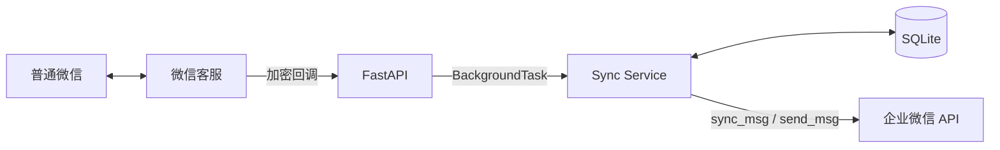

# Phase 1：Python 微信客服通道闭环

> 日期：2026-08-26  
> 状态：通道验证已完成，已升级为最小单轮 AI 助手
> 目标：普通微信用户发送文字或图片后，SlimGuard 调用智谱 GLM 生成减脂回复

## 1. 唯一验收链路

```text
普通微信用户发送文字或图片
  → 微信客服产生加密回调
  → Python 服务验签、解密并快速返回 200
  → 调用 kf/sync_msg 拉取实际消息
  → 以 msgid 去重并保存同步 cursor
  → 文字直接交给 Agent；图片先通过 media/get 下载
  → 文字调用 glm-5.2，图片调用 glm-5v-turbo（单轮、无 memory）
  → 调用 kf/send_msg 发送模型回复
  → 用户在微信客服会话中看到回复
```

Agent 只看当前一条消息，不读取历史对话：

```python
async def generate_reply(request: ReplyRequest) -> str:
    return await zhipu_chat_completion(request)
```

回复生成与微信接入层通过 `ReplyAgentProtocol` 隔离。

## 2. 范围

### 必须完成

- 企业微信微信客服账号配置；
- 回调 URL 的 GET 验证；
- POST 回调签名验证和 AES 解密；
- 从回调中取得临时 Token 和 `open_kfid`；
- `access_token` 获取及进程内缓存；
- `kf/sync_msg` 分页拉取；
- 保存并恢复 cursor；
- 按 `msgid` 防止重复回复；
- 识别来自微信客户的入站消息；
- `kf/send_msg` 发送 Agent 回复；
- 下载微信图片并作为智谱视觉模型输入；
- 使用客户昵称作为当次请求上下文；
- 模型或媒体接口失败时发送降级提示；
- 结构化日志和最小自动化测试；
- Docker 启动方式。

### 明确不做

- memory 和多轮对话；
- 结构化体重、饮食和运动数据入库；
- PostgreSQL、Redis、Celery；
- 提醒和晚间复盘；
- 管理后台；
- 多租户；
- 小程序订阅消息；
- 个人微信数据库解密或 Hook。

## 3. 最小技术栈

| 领域 | Phase 1 决策 |
|---|---|
| Python | Python 3.13，代码保持兼容 3.12+ |
| HTTP | FastAPI + Uvicorn |
| HTTP Client | HTTPX |
| 配置 | pydantic-settings |
| XML | defusedxml + 明确的数据映射 |
| AES | cryptography，按企业微信协议封装 `WXBizMsgCrypt` |
| 持久化 | SQLite + SQLAlchemy 2；Phase 1 启动时自动建表，Phase 2 引入 Alembic |
| 测试 | pytest + pytest-asyncio |
| 质量 | Ruff + mypy |
| 包管理 | `pyproject.toml` + uv lockfile |

SQLite 不是最终数据库，但 cursor 和 `msgid` 不能只保存在内存，否则重启后可能重复拉取并重复回复。Phase 2 通过 SQLAlchemy repository 将其替换为 PostgreSQL。

## 4. 进程设计

Phase 1 只运行一个 FastAPI 进程：



回调请求中只执行：

1. 请求体限制；
2. 验签；
3. AES 解密；
4. 基本字段校验；
5. 提交进程内 background task；
6. 返回 HTTP 200。

Background task 适合这个低流量技术验证，但不保证进程崩溃后的任务恢复。Phase 1 验收通过后，优先将它替换为 PostgreSQL Outbox + Celery。

## 5. 代码结构

```text
src/slim_guard/
├── main.py
├── config.py
├── api/
│   └── wecom_callback.py
├── db/
│   ├── models.py
│   ├── session.py
│   └── repositories.py
├── integrations/wecom_kf/
│   ├── crypto.py
│   ├── client.py
│   ├── schemas.py
│   └── errors.py
├── services/
│   ├── sync_messages.py
│   └── fixed_reply.py
└── observability/
    └── logging.py

tests/
├── unit/
│   ├── test_wecom_crypto.py
│   ├── test_sync_pagination.py
│   └── test_message_dedup.py
└── integration/
    └── test_callback_to_fixed_reply.py
```

## 6. 最小数据表

### `wecom_sync_states`

```text
channel_id       TEXT NOT NULL
open_kfid        TEXT NOT NULL
cursor           TEXT
last_success_at  DATETIME
PRIMARY KEY(channel_id, open_kfid)
```

### `inbound_messages`

```text
channel_id       TEXT NOT NULL
msgid            TEXT NOT NULL
external_userid  TEXT
msgtype          TEXT NOT NULL
sent_at          DATETIME NOT NULL
reply_status     TEXT NOT NULL
created_at       DATETIME NOT NULL
UNIQUE(channel_id, msgid)
```

### `outbound_messages`

```text
idempotency_key  TEXT PRIMARY KEY
inbound_msgid    TEXT NOT NULL
external_userid  TEXT NOT NULL
content          TEXT NOT NULL
status           TEXT NOT NULL
platform_msgid   TEXT
last_error       TEXT
created_at       DATETIME NOT NULL
```

消息正文在 Phase 1 不必持久化。保存消息类型、ID 和发送状态就足以排错，同时降低测试阶段的隐私暴露。

用户身份采用两层结构：

```text
users
- id（SlimGuard 内部 UUID）
- nickname / avatar_url / gender
- first_seen_at / last_seen_at

channel_identities
- channel_id
- external_userid
- user_id
- unionid（可选）
- profile_status / profile_synced_at
UNIQUE(channel_id, external_userid)
```

同一个 `external_userid` 重复发信不会创建新用户。历史消息中的客户 ID 在启动时自动回填到
用户表；新客户出现或资料缓存过期时，批量调用 `kf/customer/batchget` 同步资料。资料同步是
best-effort，失败不能阻断消息回复。

## 7. 同步与 Agent 回复算法

每个 `(channel_id, open_kfid)` 在进程内使用一个 `asyncio.Lock` 串行同步：

```text
收到 callback token
  → 获取该客服账号的锁
  → 读取 SQLite cursor
  → 调用 sync_msg
  → 在一个事务中写入本页新消息、planned outbound 和 next_cursor
  → 提交事务
  → 调用 service_state/get 获取平台权威会话状态
  → 状态 0 时调用 service_state/trans 转为状态 1
  → 将 planned outbound 原子更新为 sending
  → 调用单轮 Agent 生成回复（图片需先下载）
  → 使用稳定 msgid 调用 send_msg 发送 Agent 回复
  → 保存 accepted/failed/unknown 状态
  → has_more=true 时继续下一页
```

必须以 `has_more` 决定是否继续，不能因为某一页 `msg_list` 为空就提前结束。

先提交消息、出站计划和 cursor，再调用外部发送接口，避免平台调用成功与本地事务回滚互相污染。`send_msg` 支持指定 `msgid`，Phase 1 用稳定值做关联；官方文档没有承诺相同 `msgid` 一定实现幂等，因此不能把它作为 exactly-once 保证。

只回复满足以下条件的消息：

- 来源是外部微信客户；
- 方向是入站；
- 类型属于当前允许列表；
- `msgid` 第一次出现；
- 存在可回复的 `external_userid`；
- 不是状态事件、系统事件或己方发出的消息。

当前允许文本和图片消息。图片从企业微信下载后只保留在当次请求的内存中，
不写入 SQLite 或本地文件。

所有客户消息（包括当前不回复的图片）都会触发会话状态检查。状态 `2`、`3`、`4` 不调用
普通发送接口；状态 `3` 下客户消息超过超时阈值且没有人工回复时，watchdog 调用 API 将
会话结束为状态 `4`，再通过事件响应接口发送提示。客户再次发信后平台恢复为状态 `0`，
服务重新执行 `0 → 1`。

内部人工审核不使用企业微信状态 `3`。`REPLY_DELIVERY_MODE=internal_review` 时出站草稿
保存为 `pending_review`，批准后仍由 `send_msg` 投递，保持企业微信状态 `1`。

## 8. 配置

```dotenv
APP_ENV=development
HTTP_HOST=0.0.0.0
HTTP_PORT=8000
DATABASE_URL=sqlite+aiosqlite:///./data/slim_guard.db
WECOM_CORP_ID=
WECOM_KF_SECRET=
WECOM_OPEN_KF_ID=
WECOM_CALLBACK_TOKEN=
WECOM_CALLBACK_AES_KEY=
FIXED_REPLY_TEXT=收到，我已经连接成功。
REPLY_DELIVERY_MODE=automatic
WECOM_HUMAN_IDLE_TIMEOUT_SECONDS=600
WECOM_SESSION_WATCHDOG_INTERVAL_SECONDS=30
WECOM_CUSTOMER_PROFILE_REFRESH_SECONDS=86400
LOG_LEVEL=INFO
```

启动时校验所有必需字段；日志不得打印 Secret、回调 Token、AES Key、access token、完整用户消息或完整 `external_userid`。

## 9. API

```text
GET  /health/live
GET  /health/ready
GET  /callbacks/wecom/kf
POST /callbacks/wecom/kf
```

- `live`：进程存活即返回 200；
- `ready`：配置有效且 SQLite 可读写才返回 200；
- GET callback：完成企业微信 URL 验证；
- POST callback：处理加密事件并快速返回。

## 10. 错误与重试

- 验签或 receive ID 失败：返回 403 并记录去敏错误；
- XML 不合法：返回 400；
- `access_token` 失效：刷新后只重试一次；
- `sync_msg` 网络失败：有限次数指数退避；
- `send_msg` 明确失败：保存错误码，不无限重试；
- `send_msg` 网络超时：状态标记为 `unknown`，默认不自动重发，避免用户收到两次；
- 重复回调：依靠 cursor、消息唯一键和 outbound 幂等键消除副作用。

Phase 1 保证“同一 `msgid` 因重复回调不会再次创建发送请求”，但不承诺外部 HTTP 超时场景下的端到端 exactly-once。`sending` 或 `unknown` 状态需要通过日志和真机结果人工确认。

## 11. 验收标准

### 自动化

- 官方协议测试向量能够完成签名、解密和 receive ID 校验；
- 在第一次发送明确成功的条件下，重复提交相同回调只产生一条 outbound 请求；
- `sync_msg` 两页数据能完整拉取并保存最终 cursor；
- `has_more=1` 且空消息页不会中断；
- 服务重启后不会回复已经处理过的 `msgid`；
- 模拟 `send_msg` 成功时，集成测试能观察到 Agent 回复请求。
- 状态 `0` 会先切换为状态 `1`，状态 `3` 不会尝试普通 API 回复；
- 人工超时会执行 `3 → 4` 并发送事件提示；
- 内部审核草稿批准后仍在状态 `1` 通过 API 发出。
- 两个不同的 `external_userid` 创建两个内部用户，同一 ID 重复消息保持同一用户；
- 客户资料成功同步昵称、头像、性别和可用的 `unionid`，同步失败不影响 Agent 回复。

### 真机

1. 微信用户从客服入口发“你好”；
2. 服务日志出现一个去敏后的 inbound message ID；
3. 用户收到“收到，我已经连接成功。”；
4. 企业微信重复投递回调时，用户不会收到第二条；
5. 重启 Python 服务后再发一条消息，仍能正常回复；
6. 记录一次真实往返延迟和平台返回码。

全部通过才进入 Phase 2。失败时只修微信通道，不开始模型、体重或提醒功能。

## 12. Phase 2 演进

通道验证完成后按以下顺序演进：

1. SQLite → PostgreSQL；
2. FastAPI BackgroundTask → Transactional Outbox + Redis/Celery；
3. 单轮 Agent → 结构化体重提取、记录和趋势点评；
4. 接入模型 `ModelGateway`；
5. 接入图片下载、体重秤和饮食识别；
6. 加入提醒和晚间复盘。

微信回调、消息标准化、cursor 和幂等逻辑应保持不变。
