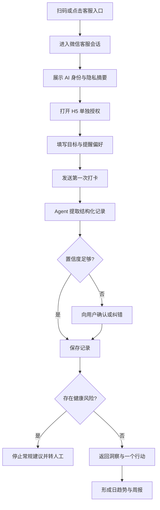
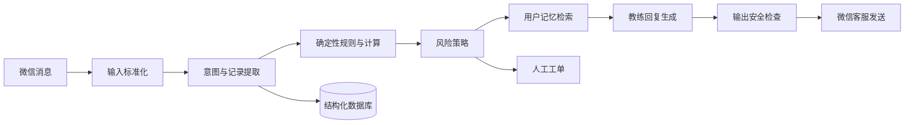

# SlimGuard 产品设计

> 版本：MVP v0.1  
> 日期：2026-08-26  
> 状态：可进入产品原型与技术验证

## 1. 产品结论

SlimGuard 是一个运行在微信生态里的 AI 减脂记录助手。用户不需要安装新 App，通过微信客服完成一对一打卡和反馈；企业微信客户群用于同伴陪伴、公共提醒和活动运营；轻量 H5 用于授权、纠错和查看趋势；运营后台承接人工介入。

第一版的核心闭环不是“AI 替用户制定复杂减肥方案”，而是：

1. 降低记录成本；
2. 帮用户看见连续趋势；
3. 每次只给一个可执行的小行动；
4. 在用户失联或出现健康风险时，采用合规的提醒或人工介入。

产品工作名继续使用仓库名 **SlimGuard**，中文名暂用“轻守”。

## 2. 产品目标与边界

### 2.1 目标用户

MVP 面向希望温和减脂、但难以持续记录的 18 岁以上普通成年人。他们已经在使用微信，不愿下载新的健康 App，也不需要医疗诊断。

典型用户：

- 想减脂 3～10 公斤，但经常三天后放弃记录；
- 愿意发文字或照片，却不愿填写复杂表单；
- 需要及时反馈和陪伴感，而不只是数据图表；
- 可以接受 AI 服务，并愿意在必要时转接真人教练。

### 2.2 MVP 目标

- 用户首次进入后 3 分钟内完成目标和提醒设置；
- 一次日常打卡在 30 秒内完成；
- Agent 能从自然语言和图片中提取记录，并让用户方便纠错；
- 每次回复简短、具体、无羞辱感；
- 形成“每日打卡—即时反馈—每周复盘”的循环；
- 支持高风险内容识别、停止自动建议和转人工。

### 2.3 非目标

MVP 不提供以下能力：

- 医疗诊断或疾病治疗；
- 药物、处方、减肥针或补剂建议；
- 精确到克的营养处方；
- 未成年人减重计划；
- 孕期、哺乳期或进食障碍人群的个性化减脂方案；
- 无人审核的外部客户群自动发言；
- 以“减重最多”为目标的公开排行榜。

## 3. 渠道设计

### 3.1 四个产品界面

| 界面 | 使用者 | 作用 | MVP 必需 |
|---|---|---|---|
| 微信客服会话 | 普通微信用户 | 打卡、即时反馈、问答、转人工 | 是 |
| 轻量 H5 | 普通微信用户 | 授权、初始档案、数据纠错、趋势、设置 | 是 |
| 运营后台 | 教练/客服/运营 | 风险工单、用户状态、Agent 草稿、审计 | 是 |
| 企业微信客户群 | 用户与运营人员 | 公共活动、陪伴、群提醒、周报 | 可选 |

### 3.2 为什么这样拆分

企业微信智能机器人不能加入包含微信用户的外部客户群。微信客服则有官方的消息回调、读取消息、智能助手状态和发送消息 API，可以承载 Agent 的一对一闭环。

客户群保留，但不承担私人健康数据采集。群中只发送：

- 公共打卡提醒；
- 活动规则；
- 经用户主动选择公开的连续打卡徽章；
- 匿名或汇总周报；
- 人工审核后的 Agent 内容。

不得默认在群内展示体重、BMI、饮食照片、失败天数或风险标签。

### 3.3 微信端用户感知

微信客服会话看起来像普通聊天窗口，但在微信的“客服消息”入口下，账号通常以“客服名称 @ 企业名称”展示。欢迎语必须直接说明这是 AI，而不能让用户误以为是真人好友。

建议身份文案：

> 你好，我是轻守 AI 记录助手。我会帮你整理体重、饮食、运动和睡眠记录，并给出非医疗性质的生活方式建议。回复“人工”可以联系真人教练，回复“停止”可以随时退出。

## 4. 核心用户流程



### 4.1 首次进入

1. 用户从二维码、小程序、公众号菜单或客户群欢迎语进入微信客服；
2. 系统使用 `welcome_code` 发送简短欢迎语；
3. 用户发送“开始”；
4. Agent 返回一次性签名的 H5 链接；
5. H5 展示服务说明、AI 身份、敏感个人信息处理说明和单独同意；
6. 用户填写基础资料；
7. 返回微信并完成第一次打卡。

基础资料只收集：

- 年龄段；
- 身高、当前体重、目标方向；
- 希望改善的行为；
- 提醒时间与语气；
- 必要的健康风险筛查项；
- 是否愿意加入客户群；
- 是否允许公开连续打卡徽章。

手机号、真实姓名和身份证不是完成打卡所必需的数据，默认不收集。

### 4.2 日常打卡

用户可以自然表达，不要求固定格式：

- “今天 72.4kg，昨晚睡了 6 个半小时”；
- “午饭一碗米饭、番茄炒蛋和鸡胸肉”；
- 直接发送食物照片；
- “今天走了 8300 步，没训练”；
- “晚上没忍住吃了两块蛋糕”。

标准回复结构：

1. 接住情绪，但不夸张评价；
2. 复述识别出的记录；
3. 给出一个趋势洞察；
4. 只提出一个下一步行动；
5. 必要时给“纠正记录”入口。

示例：

> 已记录：72.4kg、睡眠 6.5 小时。单日变化先不用担心，我们看 7 日趋势。今天只做一件事：午饭后走 10 分钟。体重或睡眠识别错了，可以点这里修改。

Agent 不应在每次打卡后输出长篇科普，也不应把食物简单标记为“好/坏”。

### 4.3 漏打卡与提醒

提醒按三层处理：

1. **会话窗口内**：用户最近 48 小时主动发送过消息且仍有下发额度时，微信客服发送一条合并提醒；
2. **窗口关闭后**：不尝试绕过微信限制，可使用用户主动订阅的小程序通知；
3. **社群或人工**：群主发送公共提醒，或运营后台创建人工跟进任务。

默认策略：

- 每日最多一次主动提醒；
- 连续两天未打卡，不加强责备，只降低任务难度；
- 连续七天未打卡，停止自动追问并进入低频召回；
- 用户回复“停止”“别提醒了”时立即关闭提醒；
- 为回复消息保留额度，避免把 5 条额度全部消耗在提醒上。

召回文案示例：

> 今天不用补齐所有记录。回复一个数字告诉我现在的体重，或者回复“明天再来”。

### 4.4 每周复盘

每周复盘只回答四个问题：

- 这一周发生了什么；
- 哪个行为与趋势最相关；
- 哪件事做得最稳定；
- 下一周只调整什么。

不以单周体重下降作为唯一成功指标。优先展示：

- 记录完成率；
- 体重 7 日移动趋势；
- 睡眠、步数和用餐规律；
- 用户自己选择的行为目标；
- 计划完成后的主观感受。

### 4.5 转人工

以下情况创建人工任务：

- 用户明确输入“人工”“真人”“投诉”；
- Agent 连续两轮无法理解；
- 用户质疑记录、隐私或收费；
- 风险规则触发；
- 用户要求个性化疾病、药物或极端减重指导。

转人工时，把最近对话摘要、已确认记录和触发原因提供给教练，但不要让人工阅读超出处理任务所需的全部历史。

## 5. 功能范围

### 5.1 P0：上线必需

- 微信客服账号和入口二维码；
- 回调验签、解密、消息同步与幂等处理；
- 文本打卡解析；
- 图片接收和基础食物识别；
- 体重、饮食、运动、睡眠四类记录；
- 用户确认和纠错；
- 目标、提醒时间和语气设置；
- 日反馈和周报；
- 48 小时窗口与消息额度管理；
- 风险规则、停止服务和转人工；
- H5 授权与趋势页；
- 运营后台的用户列表、风险工单和对话审计；
- 数据导出、删除和撤回同意。

### 5.2 P1：验证留存后增加

- 语音转文字；
- 菜品和份量交互式确认；
- 小程序订阅消息；
- 客户群入群欢迎语与活动；
- 连续打卡徽章；
- 真人教练工作台；
- 会员和支付；
- 家庭或好友监督邀请。

### 5.3 暂不做

- 自动控制外部客户群账号；
- 多 Agent 自主协作；
- 可穿戴设备全量接入；
- 自动生成医疗级饮食处方；
- 复杂卡路里数据库和精确拍照估算；
- 公开减重公斤数排行榜。

## 6. Agent 设计

### 6.1 Agent 不是单个 Prompt



LLM 负责理解和表达，确定性代码负责：

- 单位换算；
- 日期归属；
- 体重趋势；
- 消息额度；
- 提醒调度；
- 风险阈值；
- 权限和同意状态；
- 数据写入与撤销。

### 6.2 记录提取协议

每条用户消息先转换为结构化候选记录：

```json
{
  "intent": "checkin",
  "occurred_at": "2026-08-26T08:10:00+08:00",
  "measurements": [
    {
      "type": "weight",
      "value": 72.4,
      "unit": "kg",
      "confidence": 0.98
    }
  ],
  "sleep": {
    "duration_minutes": 390,
    "confidence": 0.92
  },
  "needs_confirmation": false,
  "risk_signals": []
}
```

规则：

- 低于置信度阈值的字段不得直接作为事实；
- 图片热量只能标记为估算值和区间；
- 用户纠错永远覆盖模型推断；
- 原始消息与结构化数据分别保存，并具有独立保留期限；
- Agent 不得自行补全用户没有提供的身体指标。

### 6.3 用户记忆

分三层：

| 层级 | 内容 | 使用方式 |
|---|---|---|
| 明确档案 | 目标、偏好、禁忌、提醒设置 | 长期保存，用户可编辑 |
| 结构化历史 | 体重、饮食、运动、睡眠 | 用于趋势计算 |
| 对话摘要 | 近期困难、承诺和反馈 | 定期压缩，限制保留 |

不把整段历史聊天无差别塞入模型上下文；不使用用户数据训练基础模型，除非另行获得明确、单独的同意。

### 6.4 教练语气

默认人格是“温和但有边界的记录教练”：

- 不训斥、不羞辱、不制造负罪感；
- 不把体重反弹解释为意志薄弱；
- 不承诺固定减重结果；
- 不强化极端节食；
- 一次只给一个主要动作；
- 明确区分记录事实、模型估算和一般性建议；
- 用户可选择温和、直接或极简三种语气。

## 7. 健康安全策略

### 7.1 风险分级

| 等级 | 示例 | 系统行为 |
|---|---|---|
| R0 常规 | 正常打卡、轻微波动 | 正常反馈 |
| R1 注意 | 反复极端节食表达、快速减重诉求 | 降低建议强度，提示专业咨询 |
| R2 高风险 | 持续呕吐、晕厥、严重头晕、胸痛 | 停止减脂建议，建议及时就医，创建人工任务 |
| R3 紧急 | 明确自残、自杀或生命危险 | 立即提供紧急求助提示并按预案升级 |

风险判断采用关键词、结构化规则和模型分类三路结合。仅靠 LLM 的一次判断不得自动下结论。

### 7.2 特殊人群

如果用户是未成年人、孕期/哺乳期、正在接受相关疾病治疗或报告进食障碍史，MVP 不生成个性化热量缺口和减重计划。可以继续提供中性记录服务，并建议在专业人员指导下行动。

### 7.3 关键产品约束

- 页面和回复中始终可以找到“这不是医疗服务”的说明；
- 同时提供人工与退出入口；
- 不奖励危险速度的体重下降；
- 不发送可能导致公开羞辱的群消息；
- 风险工单必须有响应时限和处置记录。

## 8. 数据与隐私

体重、饮食、运动、身体照片和由此生成的健康画像按敏感个人信息的高标准处理。

### 8.1 同意设计

至少拆分为：

1. 服务必需数据处理同意；
2. 敏感个人信息单独同意；
3. 图片分析同意；
4. 可选的群内公开同意；
5. 可选的模型改进/训练同意，不得默认勾选。

### 8.2 用户权利

用户可以在 H5 中：

- 查看保存的数据类型；
- 修改错误记录；
- 导出结构化记录；
- 删除单条记录；
- 删除账号及全部可识别数据；
- 关闭提醒；
- 撤回可选授权；
- 申请人工解释 Agent 决策。

### 8.3 安全基线

- 传输和存储加密；
- 密钥与业务数据分离；
- 客服回调验签和 AES 解密；
- 管理后台最小权限和操作审计；
- 原始图片使用短保留期；
- 日志中不记录完整消息、Webhook 密钥或 access token；
- 第三方模型只接收完成任务所需的最小上下文；
- 明确保留期限和自动清理任务。

## 9. 技术方案

### 9.1 服务划分

第一版保持模块化单体，避免过早微服务化：

- `wecom-gateway`：企微回调、验签、解密、token、`sync_msg`、`send_msg`；
- `conversation`：会话状态、消息幂等、额度与窗口；
- `records`：用户与健康记录；
- `agent`：提取、策略、记忆和回复；
- `scheduler`：提醒与周报任务；
- `risk`：规则和人工工单；
- `web`：用户 H5 与运营后台。

建议基础设施：

- PostgreSQL：业务主数据；
- Redis：token、幂等锁、短期状态和任务队列；
- 对象存储：用户图片，配置生命周期清理；
- 异步任务队列：消息处理、图片分析、提醒、周报；
- 可观测性：结构化日志、指标、错误追踪和审计事件。

### 9.2 消息处理时序

1. 企业微信发送回调事件；
2. 网关在平台要求时间内完成校验并返回成功；
3. 异步任务使用回调 token 调用 `kf/sync_msg`；
4. 以平台 `msgid` 做幂等；
5. 关联 `external_userid`、客服账号和内部用户；
6. 检查同意状态；
7. 提取记录并执行风险策略；
8. 保存已确认或高置信度记录；
9. 生成回复并执行输出检查；
10. 在合法会话状态和发送额度内调用 `kf/send_msg`；
11. 监听发送失败事件并更新状态；
12. 需要时将会话切换到人工接待。

### 9.3 核心数据实体

- `users`：内部匿名用户标识、状态、时区；
- `external_identities`：企业、客服账号、`external_userid` 映射；
- `consents`：授权类型、版本、时间、撤回时间；
- `profiles`：明确提供的基础档案；
- `goals`：目标方向、行为目标和有效期；
- `checkins`：一次打卡的聚合记录；
- `measurements`：体重等数值记录；
- `meals`、`activities`、`sleep_records`；
- `messages`：必要的消息元数据和受控原文；
- `agent_runs`：模型版本、输入摘要、策略结果、输出；
- `reminders`：计划、发送窗口、额度和结果；
- `risk_events`：风险等级、证据、处置状态；
- `human_tasks`：人工负责人、SLA、处理结果。

### 9.4 H5 身份绑定

Agent 发出的 H5 链接使用短时、一次性签名 token，绑定内部用户 ID 和用途。H5 不把 `external_userid` 明文放入 URL，也不依赖用户手动输入手机号来关联客服会话。

## 10. 运营后台

首页不做传统“大屏”，只保留需要行动的信息：

- 今日待处理风险；
- 等待转人工会话；
- 发送失败或窗口已关闭的提醒；
- 连续未打卡但允许人工跟进的用户；
- 本周 Agent 低置信度和差评样本；
- 客户群待审核文案。

单个用户页面展示：

- 授权状态；
- 最近趋势；
- 近期对话摘要；
- 已确认记录；
- Agent 做出建议的原因；
- 风险与人工处置历史；
- 数据导出和删除操作。

## 11. 客户群设计

客户群是可选的行为支持层，不是私密记录入口。

建议群机制：

- 每天一个统一打卡入口；
- 每周一个行为主题，例如“饭后走十分钟”；
- 排行只比较连续记录或参与度，不比较减重公斤数；
- 用户自己选择是否展示昵称和徽章；
- Agent 生成群运营草稿，真人审核发送；
- 群内有人发送健康数据时，引导到微信客服私聊；
- 群公告明确数据公开范围和反骚扰规则。

## 12. 商业模式假设

MVP 先验证留存，不急于收费。可测试三个层级：

| 层级 | 内容 |
|---|---|
| 免费 | 基础打卡、趋势和每周总结 |
| 会员 | 图片分析、深度周报、更多目标和提醒设置 |
| 教练服务 | AI 日常记录 + 真人周期复盘与风险兜底 |

不要用“保证减重多少公斤”作为付费承诺。更稳妥的价值表达是“减少记录负担、提高计划执行率、看清长期趋势”。

## 13. 指标设计

### 13.1 北极星指标

**每周完成 3 天以上有效打卡的活跃用户数。**

它比总消息量或单周减重更能反映产品是否帮助用户形成可持续行为。

### 13.2 漏斗指标

- 进入客服 → 发送首条消息；
- 发送首条消息 → 完成授权；
- 完成授权 → 完成首日打卡；
- 首日打卡 → 第 3 天仍打卡；
- 第 3 天 → 第 7 天完成周报；
- 第 7 天 → 第 4 周仍有有效打卡。

### 13.3 质量与安全指标

- 记录提取确认率和纠错率；
- 图片估算被修改比例；
- Agent 回复有帮助率；
- 消息发送失败率；
- 48 小时窗口外提醒占比；
- 转人工率和响应时长；
- 风险漏报、误报和处置完成率；
- 删除请求完成时间；
- 群内隐私事故数，目标为零。

不把“用户发了多少条消息”作为主要成功指标，避免鼓励不必要的依赖。

## 14. MVP 研发阶段

### 阶段 0：渠道技术验证，约 1 周

- 创建测试企业与微信客服账号；
- 生成客服链接和二维码；
- 真机确认微信端 UI、通知和历史会话入口；
- 跑通回调、`sync_msg`、`send_msg` 和会话状态；
- 验证 48 小时与 5 条限制；
- 跑通转人工；
- 输出 go/no-go 结论。

### 阶段 1：内部 MVP，约 2～3 周

- 文本打卡；
- 基础档案与单独同意；
- 结构化数据、纠错和趋势；
- Agent 短回复；
- 基础提醒；
- 人工工单；
- 简单运营后台。

### 阶段 2：小流量试运营，约 2 周

- 20～50 名成年测试用户；
- 图片打卡；
- 周报；
- 风险规则评审；
- 客户群人工运营；
- 根据真实纠错样本调整提取模型和交互。

### 阶段 3：留存验证后

- 小程序订阅消息；
- 付费会员；
- 真人教练服务；
- 更完整的群活动；
- 可穿戴设备和健康平台接入。

## 15. MVP 验收标准

满足以下条件才进入小流量试运营：

- 微信用户无需企业微信即可完成完整打卡；
- 回调重试不会产生重复记录或重复回复；
- 用户可在一分钟内纠正一次错误识别；
- Agent 不会在未同意时保存健康记录；
- 发送前检查会话状态、48 小时窗口和额度；
- 用户输入“停止”后不再收到自动提醒；
- 用户输入“人工”可以建立人工任务并获得明确反馈；
- 风险样本测试集全部进入预期处置分支；
- 管理员无法越权查看不属于其范围的用户数据；
- 可以完成用户数据导出和删除；
- 群运营默认不公开任何个人健康信息；
- 微信客服真机体验经过至少两个 iOS 和两个 Android 微信版本验证。

## 16. 上线前需要确认的产品决策

以下决策不阻塞技术验证，但必须在公开试运营前确定：

1. 品牌名称、企业主体和客服展示名称；
2. 是否只做纯 AI，还是从第一版就提供真人教练；
3. 目标人群是大众减脂，还是某个更窄的垂直人群；
4. 是否要求用户加入客户群；
5. 图片和原始聊天的具体保留期限；
6. 模型供应商与数据处理地域；
7. 风险工单的真人值班时间和响应承诺；
8. 免费与付费边界；
9. 是否支持用户主动邀请监督伙伴；
10. 对外使用“减肥”“减脂”还是“体重管理”的品牌表达。

## 17. 官方能力依据

- [企业微信：微信客服概述](https://developer.work.weixin.qq.com/document/path/94638)
- [微信客服读取消息 `kf/sync_msg`](https://s.apifox.cn/apidoc/docs-site/406014/api-10061677/)
- [微信客服发送消息 `kf/send_msg`](https://s.apifox.cn/apidoc/docs-site/406014/api-10061678)
- [微信客服会话状态](https://s.apifox.cn/apidoc/docs-site/406014/doc-417794)
- [企业微信客户群加入方式](https://developer.work.weixin.qq.com/document/path/92229)
- [中华人民共和国个人信息保护法](https://www.npc.gov.cn/npc/c2/c30834/202108/t20210820_313088.html)
- [人工智能拟人化互动服务管理暂行办法](https://www.cac.gov.cn/2026-04/10/c_1777558395078289.htm)

