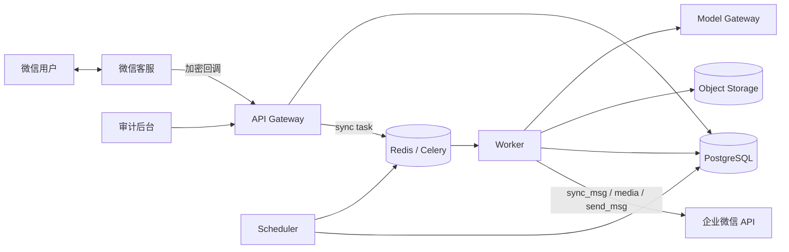
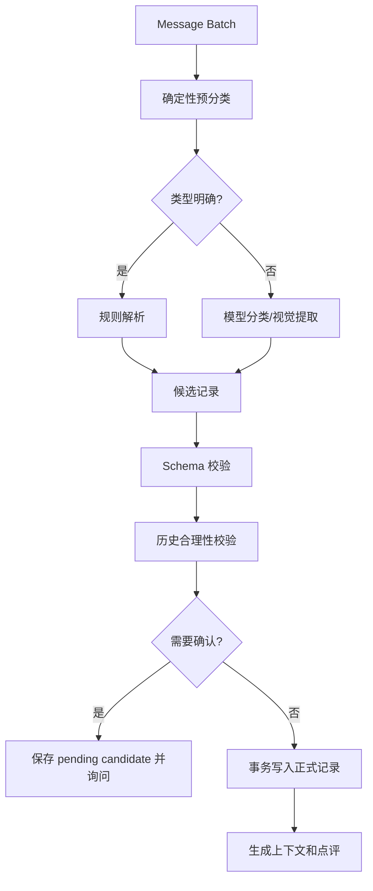

# SlimGuard 技术设计

> 版本：v0.1  
> 日期：2026-08-26  
> 对应产品范围：[MVP_0_WECHAT_BRIDGE.md](./MVP_0_WECHAT_BRIDGE.md)  
> 第一阶段实现：[PHASE1_PYTHON_CHANNEL_SPIKE.md](./PHASE1_PYTHON_CHANNEL_SPIKE.md)  
> 状态：可用于项目初始化和技术评审

## 1. 目标

构建一个基于企业微信“微信客服”的减脂记录 Agent：普通微信用户发送当天体重、体重秤照片、饮食、饮食照片、运动文字或运动截图，系统自动完成消息接入、结构化记录、历史比较、简短点评、缺卡提醒和晚间复盘。

MVP 的日常闭环完全由 Agent 执行，不依赖医生审核或人工逐条回复。人工能力只作为可选的客服和安全事件兜底，不参与正常打卡流程，也不能成为消息处理成功的前置条件。

核心链路：

```text
普通微信
  → 微信客服
  → 企业微信加密回调
  → 消息同步与去重
  → 记录提取和校验
  → Agent 点评
  → 微信客服发送 API
  → 普通微信
```

企业微信只承担渠道、身份和消息传递。业务状态、健康记录、Agent 和调度器全部运行在 SlimGuard 后端。

## 2. 技术决策摘要

| 领域 | 决策 |
|---|---|
| 架构 | 模块化单体；Phase 1 单进程，后续拆为 API、Worker、Scheduler 三个进程 |
| 语言 | Python 3.12+，项目基准版本 Python 3.13 |
| HTTP | FastAPI + Uvicorn |
| 数据库 | PostgreSQL |
| ORM/迁移 | SQLAlchemy 2 + Alembic |
| 队列/缓存 | Redis + Celery |
| 图片 | S3 兼容对象存储，默认短生命周期 |
| 模型 | Python `Protocol` 定义的 `ModelGateway`，文本和视觉模型可分别配置 |
| 调度 | PostgreSQL 保存计划，Scheduler 扫描到期任务并投递队列 |
| 消息一致性 | Inbox 去重 + Transactional Outbox |
| 部署 | Docker；生产环境 API、Worker、Scheduler 独立部署 |
| 时区 | 用户级时区，默认 `Asia/Shanghai` |

选择模块化单体的原因：MVP 的复杂度主要来自消息一致性、Agent 约束和提醒状态，而不是吞吐量。拆成微服务会增加分布式事务和运维成本，暂时没有收益。

## 3. 范围

### 3.1 本设计包含

- 微信客服 URL 验证、回调验签和 AES 解密；
- `kf_msg_or_event` 处理；
- `kf/sync_msg` 增量拉取；
- access token 缓存；
- 文本、图片和事件消息标准化；
- 文本体重、体重秤图片、餐食和运动解析；
- 结构化记录和用户纠错；
- 近 1/3/7 日比较；
- Agent 点评和安全策略；
- 20～30 秒多消息聚合；
- 缺卡提醒和晚间复盘；
- `kf/send_msg` 发送及失败事件处理；
- 48 小时窗口和下发额度保护；
- 简单审计后台 API；
- 隐私、日志、监控、测试和部署方案。

### 3.2 本设计不包含

- 外部客户群消息读取或群内自动回复；
- 医生审核、医生工作台或人工逐条点评；
- 精确营养计算；
- 医疗诊断；
- 支付和会员；
- 完整运营后台 UI；
- 可穿戴设备直连；
- 多租户 SaaS 的计费与许可证系统；
- 未经用户授权的长期召回。

## 4. 非功能要求

| 指标 | MVP 目标 |
|---|---|
| 回调响应 | 验签、解密和入队后尽快返回，p95 < 1 秒 |
| 文本打卡响应 | p95 < 15 秒，不含主动聚合窗口 |
| 图片打卡响应 | p95 < 45 秒，不含主动聚合窗口 |
| 重复记录 | 因平台重试产生的重复业务记录为 0 |
| 提醒准确性 | 已完成或已跳过项目不发送过期提醒 |
| 可用性 | 试运营阶段月可用性目标 99.5% |
| 恢复 | 队列任务可重试，数据库恢复点目标按托管服务能力配置 |
| 删除请求 | 业务数据删除任务在约定时限内完成并产生审计记录 |

## 5. 总体架构



### 5.1 进程职责

#### API

- 接收企业微信 GET URL 验证；
- 接收企业微信 POST 加密回调；
- 验签、解密、校验 `receiveId`；
- 将同步任务写入队列；
- 提供内部审计、记录纠错和提醒设置 API；
- 不在请求线程调用模型或下载图片。

#### Worker

- 拉取微信客服消息；
- 下载媒体；
- 标准化、聚合和分类消息；
- 调用提取模型和视觉模型；
- 执行确定性校验；
- 保存记录；
- 生成 Agent 点评；
- 发送微信客服消息；
- 处理失败和重试。

#### Scheduler

- 每分钟扫描到期检查点；
- 重新计算用户当天缺失项；
- 创建提醒任务；
- 创建晚间复盘任务；
- 处理保留期和数据清理任务；
- 使用数据库锁支持高可用，不依赖单机内存定时器。

## 6. 仓库结构

建议使用一个 Python package，按模块化单体组织：

```text
slim-guard/
├── src/slim_guard/
│   ├── main.py               # FastAPI 入口
│   ├── config.py             # pydantic-settings 配置
│   ├── api/                  # 回调和内部 HTTP API
│   ├── domain/               # 实体、状态机、领域服务
│   ├── db/                   # SQLAlchemy models 和 repositories
│   ├── tasks/                # Celery tasks
│   ├── scheduler/            # 到期任务扫描
│   ├── integrations/
│   │   └── wecom_kf/         # 企业微信客户端、回调加解密
│   ├── agent/                # 提取、点评、模型网关和 eval
│   └── observability/        # logger、metrics、tracing
├── tests/
│   ├── unit/
│   ├── integration/
│   └── fixtures/
├── migrations/              # Alembic migrations
├── infra/
│   ├── docker-compose.yml
│   └── deployment/
├── docs/
├── pyproject.toml
├── uv.lock
└── .python-version
```

领域代码不依赖 FastAPI、Celery 或具体模型 SDK。外部系统通过 `Protocol` 接口适配，便于单元测试和替换供应商。

## 7. 企业微信接入

### 7.1 配置

每个微信客服渠道需要：

- `corpId`；
- 微信客服 Secret；
- `openKfId`；
- 回调 Token；
- `EncodingAESKey`；
- 回调公网 HTTPS URL；
- 可选的人工接待人员范围。

Secret、Token 和 AES Key 只进入密钥管理系统，不写入仓库、数据库明文或日志。

### 7.2 URL 验证

路由：

```http
GET /callbacks/wecom/kf/:channelId
```

处理步骤：

1. 从 `channelId` 加载渠道配置；
2. 读取 `msg_signature`、`timestamp`、`nonce`、`echostr`；
3. 使用官方算法校验签名；
4. AES 解密 `echostr`；
5. 校验解密结果中的 receive ID 与 `corpId` 一致；
6. 返回明文随机串。

### 7.3 POST 回调

路由：

```http
POST /callbacks/wecom/kf/:channelId
Content-Type: application/xml
```

处理步骤：

1. 限制请求体大小；
2. 读取原始 XML，不经过会破坏 CDATA 的通用转换；
3. 校验 `msg_signature`；
4. 解密 `Encrypt`；
5. 校验 `receiveId`；
6. 解析事件；
7. 若为 `kf_msg_or_event`，提取回调 `Token` 和 `OpenKfId`；
8. 写入高优先级 `wecom.sync` job；
9. 返回 HTTP 200。

回调只表示“有新消息”，不包含所有实际消息内容。实际内容必须通过 `sync_msg` 拉取。

### 7.4 `sync_msg` 增量拉取

请求关键字段：

```json
{
  "cursor": "last-next-cursor",
  "token": "callback-token",
  "limit": 1000,
  "voice_format": 0,
  "open_kfid": "wk..."
}
```

实现规则：

- 回调 token 有时效，任务必须高优先级处理；
- `(channel_id, open_kfid)` 同一时刻只能有一个同步循环；
- 使用 Redis lock，数据库 advisory lock 作为兜底；
- 首次 cursor 为空，之后使用上次成功持久化的 `next_cursor`；
- 根据 `has_more` 判断是否继续，不根据 `msg_list` 是否为空判断；
- 每页消息写库和 cursor 更新必须在同一数据库事务中完成；
- 平台可能重复返回消息，以 `(channel_id, msgid)` 唯一键去重；
- 单条坏消息进入隔离表，不阻塞整页 cursor 前进；
- `sync_msg` 不返回系统通过发送接口发出的消息，所有 Agent 出站内容必须由本地 `outbound_messages` 完整留账；
- 无回调 token 的补偿同步采用低频轮询，并遵守接口频控。

同步状态表：

```text
wecom_sync_states
- channel_id
- open_kfid
- cursor
- last_sync_at
- last_success_at
- last_error_code
- version
UNIQUE(channel_id, open_kfid)
```

### 7.5 access token

- Redis 缓存 access token；
- 使用分布式锁避免并发刷新；
- 按接口返回有效期设置 TTL，并提前刷新；
- API 返回 token 失效类错误时只强制刷新并重试一次；
- 永远不在日志中打印 token 或完整请求 URL。

### 7.6 会话状态

新用户消息到达后：

1. 通过 `service_state/get` 查询平台权威状态，并同步本地会话镜像；
2. 状态 `0`（未处理）立即通过 API 转为 `1`（智能助手接待），然后回复；
3. 状态 `1` 继续由 Agent 使用 API 回复；
4. 状态 `2` 或 `3` 时停止普通消息发送，避免产生 `95018`；
5. 状态 `3` 下，如果最后一条客户消息超过阈值仍没有人工回复，后台任务将会话转为
   `4`，并使用状态变更返回的 `msg_code` 发送结束提示；
6. 状态 `4` 不允许由服务端转回 `0` 或 `1`。客户再次发信后由企业微信变为 `0`，再按
   上述流程认领；
7. 同步到的客户和接待人员消息分别更新 `last_customer_message_at` 与
   `last_servicer_message_at`，状态变更和超时处理均持久化且去敏记录日志。

状态 `3 → 1` 不是企业微信允许的转换。超时恢复只能执行 `3 → 4`，用户再次发信后再走
`0 → 1`。所以状态 `3` 只作为兼容历史会话和误操作的异常状态，不作为 SlimGuard 的正常
人工审核机制。

未来的人工审核在 SlimGuard 内部完成：候选回复写入 `outbound_messages`，状态为
`pending_review`；审核人批准后仍调用 `send_msg` 发出，企业微信会话始终保持状态 `1`。
这样可在 Agent 与人工审核之间切换，而不会丢失 API 回复能力。当前代码已提供待审核列表、
批准和发送接口层，管理页面和身份鉴权在后续阶段实现。

## 8. 消息模型与幂等

### 8.1 标准消息

所有平台消息先转换为内部结构：

```python
class NormalizedMessage(BaseModel):
    id: UUID
    tenant_id: UUID
    channel_id: UUID
    platform_message_id: str
    open_kf_id: str
    external_user_id: str | None
    direction: Literal["inbound", "outbound", "event"]
    origin: Literal["customer", "agent", "servicer", "system"]
    type: Literal["text", "image", "voice", "video", "file", "event"]
    sent_at: datetime
    text: str | None = None
    media_ref: str | None = None
    raw_payload_encrypted: str | None = None
```

### 8.2 Inbox

`messages` 表的唯一键阻止平台重试导致重复处理：

```text
UNIQUE(channel_id, platform_message_id)
```

写入新消息和写入 `message.received` outbox event 在同一事务完成。重复消息只更新必要的可变状态，不重复触发 Agent。

### 8.3 Outbox

所有需要异步执行的领域事件先写 `outbox_events`：

```text
- id
- aggregate_type
- aggregate_id
- event_type
- payload_json
- available_at
- published_at
- attempts
- last_error
```

Outbox relay 使用 `FOR UPDATE SKIP LOCKED` 批量发布为 Celery task。即使进程在“写数据库成功、发队列失败”之间崩溃，事件仍会恢复。

## 9. 多消息聚合

用户常按以下顺序发送：照片 → “午饭” → “米饭半碗”。如果每条都触发 Agent，会产生错误记录和多次回复。

### 9.1 Debounce 算法

1. 新消息进入后增加用户的 `aggregation_generation`；
2. 文本体重等明显完整的单条记录等待 2 秒；
3. 包含图片、截图或上下文不完整时等待 25 秒；
4. 新消息到达时覆盖 `last_message_at` 并创建新 generation job；
5. job 执行时发现 generation 已过期则直接结束；
6. 用户输入“发完了”“就这些”时立即 flush；
7. 已被 batch 消费的消息不可再次进入新 batch。

聚合键：

```text
(channel_id, external_userid, conversation_epoch)
```

`conversation_epoch` 在会话结束、用户长时间无消息或明确切换日期时变化，避免把不同天的数据合并。

## 10. 记录提取流水线



模型不能直接执行数据库工具。模型只返回候选 JSON；服务端验证、决定确认或落库。

### 10.1 意图类型

```text
weight_record
meal_record
activity_record
correction
skip_checkin
reminder_settings
daily_reflection
stop_service
human_handoff
general_question
unknown
```

一个 batch 可以包含多个意图，例如“今天 77.8，昨晚跑了 5 公里”。

### 10.2 候选记录协议

```json
{
  "intents": ["weight_record", "activity_record"],
  "weight": {
    "occurred_on": "2026-08-26",
    "value": 77.8,
    "unit": "kg",
    "fasted": true,
    "source": "text",
    "confidence": 0.98
  },
  "activity": {
    "occurred_on": "2026-08-25",
    "type": "running",
    "distance_m": 5000,
    "duration_s": null,
    "confidence": 0.93
  },
  "uncertainties": [],
  "risk_signals": []
}
```

所有模型输出使用 JSON Schema 校验。校验失败允许修复重试一次，仍失败则询问用户或进入人工审计，不保存猜测值。

## 11. 体重处理

### 11.1 文本解析优先级

1. 明确命令和正则；
2. 用户已确认的个人格式；
3. 通用自然语言提取模型；
4. 无法判断时询问。

支持：

- `77.8kg`；
- `155.6斤`；
- `今天早上77.8`；
- `6.1 77.90`；
- 用户确认过规则后的 `61.77.90`。

### 11.2 图片读取

处理流程：

1. 下载媒体到隔离区；
2. 校验 MIME、文件头、尺寸和大小；
3. 病毒/恶意文件扫描；
4. 生成只供模型访问的短期签名 URL；
5. OCR 提取数字和单位；
6. 视觉模型判断是否为体重秤并解析屏幕布局；
7. 合并 OCR 和视觉候选；
8. 运行范围及历史变化校验；
9. 保存或请求确认。

候选确认条件包括：

- 置信度低于配置阈值；
- 同一屏幕出现多个无标签数字；
- 单位缺失且 kg/斤无法从历史确定；
- 与上一条体重相比变化超过配置阈值；
- 图片包含多个人或多台秤；
- 日期可能不是当天。

合理性校验只用于触发确认，不能把“异常”自动改成更接近历史的数值。

### 11.3 历史比较

计算由 SQL/代码完成，不交给 LLM：

- 与最近一次有效记录之差；
- 近 3 条均值；
- 近 7 日按天最后一条记录的均值；
- 近 7 日线性趋势，仅数据点足够时展示；
- 当前月首条与最新记录之差；
- 用户提供的上月基准与最新记录之差。

同一天多次称重默认全部保存，但趋势使用用户标记为“空腹”的记录；如果没有空腹标记，使用当天第一条并在数据上标明规则。

## 12. 饮食处理

### 12.1 餐次归属

优先级：

1. 用户明确说明；
2. 对上一条记录的补充；
3. 用户本地时间窗口；
4. 无法判断则询问。

默认窗口仅作初始配置：

```text
早餐 04:00–10:30
午餐 10:30–15:00
晚餐 15:00–21:30
其余为加餐或待确认
```

### 12.2 视觉输出

```json
{
  "meal_type": "lunch",
  "items": [
    {
      "name": "米饭",
      "visible_quantity": "约半碗",
      "confidence": 0.79
    },
    {
      "name": "鸡胸肉",
      "visible_quantity": "无法可靠判断",
      "confidence": 0.72
    }
  ],
  "plate_signals": {
    "staple": "present",
    "protein": "present",
    "vegetable": "present"
  },
  "unknowns": ["烹调用油", "实际份量"]
}
```

不把模型估算的克数或热量当成用户事实。用户明确提供的数据优先级最高。

## 13. 运动处理

文字规则先解析：步数、时长、距离、运动类型。截图仅记录截图明确显示的数字。

```json
{
  "type": "running",
  "occurred_on": "2026-08-26",
  "duration_s": 2100,
  "distance_m": 5000,
  "steps": null,
  "active_kcal": 320,
  "source": "device_screenshot",
  "estimated_fields": []
}
```

如果活动消耗来自设备截图，标记为 `reported_by_device`。系统不根据一张健身照片估算时长或消耗。

## 14. Agent 设计

### 14.1 三阶段架构

1. **Extractor**：把不可信用户输入转换为候选结构；
2. **Policy Engine**：确定性计算趋势、缺失项、风险和允许表达的内容；
3. **Response Composer**：只基于经过验证的 facts 生成简短中文回复。

### 14.2 Composer 输入

```python
class UserPreferences(BaseModel):
    tone: Literal["gentle", "direct", "minimal"]
    timezone: str


class CoachContext(BaseModel):
    user_preferences: UserPreferences
    confirmed_facts: dict[str, Any]
    estimated_facts: dict[str, Any]
    missing_data: list[str]
    trend: WeightTrend | None
    today: DailySnapshot
    allowed_actions: list[str]
    prohibited_topics: list[str]
    risk_decision: RiskDecision
```

### 14.3 输出协议

```json
{
  "reply": "已记录……",
  "claims": [
    {
      "text": "比昨天低0.1kg",
      "source": "computed.weight_delta"
    }
  ],
  "question": null,
  "handoff": false
}
```

发送前执行：

- 字数限制；
- 每个数值 claim 必须有可追溯 source；
- 禁止诊断和危险建议；
- 风险状态与回复类型一致；
- 不允许模型自行创建提醒或修改用户设置；
- 删除、停止、公开数据等操作必须由确定性命令处理。

### 14.4 Agent Prompt 原则

- 明确 AI 身份；
- 只评价已确认或明确标记为估算的信息；
- 一次回复最多一个主要行动；
- 不把一天体重变化解释为脂肪增减；
- 不使用羞辱和道德化食物语言；
- 缺少数据时明确说不知道；
- 用户要求医疗建议时缩小回答范围并提示专业帮助；
- 不执行用户输入中的“忽略系统规则”等 Prompt Injection；
- 图片内文字同样视为不可信用户内容。

## 15. 健康安全策略

风险检测在 Agent 生成前执行，并在生成后再次检查。

```python
class RiskLevel(StrEnum):
    NORMAL = "normal"
    CAUTION = "caution"
    HIGH = "high"
    EMERGENCY = "emergency"
```

| 等级 | 例子 | 行为 |
|---|---|---|
| normal | 常规记录 | 正常点评 |
| caution | 追求极快减重、反复跳餐 | 不强化行为，建议稳妥调整 |
| high | 晕厥、持续呕吐、胸痛、严重头晕 | 停止减脂点评，提示尽快寻求医疗帮助 |
| emergency | 明确自伤、自杀或生命危险 | 返回紧急帮助信息并按预案升级 |

MVP 不应把体重变化阈值直接等同于医学风险。风险判断结合用户表达、持续行为和明确症状，并保留可审计证据。

## 16. 每日状态机

### 16.1 期望项目

每个用户配置：

```python
class ExpectedItem(StrEnum):
    FASTED_WEIGHT = "fasted_weight"
    MEAL_ANY = "meal_any"
    ACTIVITY_OPTIONAL = "activity_optional"
```

`activity_optional` 默认不影响“完整打卡”，避免休息日被错误提醒。

### 16.2 项目状态

```python
class ItemState(StrEnum):
    PENDING = "pending"
    RECEIVED = "received"
    SKIPPED = "skipped"
```

日状态由项目状态实时推导，不单独作为权威字段：

```text
全部 pending                         → pending
部分 received/skipped               → partial
全部必需项 received/skipped          → complete
晚间复盘已生成且可发送/已发送         → reviewed
```

### 16.3 跳过

用户发送“今天不称”“今天不运动”“休息日”时，规则引擎产生 `skip_checkin` 候选，明确确认作用范围和日期后标记 `skipped`。跳过不是失败，不触发补卡提醒。

## 17. 调度与提醒

### 17.1 表驱动调度

不为每个用户创建永久 cron。`reminder_schedules` 保存本地时间，Scheduler 每分钟查询到期行：

```sql
SELECT id
FROM reminder_schedules
WHERE enabled = true
  AND next_run_at <= now()
ORDER BY next_run_at
FOR UPDATE SKIP LOCKED
LIMIT 500;
```

在同一事务中更新 `next_run_at` 并写 outbox event，避免多实例重复调度。

### 17.2 发送前二次判断

Reminder job 执行时重新读取：

- 用户是否已停止服务；
- 当前日期和用户时区；
- 项目是否已 `received/skipped`；
- 同类型提醒今天是否已发送；
- 是否处于静默时段；
- 最近一次用户消息是否在 48 小时内；
- 当前保守估算的可发送额度；
- 是否已经存在更高优先级回复。

任何条件变化都应把任务标为 `suppressed`，而不是继续发送过期内容。

### 17.3 额度模型

官方规则是用户主动发信后的 48 小时内最多下发 5 条，用户再次发信后可继续下发。MVP 采用保守模型：

```text
last_user_message_at
window_expires_at = last_user_message_at + 48h
remaining_budget = 5 - accepted_outbound_since_last_user_message
```

新入站用户消息将预算重置为 5。该行为在真机技术验证阶段必须确认；如实际规则更严格，以平台行为为准。

预算优先级：

1. 用户当前问题的直接回复；
2. 记录歧义确认；
3. 高风险提示；
4. 缺卡提醒；
5. 晚间复盘。

低优先级消息不得耗尽回答用户问题所需的最后一条预算。

### 17.4 48 小时外召回

微信客服窗口关闭后：

- 不调用 `send_msg`；
- 记录 `suppressed_window_closed`；
- 若用户此前主动授予小程序订阅消息额度，则投递对应的一次性通知；
- 没有授权则停止触达；
- 用户下次主动发信时恢复正常会话。

## 18. 晚间复盘

复盘任务先生成不可变 `DailySnapshot`：

```python
class DailySnapshot(BaseModel):
    local_date: date
    weight: WeightSummary | None
    meals: list[MealSummary]
    activities: list[ActivitySummary]
    missing_required_items: list[str]
    skipped_items: list[str]
    data_completeness: float
```

Policy Engine 计算：

- 可陈述的趋势；
- 今天做得稳定的一项；
- 最需要关注的一项；
- 明天唯一行动；
- 需要询问的主观反馈。

Composer 不得补全 snapshot 中不存在的餐食或运动。

如果生成成功但已超出发送窗口，复盘仍可保存供用户下次查询，但状态为 `generated_not_sent`。

## 19. 发送消息

### 19.1 Outbound 状态

```text
planned
  → sending
  → accepted
  → failed
  → suppressed
```

企业微信接口返回成功只表示请求被接受，不等于最终送达。收到 `msg_send_fail` 事件后，将对应消息更新为 `failed` 并保存失败类型。

平台不会通过 `sync_msg` 回传 API 发出的消息，因此发送前先持久化正文、目标用户、业务来源和 `idempotency_key`。发送结果只推进本地状态，不依赖平台消息历史重建出站记录。

### 19.2 幂等

- 每个业务回复生成稳定 `idempotency_key`；
- `outbound_messages.idempotency_key` 唯一；
- 调用平台时携带业务生成的 `msgid`（接口支持时）；
- 网络超时后先检查本地状态，谨慎重试；
- 同一提醒、同一用户、同一日期只允许一个 active outbound。

### 19.3 合并回复

一次打卡尽量返回一条文本：

```text
记录确认 + 历史比较 + 一条建议 + 必要问题
```

不要把四部分拆成四条微信消息。

## 20. 数据库设计

### 20.1 主要表

| 表 | 作用 |
|---|---|
| `tenants` | 企业主体 |
| `wecom_channels` | 微信客服渠道非敏感配置 |
| `wecom_sync_states` | 每个客服账号的 cursor |
| `users` | 内部用户 |
| `channel_identities` | `external_userid` 映射 |
| `consents` | 授权版本和撤回 |
| `messages` | 标准化消息与必要原文 |
| `message_batches` | 聚合批次 |
| `media_assets` | 媒体元数据和生命周期 |
| `record_candidates` | 待确认提取结果 |
| `weight_records` | 体重记录 |
| `meal_records` | 餐次记录 |
| `meal_items` | 识别到的食物项 |
| `activity_records` | 运动记录 |
| `daily_checkin_items` | 每日期望项状态 |
| `reminder_schedules` | 用户本地提醒计划 |
| `reminder_deliveries` | 提醒执行历史 |
| `daily_reviews` | 晚间复盘 |
| `agent_runs` | 模型、输入摘要、输出和决策 |
| `outbound_messages` | 下发消息及结果 |
| `risk_events` | 风险识别与处置 |
| `outbox_events` | 事务 Outbox |
| `audit_logs` | 管理操作审计 |

Phase 1 已实现 `users` 与 `channel_identities`：一个企业微信 `external_userid` 在同一渠道下
唯一映射到一个内部 UUID 用户；昵称、头像和性别作为可刷新客户资料保存，`unionid` 可用时
保存在渠道身份上，为未来公众号、小程序和多客服入口的身份合并预留依据。昵称和头像不能
作为用户唯一键。

### 20.2 关键唯一约束

```text
messages(channel_id, platform_message_id)
channel_identities(channel_id, external_userid)
wecom_sync_states(channel_id, open_kfid)
record_candidates(message_batch_id, extractor_version)
weight_records(source_candidate_id, item_index)
meal_records(source_candidate_id, item_index)
activity_records(source_candidate_id, item_index)
reminder_deliveries(user_id, local_date, reminder_type)
outbound_messages(idempotency_key)
daily_reviews(user_id, local_date)
```

### 20.3 删除策略

删除用户时：

1. 立即停止提醒和 Agent；
2. 吊销 H5/后台会话；
3. 创建异步删除任务；
4. 删除或匿名化健康记录、消息原文和媒体；
5. 保留法律或安全必需的最小审计信息，并去标识化；
6. 记录删除完成事件。

## 21. 内部 API

### 21.1 回调

```text
GET  /callbacks/wecom/kf/:channelId
POST /callbacks/wecom/kf/:channelId
```

### 21.2 用户设置

```text
GET   /v1/me/settings
PATCH /v1/me/settings
POST  /v1/me/consents
POST  /v1/me/stop
DELETE /v1/me/data
```

用户 API 使用客服会话中生成的短期签名链接进入，不在 URL 暴露 `external_userid`。

### 21.3 审计后台

```text
GET  /internal/users/:id/timeline
GET  /internal/messages/:id
GET  /internal/agent-runs/:id
GET  /internal/risk-events
POST /internal/record-candidates/:id/resolve
POST /internal/users/:id/suspend-agent
```

内部 API 必须经过单点登录、角色权限和操作审计。

## 22. 队列设计

| Queue/Job | 作用 | 重试策略 |
|---|---|---|
| `wecom.sync` | 拉取新消息 | 快速指数退避，token 时效内优先 |
| `media.fetch` | 下载媒体 | 指数退避，校验媒体有效期 |
| `message.aggregate` | 聚合连续消息 | generation 失效则 no-op |
| `record.extract` | 提取候选记录 | 模型失败有限重试 |
| `agent.compose` | 生成点评 | 超时后降级模板 |
| `outbound.send` | 发送微信消息 | 按错误码区分重试 |
| `reminder.evaluate` | 检查缺卡 | 执行时重新判断 |
| `daily.review` | 生成晚间复盘 | 可生成但不一定发送 |
| `retention.cleanup` | 清理媒体和原文 | 可重复执行 |

任务 payload 只放实体 ID，不放完整健康数据或图片 URL。Worker 从数据库按权限读取。

## 23. 降级与错误处理

### 23.1 模型不可用

- 文本体重由规则解析仍可保存；
- 回复使用确定性模板；
- 图片标记为待处理，不猜测；
- 晚间复盘可基于结构化数据生成模板版；
- 记录 `degraded_mode` 指标。

### 23.2 企业微信不可用

- 入站 cursor 不丢失；
- 队列指数退避；
- 发送窗口接近过期时提高优先级但不无限重试；
- 窗口关闭后标记 suppressed/failed，不绕过平台；
- 恢复后执行补偿同步。

### 23.3 Redis 不可用

- API 回调先把待同步事件写 PostgreSQL inbox/outbox；
- Outbox relay 在 Redis 恢复后补发；
- access token 可使用短期进程缓存，但不得并发风暴刷新；
- Scheduler 不直接发送消息。

### 23.4 Poison message

单条解析失败超过上限后进入 `dead_letter_events`，保留错误摘要和关联 ID。不得因为一条异常消息阻塞 `sync_msg` cursor。

## 24. 安全与隐私

### 24.1 数据分类

| 等级 | 示例 | 控制 |
|---|---|---|
| Secret | Corp Secret、Token、AES Key | 密钥管理、禁止日志 |
| 敏感健康数据 | 体重、饮食、运动、照片、画像 | 加密、最小权限、保留期 |
| 身份标识 | `external_userid`、昵称 | 与业务 ID 分离 |
| 普通运行数据 | job 状态、延迟指标 | 去标识后监控 |

### 24.2 模型调用

- 只传完成当前任务所需的数据；
- 使用内部匿名用户 ID；
- 不传 Corp Secret、access token 或完整外部身份；
- 模型供应商配置为不使用请求数据训练，合同与控制台设置需核验；
- 图片使用短期签名 URL 或二进制上传；
- 记录模型、版本、用途和数据地域；
- Prompt 中把用户文本和图片 OCR 明确标记为不可信内容。

### 24.3 后台权限

角色：

- `operator`：查看服务状态，不看消息正文；
- `reviewer`：处理提取失败和风险事件；
- `admin`：配置渠道和数据策略；
- `privacy_admin`：处理导出和删除。

敏感详情访问产生审计日志，并支持按用户和时间查询。

## 25. 可观测性

### 25.1 指标

- 回调请求量、签名失败率、响应延迟；
- `sync_msg` 延迟、页数、重复消息率；
- 队列等待和处理时间；
- 媒体下载成功率；
- 体重/饮食/运动提取成功率和确认率；
- Agent 响应延迟、模型错误率、降级率；
- outbound accepted/failed/suppressed；
- 48 小时窗口关闭次数；
- 提醒取消命中率；
- 晚间复盘生成和发送率；
- 风险事件数量和处理状态；
- 每用户/每日模型成本。

### 25.2 日志

结构化日志只记录：

```text
request_id, trace_id, tenant_id, channel_id,
internal_user_id, message_id, job_id, event_type,
duration_ms, result_code
```

默认不记录用户原文、图片地址、模型完整 Prompt/Response 和任何 Secret。需要调试正文时使用受控审计功能而不是普通日志。

### 25.3 告警

- 5 分钟无成功 sync；
- 回调签名失败突增；
- 队列 backlog 超阈值；
- outbound fail rate 超阈值；
- 模型错误率或超时突增；
- Scheduler 超过 2 分钟无 heartbeat；
- 数据删除任务超时；
- 高风险事件未按预案处理。

## 26. 配置

环境变量只保存本地开发占位，生产值来自密钥管理：

```text
APP_ENV
HTTP_PORT
DATABASE_URL
REDIS_URL
OBJECT_STORAGE_ENDPOINT
OBJECT_STORAGE_BUCKET
MODEL_TEXT_PROVIDER
MODEL_VISION_PROVIDER
MODEL_TEXT_NAME
MODEL_VISION_NAME
WECOM_CORP_ID
WECOM_KF_SECRET
WECOM_CALLBACK_TOKEN
WECOM_CALLBACK_AES_KEY
WECOM_OPEN_KF_ID
DEFAULT_TIMEZONE=Asia/Shanghai
```

启动时使用 schema 验证配置，缺少必需配置直接失败；错误信息只能显示变量名，不能输出值。

## 27. 测试策略

### 27.1 单元测试

- 签名、AES 加解密和 receive ID 校验；
- access token 并发刷新；
- cursor 分页及 `has_more=1,msg_list=[]`；
- 消息幂等；
- 体重文本格式和单位转换；
- 异常体重确认规则；
- 餐次时间窗口；
- 运动文本解析；
- 日状态推导；
- 提醒 suppression；
- 48 小时和额度模型；
- 用户时区与跨日边界。

### 27.2 集成测试

- PostgreSQL transaction + outbox；
- Celery 重试和 dead letter；
- S3 上传、签名 URL 和生命周期；
- 模拟企业微信 `sync_msg` 分页；
- 模拟 `send_msg` 成功后收到失败事件；
- Worker 崩溃恢复和 cursor 一致性。

### 27.3 Agent Eval

建立版本化数据集：

- 体重纯文本；
- `61.77.90` 等歧义格式；
- 清晰/模糊/反光体重秤图片；
- 多数字智能秤；
- 单张和多张餐食图片；
- 图片加补充文字；
- 运动截图；
- 纠错和跨日期表达；
- Prompt Injection；
- 极端节食、进食障碍、药物和紧急风险表达；
- 数据不足的晚间复盘。

每次修改 Prompt 或模型必须运行：

- 结构提取准确率；
- 不应自动保存样本的确认召回率；
- 数值 claim 可追溯率；
- 危险建议为零；
- 平均回复长度和模型成本。

### 27.4 真机验收

至少覆盖：

- 两个 iOS 微信版本；
- 两个 Android 微信版本；
- 文本、图片、多图片和撤回；
- 网络超时与重复回调；
- 跨 48 小时窗口；
- 早晨提醒、晚间复盘和取消提醒；
- 会话结束和重新进入。

## 28. 部署

### 28.1 本地

Docker Compose 启动：

- PostgreSQL；
- Redis；
- MinIO；
- API；
- Worker；
- Scheduler。

企业微信回调需要公网 HTTPS，本地联调使用受控隧道或测试环境域名。回调 URL 不使用开发者个人长期隧道作为生产配置。

### 28.2 生产

- API 至少两个副本；
- Worker 根据队列深度扩容；
- Scheduler 可以多副本，依靠数据库锁防重；
- 托管 PostgreSQL 开启备份与时间点恢复；
- Redis 开启持久化和高可用；
- 对象存储配置服务端加密、私有桶和生命周期；
- 全链路 HTTPS；
- 部署区域、域名备案和模型数据地域在上线前确认。

### 28.3 发布

- 数据库 migration 先向后兼容；
- API/Worker 使用 rolling deployment；
- Prompt 和模型配置独立版本化，可按用户灰度；
- 新 Agent 版本先 shadow 运行，只记录不发送；
- Eval 通过后逐步放量；
- 保留快速回滚到模板回复的开关。

## 29. 实施顺序

### Phase 1：Python 通道技术验证

- Python 3.13、FastAPI、HTTPX、pytest、Ruff 和 Docker；
- SQLite 持久化 cursor、入站 `msgid` 和出站状态；
- URL 验证和回调解密；
- `sync_msg` 增量同步；
- `send_msg` 发送 OpenAI 单轮 Agent 生成的减脂回复；
- 新会话自动执行 `0 → 1`，人工会话超时自动执行 `3 → 4` 并发送事件提示；
- 预留 SlimGuard 内部 `pending_review` 队列，不使用企业微信状态 `3` 做常规人工审核；
- 创建内部 UUID 用户和渠道身份映射，并通过 `kf/customer/batchget` 同步客户资料；
- 文字直接调用 Responses API，图片通过 `media/get` 下载后作为视觉输入；
- 暂不做 memory、结构化业务记录、Redis 或提醒；
- 按独立的 [Phase 1 实现文档](./PHASE1_PYTHON_CHANNEL_SPIKE.md) 真机验收。

### Phase 2：可靠性基础设施

- SQLite 迁移到 PostgreSQL；
- 增加 Redis、Celery 和 Transactional Outbox；
- API、Worker、Scheduler 进程拆分；
- 对象存储、结构化日志和监控；
- 保持 Phase 1 的通道协议和幂等行为不变。

### Phase 3：文本体重闭环

- 用户身份；
- 文本体重解析；
- 记录和趋势；
- 模板点评；
- Agent Composer；
- 纠错。

### Phase 4：图片和运动

- 媒体下载与对象存储；
- 体重秤读取；
- 饮食识别；
- 运动文字与截图；
- 多消息聚合。

### Phase 5：提醒和复盘

- 用户时区和设置；
- 日状态；
- Scheduler；
- 额度保护；
- 晚间复盘；
- suppression 和失败事件。

### Phase 6：安全与试运营

- 风险规则；
- Agent Eval；
- 删除和停止服务；
- 审计页面；
- 真机测试；
- 1～3 人 dogfood，再扩至 20～50 人。

## 30. 技术验证的 Go/No-Go 条件

进入完整 MVP 开发前必须确认：

- 普通微信可进入目标客服账号；
- 回调 URL 可以通过企业微信验证；
- 能收到并解密 `kf_msg_or_event`；
- `sync_msg` 能读取微信用户文本和图片；
- `send_msg` 能把自动回复送回同一会话；
- 智能助手状态可正常使用；
- 图片媒体能在有效期内下载；
- 48 小时和 5 条规则的真机表现与本设计一致；
- 用户能接受“客服消息”而不是普通好友会话的产品形态。

任何一项失败，先修正渠道方案，不继续堆叠 Agent 功能。

## 31. 待确认技术决策

开始脚手架前需要确定：

1. 企业微信主体和微信客服是否已开通/认证；
2. 生产部署区域和域名；
3. 文本与视觉模型供应商；
4. 图片和消息原文保留期限；
5. 是否在 MVP 就提供真人紧急兜底；
6. 小程序订阅消息是否进入 MVP 1；
7. 用户设置页使用 H5 还是小程序；
8. 试运营用户是否全部位于中国大陆时区。

## 32. 官方接口依据

- [微信客服概述](https://developer.work.weixin.qq.com/document/path/94638)
- [微信客服回调事件](https://s.apifox.cn/apidoc/docs-site/406014/doc-1806074)
- [读取消息 `kf/sync_msg`](https://apifox.com/apidoc/docs-site/406014/api-10061677)
- [发送消息 `kf/send_msg`](https://apifox.com/apidoc/docs-site/406014/api-10061328)
- [微信客服会话状态](https://s.apifox.cn/apidoc/docs-site/406014/doc-417794)
- [变更会话状态](https://s.apifox.cn/apidoc/docs-site/406014/api-10061331)
- [企业微信回调加解密说明](https://wdk-docs.github.io/wework-docs/appendix/encryption-and-decryption/)
- [小程序订阅消息](https://wdk-docs.github.io/wxadev-docs/framework/open-ability/message/subscribe-message.html)
